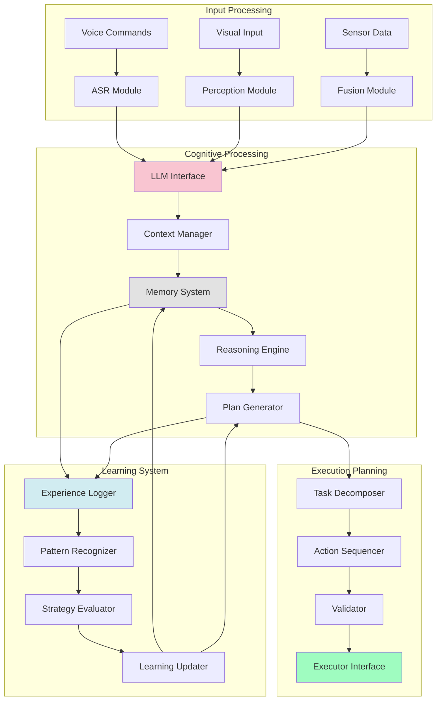
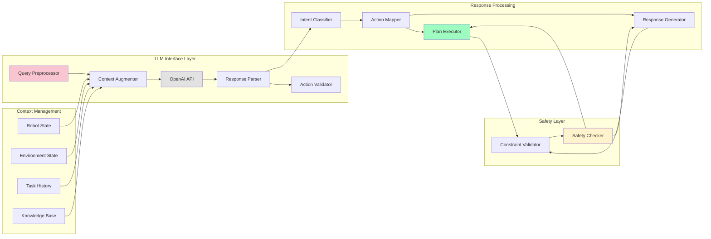
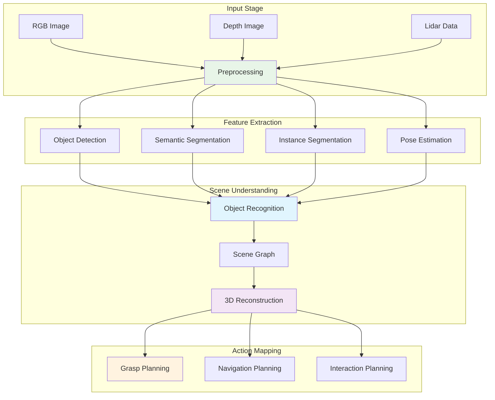
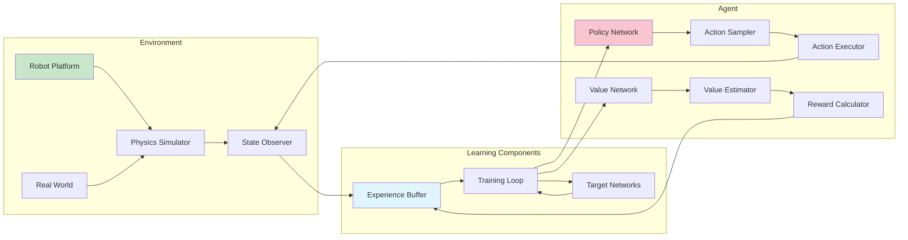
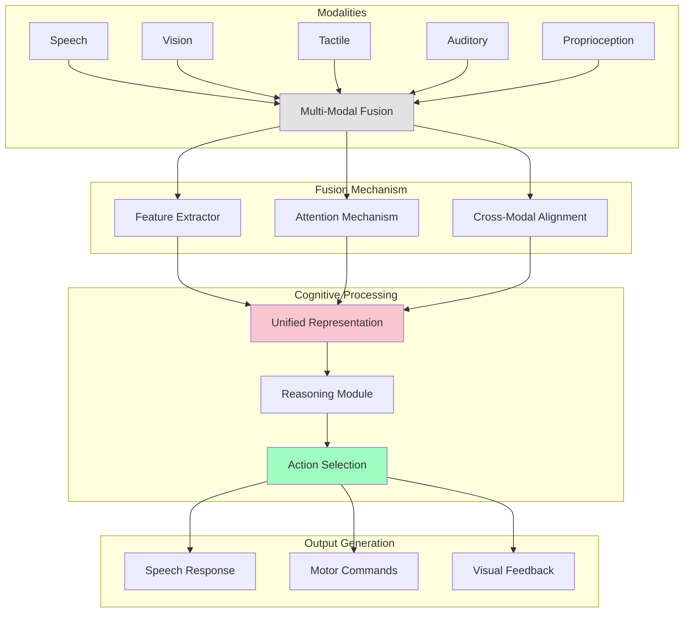
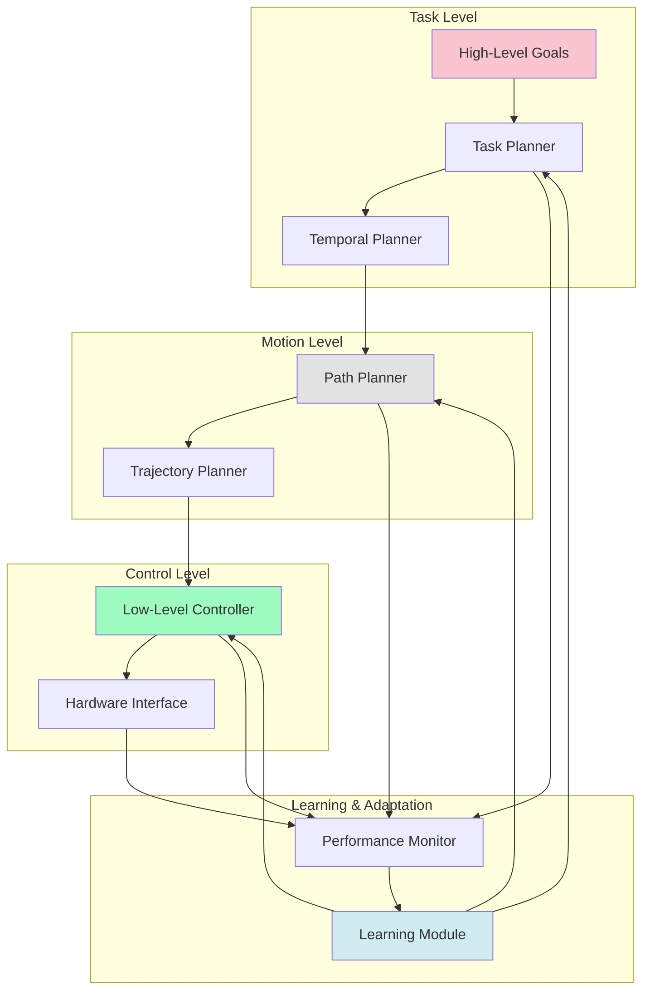
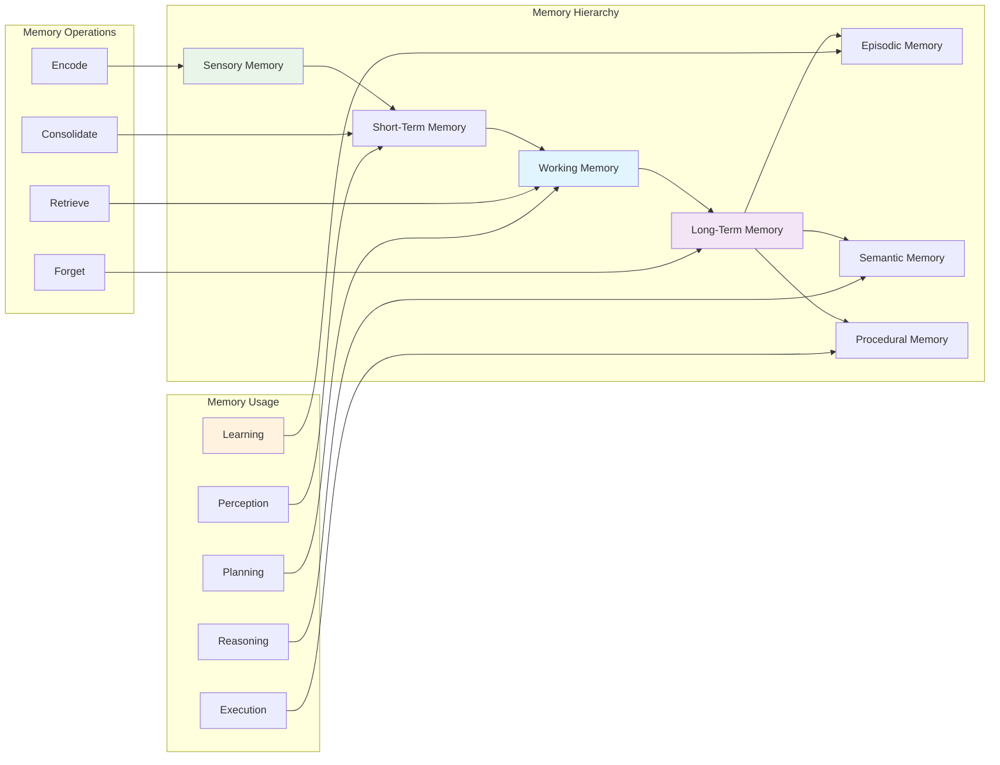
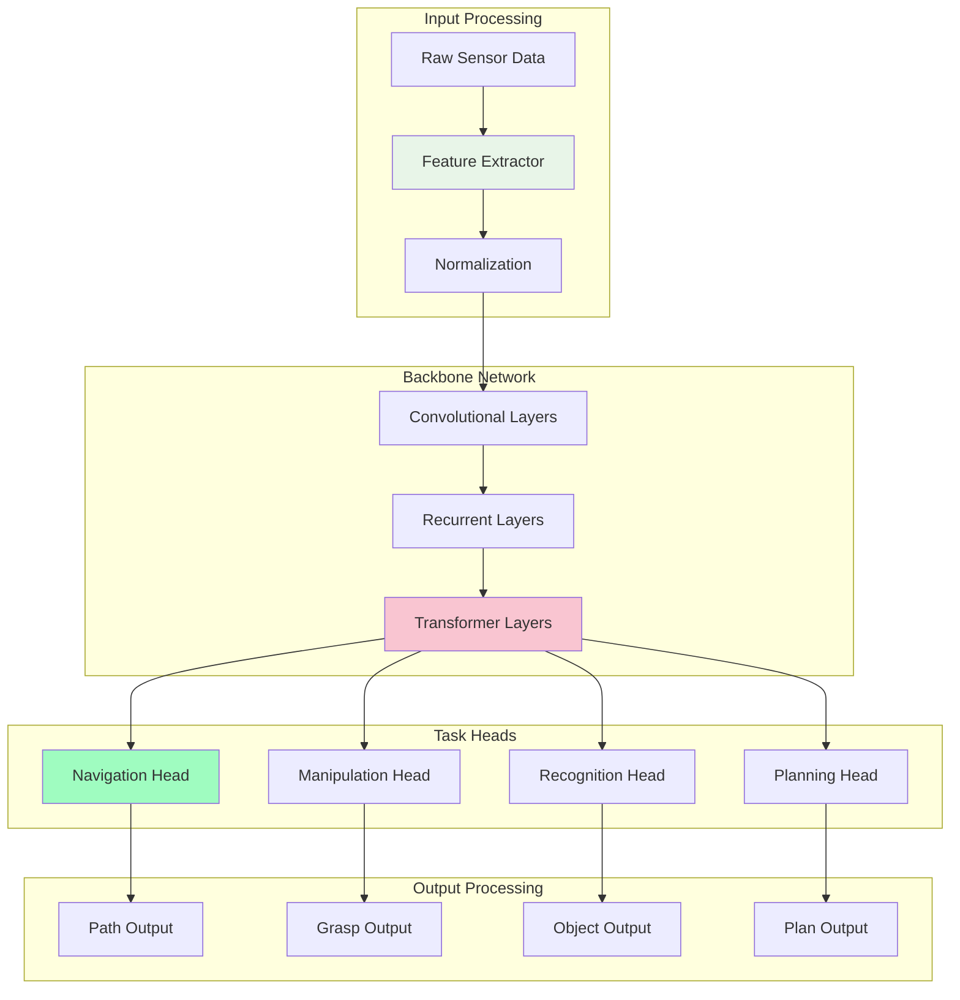

# AI Architecture for Humanoid Robotics

This document details the AI architecture for humanoid robotics, including LLM integration, cognitive planning, and machine learning components.

## Cognitive Architecture

## LLM Integration Architecture

## Vision Processing Pipeline

## Reinforcement Learning Architecture

## Multi-Modal Integration

## Planning Hierarchy

## Memory Architecture

## Neural Network Architecture

