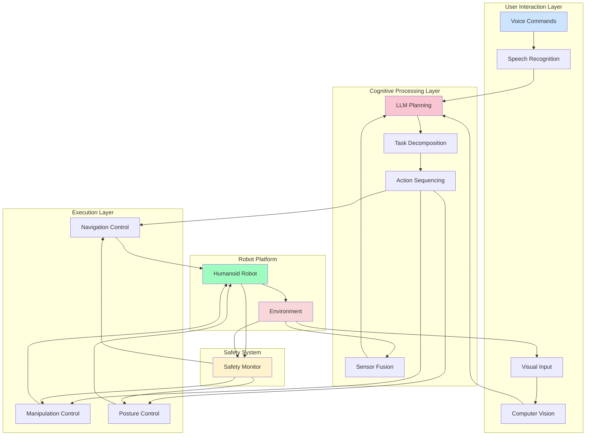
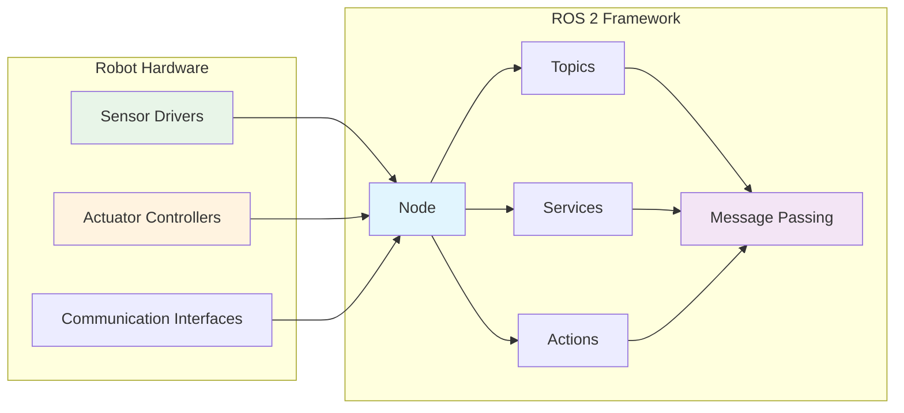
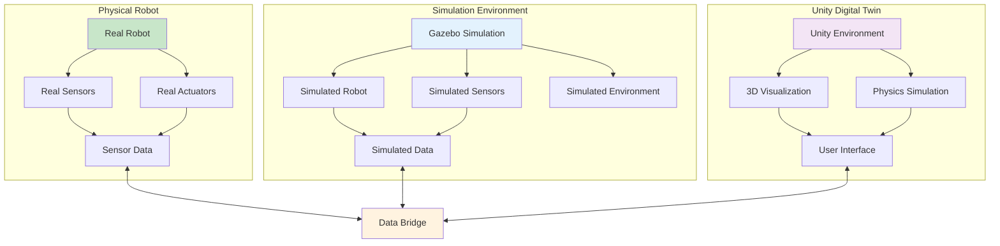
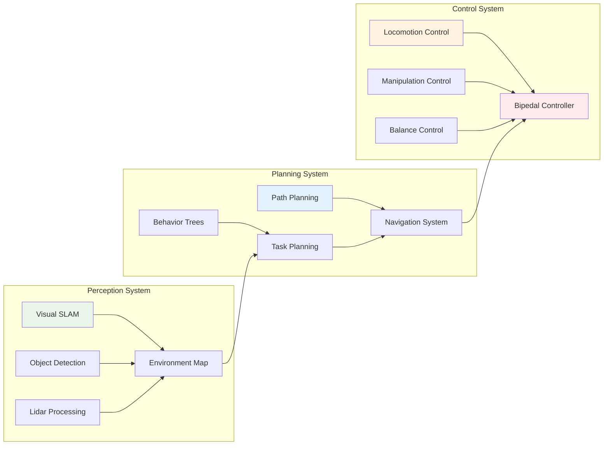
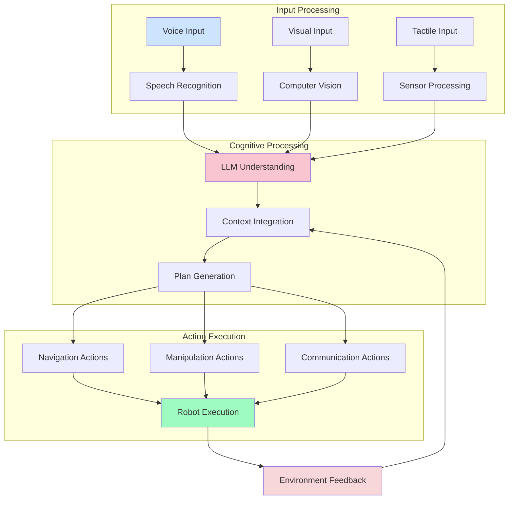
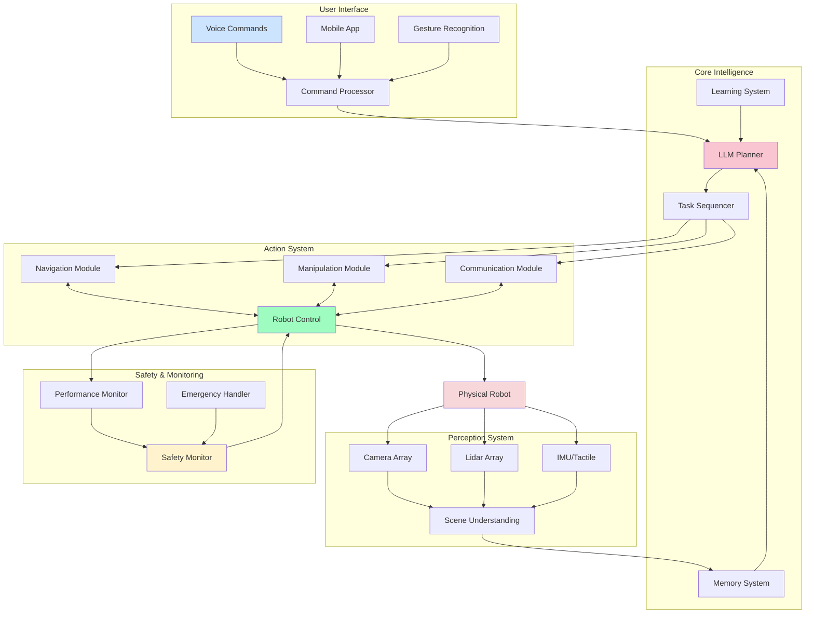
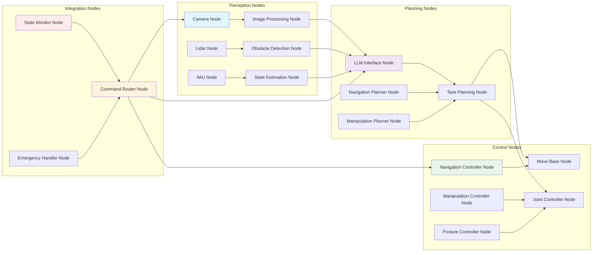
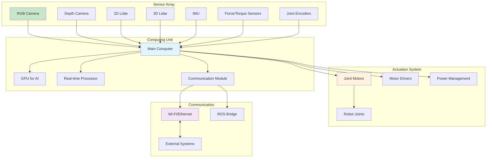
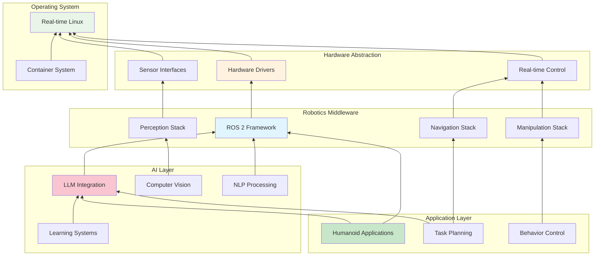

# Architecture Diagrams for Physical AI & Humanoid Robotics

This document contains the key architectural diagrams referenced throughout the textbook, showing the system architecture, component relationships, and data flows for the humanoid robotics system.

## System Architecture Overview

## Module 1: ROS 2 Architecture

## Module 2: Digital Twin Architecture

## Module 3: AI-Robot Brain Architecture

## Module 4: Vision-Language-Action (VLA) Architecture

## Complete Autonomous System Integration

## ROS 2 Node Architecture

## Hardware Architecture

## Software Stack Architecture

