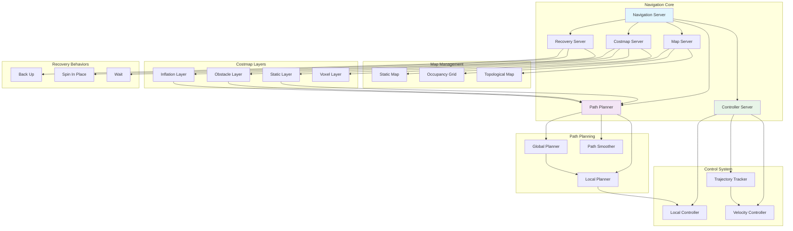
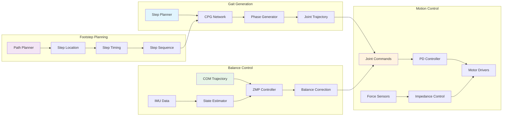
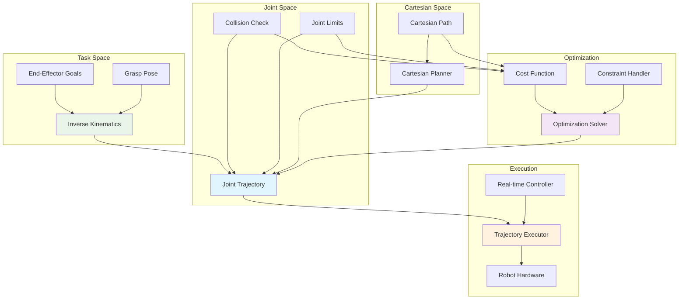
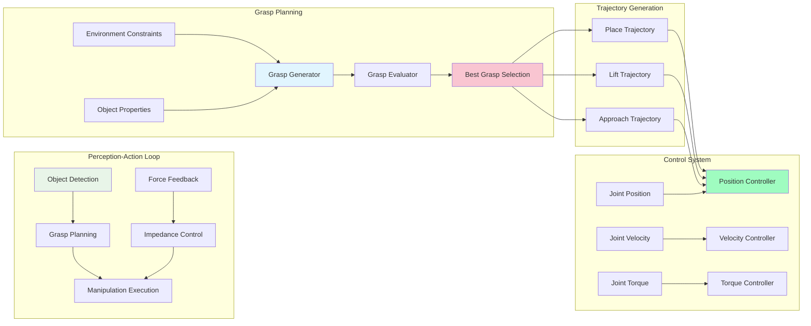
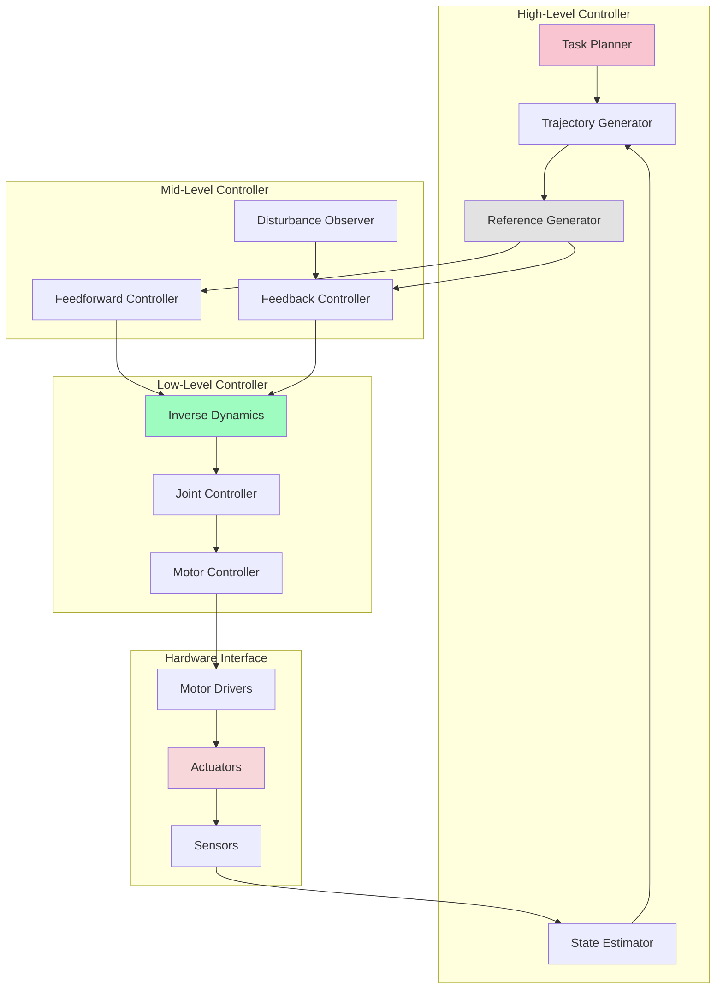
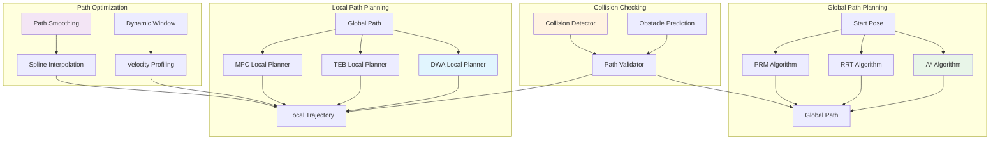
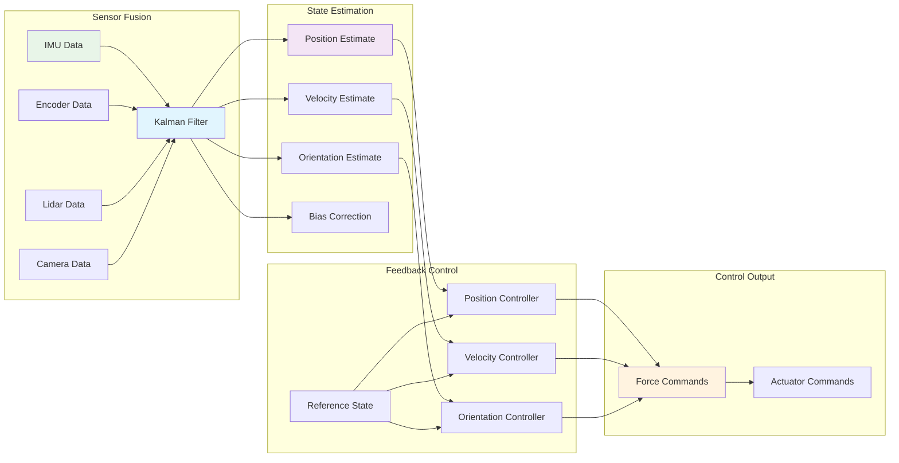
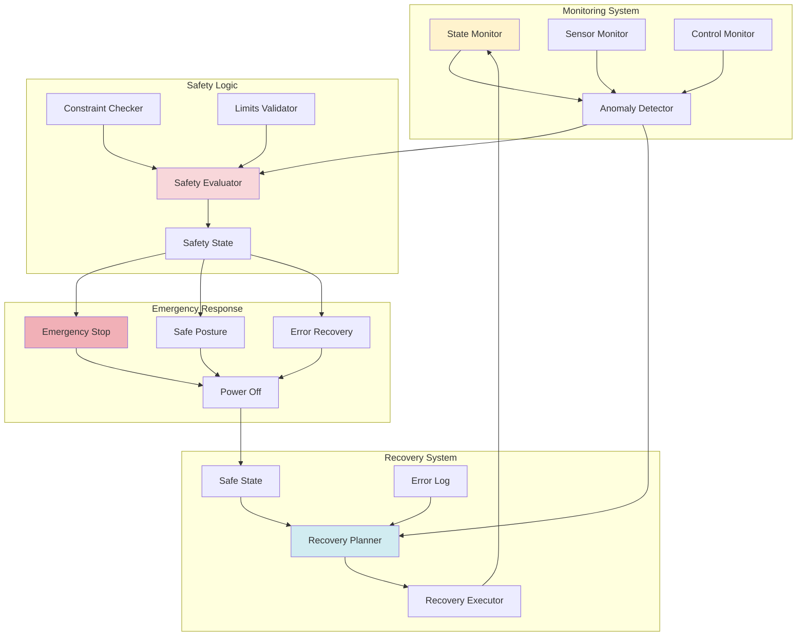
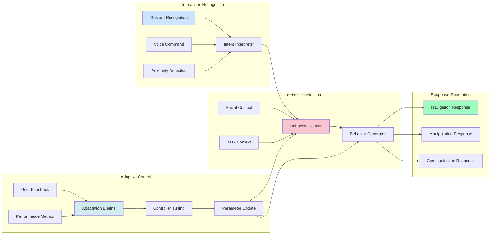

# Navigation and Control Architecture for Humanoid Robotics

This document details the navigation and control architecture for humanoid robots, including bipedal locomotion, path planning, and motion control systems.

## Navigation Stack Architecture

## Bipedal Locomotion Control

## Motion Planning Hierarchy

## Manipulation Control Architecture

## Control System Architecture

## Path Planning Algorithms

## State Estimation and Feedback

## Safety and Emergency Systems

## Human-Robot Interaction Control

