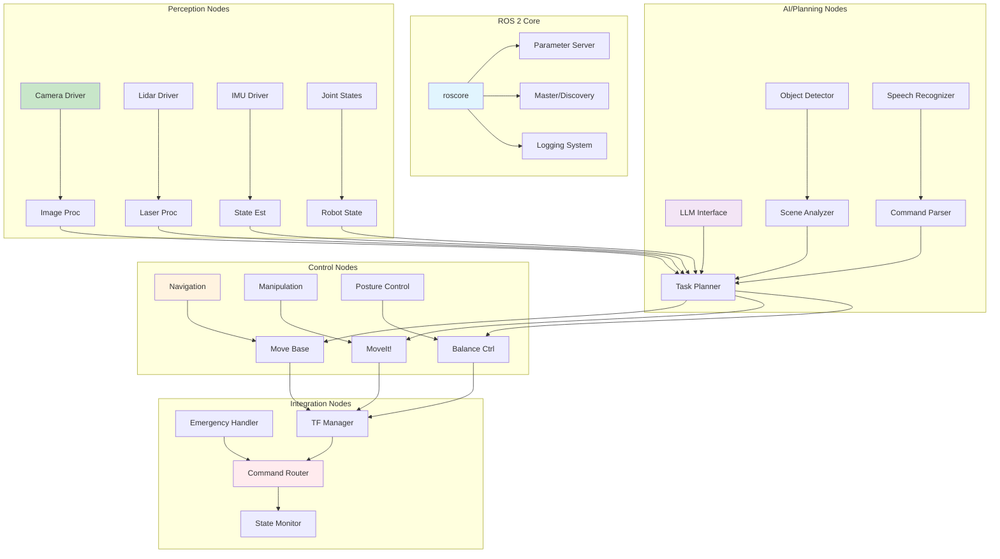
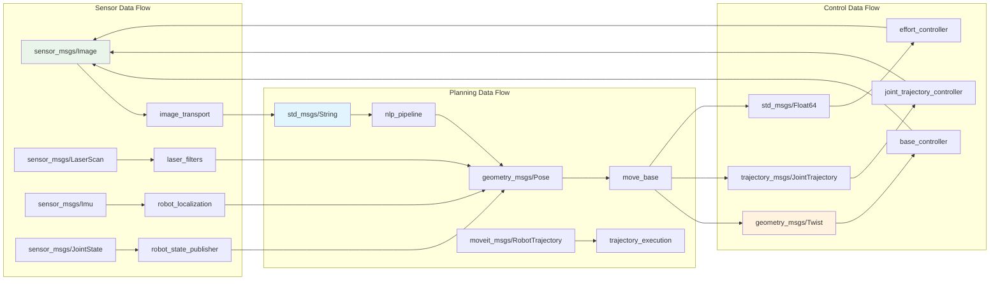
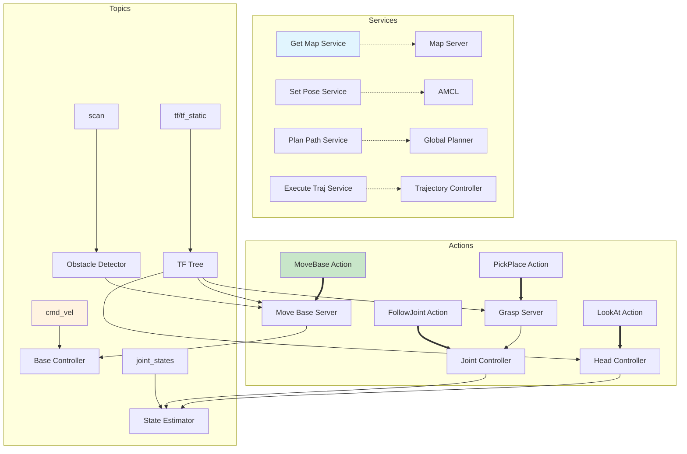
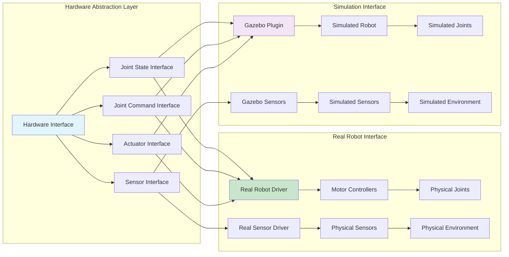
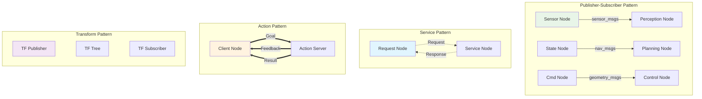
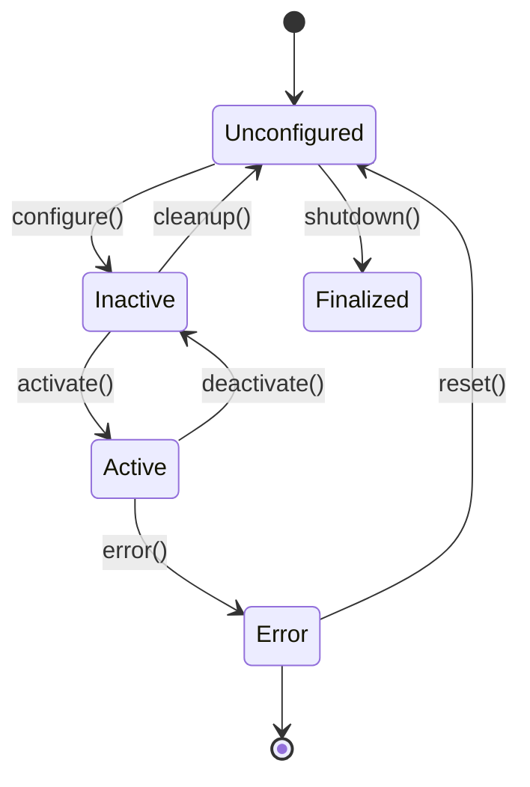
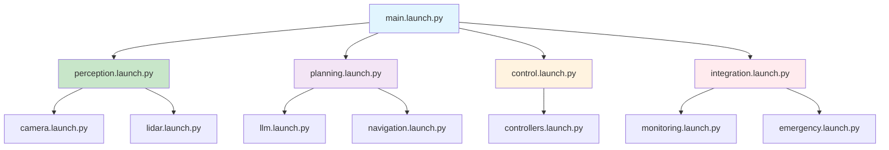
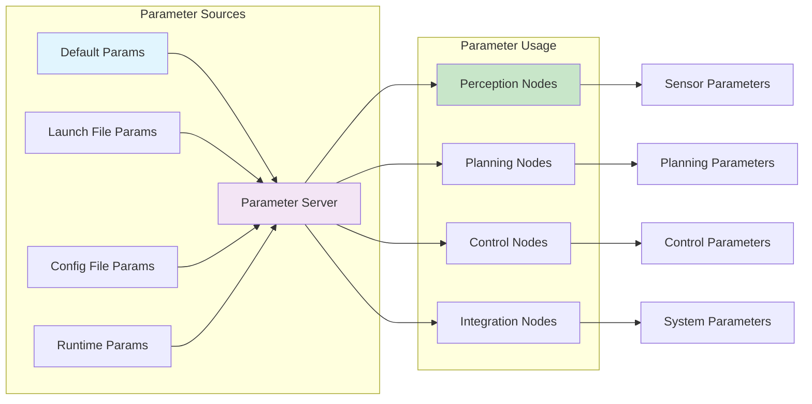

# ROS 2 Architecture for Humanoid Robotics

This document details the ROS 2 architecture specifically designed for humanoid robotics applications, covering the node structure, message passing, and system integration.

## ROS 2 Node Structure



## Message Flow Architecture



## Service and Action Architecture



## Hardware Interface Architecture



## Communication Patterns



## Node Lifecycle Management



## Package Organization

```
humanoid_robot/
├── perception/
│   ├── camera_driver/
│   ├── lidar_processing/
│   └── object_detection/
├── planning/
│   ├── task_planning/
│   ├── motion_planning/
│   └── llm_interface/
├── control/
│   ├── base_controller/
│   ├── joint_controllers/
│   └── balance_control/
├── integration/
│   ├── command_router/
│   ├── state_monitor/
│   └── emergency_handler/
└── utils/
    ├── tf_utils/
    ├── param_utils/
    └── diag_utils/
```

## Launch File Architecture



## Parameter Management

