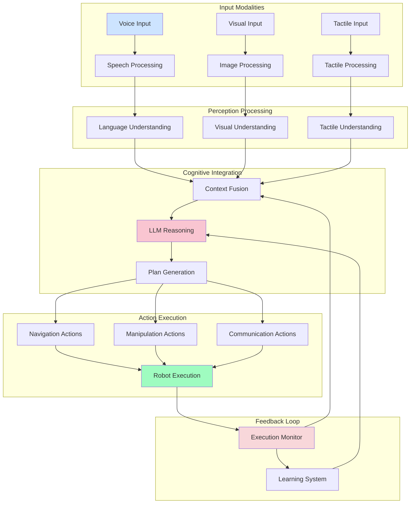
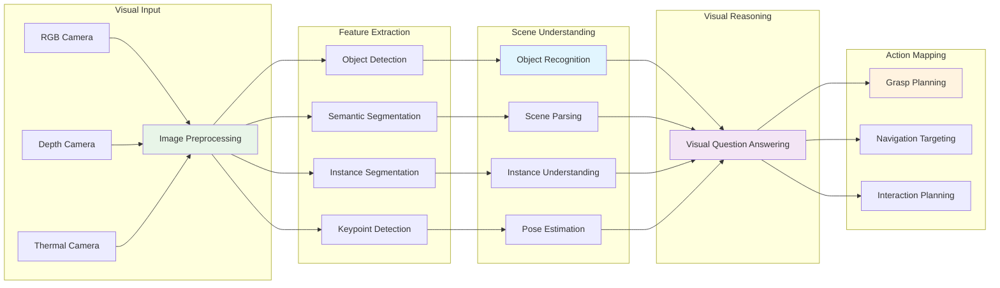
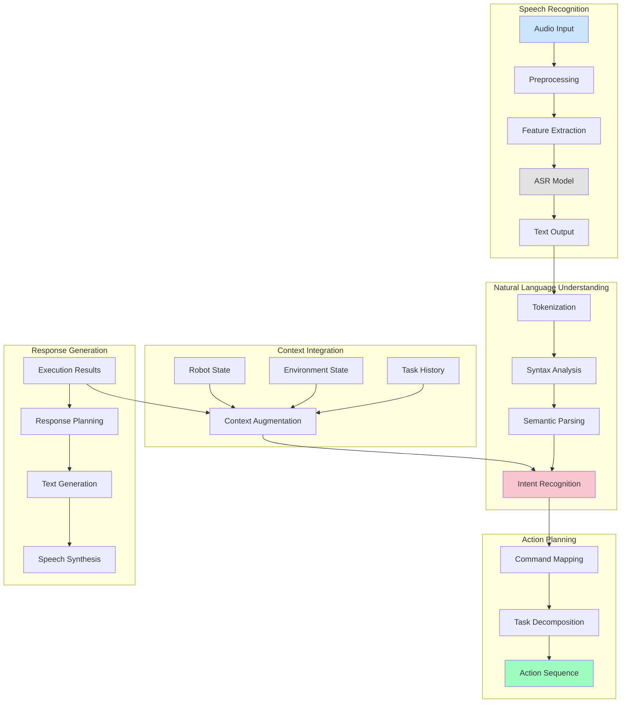
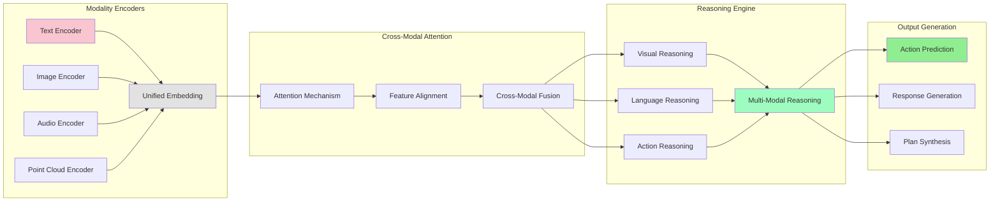
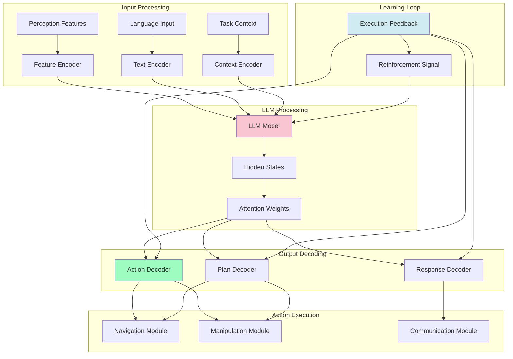
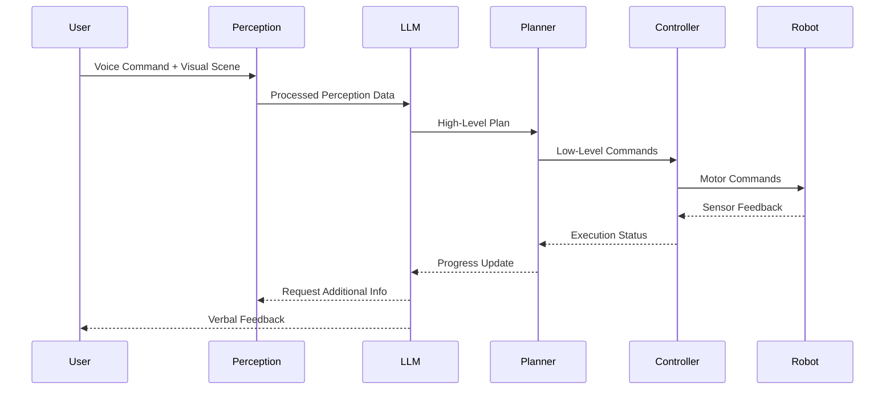
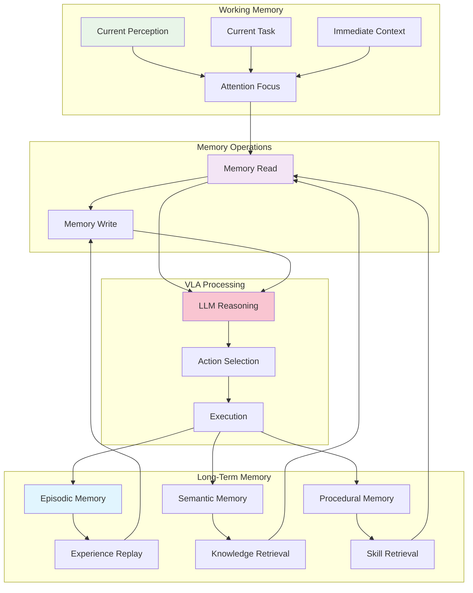
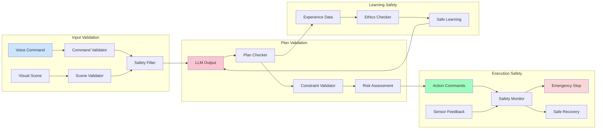
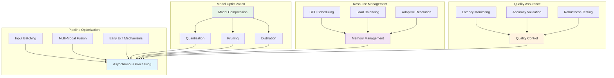
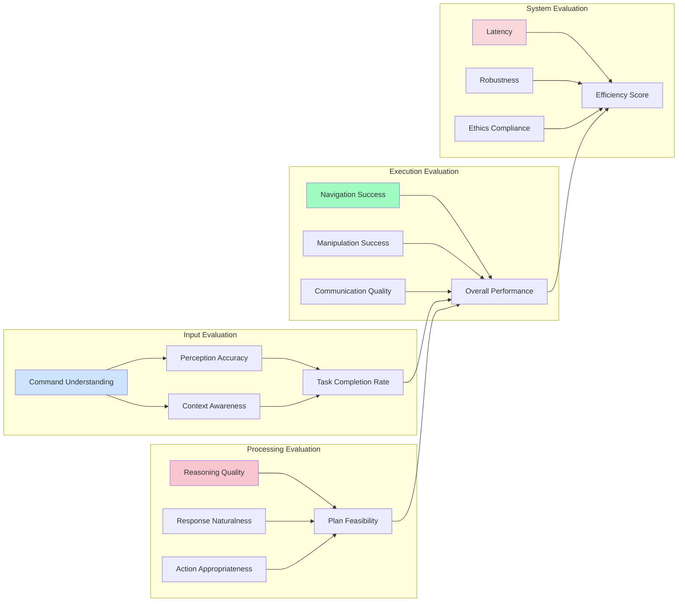

# Vision-Language-Action (VLA) Architecture

This document details the Vision-Language-Action architecture for humanoid robotics, integrating perception, language understanding, and action execution.

## VLA System Architecture

## Vision Processing Pipeline

## Language Processing Architecture

## Multimodal Fusion Architecture

## LLM Integration for VLA

## Real-Time VLA Pipeline

## Memory-Augmented VLA

## VLA Safety Architecture

## VLA Performance Optimization

## VLA Evaluation Framework

