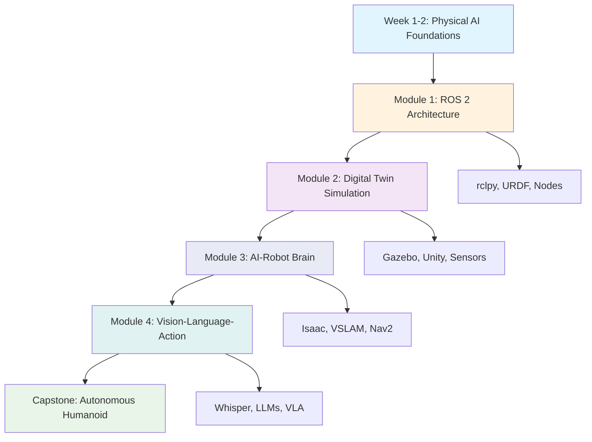

# Introduction to Physical AI & Humanoid Robotics

Welcome to the comprehensive 13-week course on Physical AI and Humanoid Robotics! This textbook will guide you through the complete stack of technologies needed to build intelligent humanoid robotic systems.

## Course Overview

This course is structured as a 13-week quarter program with four main modules:

- **Module 1: The Robotic Nervous System (Weeks 3-5)** - Learn ROS 2 architecture, nodes, topics, services, and Python integration with rclpy
- **Module 2: The Digital Twin (Weeks 6-7)** - Explore physics simulation in Gazebo and environment building in Unity
- **Module 3: The AI-Robot Brain (Weeks 8-10)** - Implement NVIDIA Isaac tools for VSLAM, navigation, and bipedal movement
- **Module 4: Vision-Language-Action (Weeks 11-13)** - Integrate voice commands, LLM-based planning, and complete an autonomous humanoid project

The course begins with two introductory weeks covering Physical AI foundations and sensor systems.

## What You'll Learn

By the end of this course, you will be able to:

- Design and implement complete humanoid robot systems using ROS 2
- Create and validate simulation environments using Gazebo and Unity
- Integrate NVIDIA Isaac tools for perception and navigation
- Build autonomous systems with voice commands and LLM-based planning
- Document and present technical implementations effectively

## Prerequisites

- Basic programming experience (Python preferred)
- Fundamental mathematics (calculus, linear algebra, probability)
- Basic understanding of robotics concepts (helpful but not required)

## Technology Stack

Throughout this course, you'll work with industry-standard tools:

- **Robotics Framework**: ROS 2 (Humble Hawksbill)
- **Simulation**: Gazebo, Unity
- **AI/ML**: NVIDIA Isaac Sim, Isaac ROS, OpenAI Whisper
- **Programming**: Python 3.8+

## Course Structure

Each week includes:
- Theoretical concepts and principles
- Practical implementation exercises
- Hands-on projects and assignments
- Assessment and feedback opportunities

## Course Architecture

The following diagram illustrates the overall architecture of the course and how the modules connect:

Let's begin your journey into Physical AI and Humanoid Robotics!