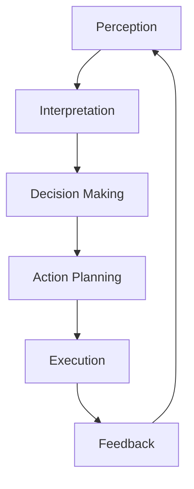

# Week 10: AI Decision Making and Bipedal Movement

## Learning Objectives

By the end of this week, you will be able to:
- Implement AI integration in robotic systems for decision making
- Design perception-action integration for humanoid robots
- Execute the Module 3 project: Autonomous navigation for humanoid robots
- Understand advanced control techniques for bipedal movement
- Evaluate and optimize AI-driven navigation systems

## AI Integration in Robotic Systems

### Overview of AI in Robotics

Artificial Intelligence has become a crucial component in modern robotics, especially for humanoid robots that need to operate in complex, dynamic environments. AI enables robots to:
- Process sensory information intelligently
- Make decisions in uncertain environments
- Learn from experience
- Adapt to new situations
- Plan complex behaviors

### Types of AI in Robotics

1. **Classical AI**: Rule-based systems, expert systems
2. **Machine Learning**: Supervised, unsupervised, and reinforcement learning
3. **Deep Learning**: Neural networks for perception and control
4. **Cognitive Architectures**: Integrated systems for reasoning and planning

## Perception-Action Integration

### The Perception-Action Cycle

The perception-action cycle is fundamental to intelligent robotic behavior:



### Integration Architecture

For humanoid robots, the perception-action integration involves:

1. **Sensory Processing**: Converting raw sensor data to meaningful information
2. **Situation Assessment**: Understanding the current environment and context
3. **Goal Selection**: Choosing appropriate goals based on current state
4. **Action Planning**: Generating sequences of actions to achieve goals
5. **Motor Control**: Executing actions with proper timing and coordination
6. **Monitoring**: Tracking execution and adapting as needed

### Implementation Example

```python
# perception_action_integration.py
import numpy as np
from geometry_msgs.msg import Twist, Point
from sensor_msgs.msg import LaserScan
from nav_msgs.msg import OccupancyGrid
from std_msgs.msg import String
import rclpy
from rclpy.node import Node

class PerceptionActionIntegrator(Node):
    def __init__(self):
        super().__init__('perception_action_integrator')

        # Publishers
        self.cmd_vel_pub = self.create_publisher(Twist, '/cmd_vel', 10)
        self.status_pub = self.create_publisher(String, '/ai_status', 10)

        # Subscribers
        self.scan_sub = self.create_subscription(
            LaserScan, '/scan', self.scan_callback, 10)
        self.odom_sub = self.create_subscription(
            String, '/robot_state', self.state_callback, 10)

        # Internal state
        self.scan_data = None
        self.robot_state = "idle"
        self.current_goal = None
        self.safety_threshold = 0.5  # meters

        # AI decision timer
        self.ai_timer = self.create_timer(0.2, self.ai_decision_cycle)

    def scan_callback(self, msg):
        """Process laser scan data"""
        self.scan_data = msg

    def state_callback(self, msg):
        """Update robot state"""
        self.robot_state = msg.data

    def ai_decision_cycle(self):
        """Main AI decision-making cycle"""
        if self.scan_data is None:
            return

        # 1. Analyze current situation
        situation = self.analyze_situation()

        # 2. Select appropriate goal
        goal = self.select_goal(situation)

        # 3. Plan action sequence
        action_sequence = self.plan_actions(situation, goal)

        # 4. Execute action
        self.execute_action(action_sequence)

    def analyze_situation(self):
        """Analyze current situation from sensor data"""
        situation = {
            'obstacles': self.detect_obstacles(),
            'clear_path': self.check_clear_path(),
            'robot_state': self.robot_state,
            'goal_reached': self.check_goal_reached()
        }
        return situation

    def detect_obstacles(self):
        """Detect obstacles from laser scan"""
        if not self.scan_data:
            return []

        obstacles = []
        for i, range_val in enumerate(self.scan_data.ranges):
            if 0.1 < range_val < self.safety_threshold:
                angle = i * self.scan_data.angle_increment + self.scan_data.angle_min
                # Convert polar to Cartesian coordinates
                x = range_val * np.cos(angle)
                y = range_val * np.sin(angle)
                obstacles.append(Point(x=x, y=y, z=0.0))

        return obstacles

    def check_clear_path(self):
        """Check if path ahead is clear"""
        if not self.scan_data:
            return False

        # Check front sector (±30 degrees)
        front_start = int((np.pi/6) / self.scan_data.angle_increment)
        front_end = int((5*np.pi/6) / self.scan_data.angle_increment)

        for i in range(front_start, front_end):
            if i < len(self.scan_data.ranges) and 0.1 < self.scan_data.ranges[i] < self.safety_threshold:
                return False
        return True

    def select_goal(self, situation):
        """Select appropriate goal based on situation"""
        if situation['goal_reached']:
            return "wait_for_new_goal"

        if not situation['clear_path'] and situation['obstacles']:
            return "avoid_obstacles"

        if situation['robot_state'] == "exploring":
            return "continue_exploration"

        return "move_forward"

    def plan_actions(self, situation, goal):
        """Plan sequence of actions to achieve goal"""
        if goal == "avoid_obstacles":
            return self.plan_obstacle_avoidance(situation)
        elif goal == "move_forward":
            return self.plan_forward_motion()
        elif goal == "continue_exploration":
            return self.plan_exploration()
        else:
            return []

    def plan_obstacle_avoidance(self, situation):
        """Plan obstacle avoidance actions"""
        # Find direction with maximum clearance
        max_clearance = 0
        best_angle = 0

        for i, range_val in enumerate(self.scan_data.ranges):
            if range_val > max_clearance:
                max_clearance = range_val
                best_angle = i * self.scan_data.angle_increment + self.scan_data.angle_min

        # Plan turn action
        return [
            {'type': 'turn', 'angle': best_angle, 'magnitude': 0.3},
            {'type': 'move', 'direction': 'forward', 'distance': 0.5}
        ]

    def plan_forward_motion(self):
        """Plan forward motion"""
        return [
            {'type': 'move', 'direction': 'forward', 'speed': 0.3}
        ]

    def plan_exploration(self):
        """Plan exploration actions"""
        return [
            {'type': 'move', 'direction': 'forward', 'speed': 0.2},
            {'type': 'scan', 'angle': 0.5}
        ]

    def execute_action(self, action_sequence):
        """Execute the planned action sequence"""
        for action in action_sequence:
            if action['type'] == 'move':
                cmd_vel = Twist()
                if action['direction'] == 'forward':
                    cmd_vel.linear.x = action.get('speed', 0.3)
                elif action['direction'] == 'backward':
                    cmd_vel.linear.x = -action.get('speed', 0.3)
                self.cmd_vel_pub.publish(cmd_vel)

            elif action['type'] == 'turn':
                cmd_vel = Twist()
                cmd_vel.angular.z = action['magnitude']
                self.cmd_vel_pub.publish(cmd_vel)

            # Publish status
            status_msg = String()
            status_msg.data = f"Executing: {action['type']}"
            self.status_pub.publish(status_msg)

    def check_goal_reached(self):
        """Check if current goal is reached (simplified)"""
        # In a real implementation, this would check actual goal position
        return False

def main(args=None):
    rclpy.init(args=args)
    node = PerceptionActionIntegrator()

    try:
        rclpy.spin(node)
    except KeyboardInterrupt:
        pass
    finally:
        node.destroy_node()
        rclpy.shutdown()

if __name__ == '__main__':
    main()
```

## Bipedal Movement Planning

### Challenges in Bipedal Locomotion

Bipedal movement presents unique challenges compared to wheeled or tracked robots:
- Balance maintenance during movement
- Dynamic stability control
- Footstep planning and execution
- Terrain adaptation
- Energy efficiency optimization

### Center of Mass (CoM) Control

The Center of Mass is critical for bipedal stability:

```python
# com_controller.py
class CenterOfMassController:
    def __init__(self):
        self.com_position = np.array([0.0, 0.0, 0.8])  # Initial CoM position
        self.com_velocity = np.array([0.0, 0.0, 0.0])
        self.com_acceleration = np.array([0.0, 0.0, 0.0])
        self.gravity = 9.81
        self.support_polygon = []  # Area where CoM must be maintained

    def update_com_dynamics(self, forces, dt):
        """Update CoM dynamics based on applied forces"""
        # Calculate acceleration from forces (F = ma)
        acceleration = forces / self.mass

        # Update velocity and position
        self.com_velocity += acceleration * dt
        self.com_position += self.com_velocity * dt

        # Apply gravity
        self.com_position[2] -= 0.5 * self.gravity * dt * dt

    def is_stable(self):
        """Check if CoM is within support polygon"""
        # Simplified stability check
        # In practice, this would use Zero Moment Point (ZMP) or other methods
        if not self.support_polygon:
            return False

        # Check if CoM projection is within support polygon
        return self.point_in_polygon(
            self.com_position[0:2],
            self.support_polygon
        )

    def point_in_polygon(self, point, polygon):
        """Check if point is inside polygon using ray casting"""
        x, y = point
        n = len(polygon)
        inside = False

        p1x, p1y = polygon[0]
        for i in range(1, n + 1):
            p2x, p2y = polygon[i % n]
            if y > min(p1y, p2y):
                if y <= max(p1y, p2y):
                    if x <= max(p1x, p2x):
                        if p1y != p2y:
                            xinters = (y - p1y) * (p2x - p1x) / (p2y - p1y) + p1x
                        if p1x == p2x or x <= xinters:
                            inside = not inside
            p1x, p1y = p2x, p2y

        return inside
```

### Walking Pattern Generation

```python
# walking_pattern_generator.py
class WalkingPatternGenerator:
    def __init__(self):
        self.step_length = 0.3  # meters
        self.step_width = 0.2   # meters
        self.step_height = 0.1  # meters
        self.step_duration = 1.0  # seconds

    def generate_walking_pattern(self, distance, direction="forward"):
        """Generate walking pattern for desired movement"""
        steps = []

        if direction == "forward":
            num_steps = int(distance / self.step_length)
            for i in range(num_steps):
                # Left foot step
                left_step = {
                    'foot': 'left',
                    'position': [i * self.step_length, self.step_width/2, 0],
                    'timing': i * self.step_duration
                }
                steps.append(left_step)

                # Right foot step
                right_step = {
                    'foot': 'right',
                    'position': [(i + 0.5) * self.step_length, -self.step_width/2, 0],
                    'timing': (i + 0.5) * self.step_duration
                }
                steps.append(right_step)

        return steps

    def generate_turn_pattern(self, angle, direction="left"):
        """Generate walking pattern for turning"""
        steps = []
        # Simplified turn generation
        # In practice, this would involve more complex gait patterns
        step_pairs = int(abs(angle) / 0.2)  # Approximate step size for turning

        for i in range(step_pairs):
            if direction == "left":
                # Left turn: step with right foot first
                steps.append({
                    'foot': 'right',
                    'position': [0, -self.step_width/2, 0],
                    'timing': i * self.step_duration,
                    'turn': True,
                    'direction': 'left'
                })
                steps.append({
                    'foot': 'left',
                    'position': [0, self.step_width/2, 0],
                    'timing': (i + 0.5) * self.step_duration,
                    'turn': True,
                    'direction': 'left'
                })

        return steps
```

## AI-Based Path Planning for Humanoids

### Cognitive Path Planning

Advanced path planning for humanoid robots incorporates cognitive elements:

```python
# cognitive_path_planner.py
class CognitivePathPlanner:
    def __init__(self):
        self.known_obstacles = {}
        self.traversable_areas = []
        self.path_preferences = {
            'shortest': 0.4,
            'safest': 0.3,
            'energy_efficient': 0.3
        }

    def plan_path(self, start, goal, environment_map):
        """Plan path considering multiple cognitive factors"""
        # Generate multiple potential paths
        path_options = self.generate_path_options(start, goal, environment_map)

        # Evaluate each path based on cognitive factors
        evaluated_paths = []
        for path in path_options:
            score = self.evaluate_path(path, environment_map)
            evaluated_paths.append((path, score))

        # Select best path based on evaluation
        best_path = max(evaluated_paths, key=lambda x: x[1])[0]
        return best_path

    def generate_path_options(self, start, goal, environment_map):
        """Generate multiple path options using different algorithms"""
        paths = []

        # A* path
        a_star_path = self.a_star_planning(start, goal, environment_map)
        paths.append(a_star_path)

        # Potential field path
        potential_path = self.potential_field_planning(start, goal, environment_map)
        paths.append(potential_path)

        # Visibility graph path
        visibility_path = self.visibility_graph_planning(start, goal, environment_map)
        paths.append(visibility_path)

        return paths

    def evaluate_path(self, path, environment_map):
        """Evaluate path based on cognitive factors"""
        # Calculate path length (shortest factor)
        length = self.calculate_path_length(path)
        length_score = 1.0 / (1.0 + length)  # Inverse relationship

        # Calculate safety (avoiding obstacles and risky areas)
        safety_score = self.calculate_safety_score(path, environment_map)

        # Calculate energy efficiency (smooth turns, minimal acceleration)
        energy_score = self.calculate_energy_score(path)

        # Weighted combination
        total_score = (
            self.path_preferences['shortest'] * length_score +
            self.path_preferences['safest'] * safety_score +
            self.path_preferences['energy_efficient'] * energy_score
        )

        return total_score

    def calculate_safety_score(self, path, environment_map):
        """Calculate safety score based on obstacle proximity"""
        safety_score = 1.0
        for point in path:
            min_distance = float('inf')
            # Check distance to known obstacles
            for obstacle_pos in self.known_obstacles.values():
                dist = np.linalg.norm(np.array(point) - np.array(obstacle_pos))
                min_distance = min(min_distance, dist)

            # Penalize for being too close to obstacles
            if min_distance < 0.5:  # 0.5m safety margin
                safety_score *= min_distance / 0.5

        return safety_score

    def calculate_energy_score(self, path):
        """Calculate energy efficiency based on path smoothness"""
        if len(path) < 2:
            return 1.0

        total_turns = 0
        for i in range(1, len(path) - 1):
            # Calculate change in direction
            prev_vec = np.array(path[i]) - np.array(path[i-1])
            next_vec = np.array(path[i+1]) - np.array(path[i])

            # Calculate angle between vectors
            cos_angle = np.dot(prev_vec, next_vec) / (
                np.linalg.norm(prev_vec) * np.linalg.norm(next_vec)
            )
            angle = np.arccos(np.clip(cos_angle, -1, 1))

            total_turns += angle

        # Penalize for excessive turning
        energy_score = max(0, 1.0 - total_turns / (2 * np.pi))
        return energy_score
```

## Module 3 Project: Autonomous Navigation

### Project Overview

The Module 3 project involves implementing an autonomous navigation system for a humanoid robot that:
1. Uses NVIDIA Isaac tools for perception
2. Integrates VSLAM for localization
3. Implements Nav2 for navigation
4. Demonstrates bipedal movement capabilities

### Project Requirements

1. **Perception System**: Implement visual SLAM for environment mapping
2. **Navigation System**: Use Nav2 with humanoid-specific configurations
3. **Control System**: Ensure stable bipedal locomotion during navigation
4. **AI Integration**: Implement decision-making for obstacle avoidance
5. **Simulation Testing**: Demonstrate functionality in Gazebo

### Implementation Structure

```python
# module3_project.py
import rclpy
from rclpy.node import Node
from geometry_msgs.msg import Twist, PoseStamped
from sensor_msgs.msg import LaserScan, Image, Imu
from nav_msgs.msg import Odometry
from std_msgs.msg import String
import cv2
from cv_bridge import CvBridge
import numpy as np
import math

class HumanoidNavigationProject(Node):
    def __init__(self):
        super().__init__('humanoid_navigation_project')

        # Publishers
        self.cmd_vel_pub = self.create_publisher(Twist, '/cmd_vel', 10)
        self.goal_pub = self.create_publisher(PoseStamped, '/goal_pose', 10)
        self.status_pub = self.create_publisher(String, '/project_status', 10)

        # Subscribers
        self.scan_sub = self.create_subscription(
            LaserScan, '/scan', self.scan_callback, 10)
        self.odom_sub = self.create_subscription(
            Odometry, '/odom', self.odom_callback, 10)
        self.imu_sub = self.create_subscription(
            Imu, '/imu', self.imu_callback, 10)
        self.image_sub = self.create_subscription(
            Image, '/camera/image_raw', self.image_callback, 10)

        # Internal components
        self.bridge = CvBridge()
        self.scan_data = None
        self.odom_data = None
        self.imu_data = None
        self.current_image = None

        # Navigation state
        self.current_pose = None
        self.current_goal = None
        self.navigation_state = "idle"  # idle, navigating, avoiding, reached
        self.balance_threshold = 0.1  # radian threshold for balance

        # Project phases
        self.phase = "setup"  # setup, exploration, navigation, completion
        self.exploration_goals = [
            (2.0, 0.0), (4.0, 2.0), (6.0, 0.0), (8.0, 2.0)
        ]
        self.current_goal_index = 0

        # Timers
        self.main_timer = self.create_timer(0.1, self.main_control_loop)
        self.status_timer = self.create_timer(2.0, self.publish_status)

    def scan_callback(self, msg):
        """Laser scan callback"""
        self.scan_data = msg

    def odom_callback(self, msg):
        """Odometry callback"""
        self.odom_data = msg
        self.current_pose = msg.pose.pose

    def imu_callback(self, msg):
        """IMU callback for balance monitoring"""
        self.imu_data = msg

    def image_callback(self, msg):
        """Camera image callback for visual SLAM"""
        try:
            self.current_image = self.bridge.imgmsg_to_cv2(msg, "bgr8")
        except Exception as e:
            self.get_logger().error(f'Error converting image: {e}')

    def main_control_loop(self):
        """Main project control loop"""
        if self.current_pose is None or self.scan_data is None:
            return

        # Check robot balance
        if self.imu_data:
            balance_ok = self.check_balance()
            if not balance_ok:
                self.emergency_stop()
                return

        # Execute current phase
        if self.phase == "setup":
            self.setup_phase()
        elif self.phase == "exploration":
            self.exploration_phase()
        elif self.phase == "navigation":
            self.navigation_phase()
        elif self.phase == "completion":
            self.completion_phase()

    def check_balance(self):
        """Check if robot is within balance thresholds"""
        if not self.imu_data:
            return True

        # Extract orientation from quaternion
        quat = self.imu_data.orientation
        roll, pitch, yaw = self.quaternion_to_euler(
            quat.x, quat.y, quat.z, quat.w)

        # Check if within balance thresholds
        return (abs(roll) < self.balance_threshold and
                abs(pitch) < self.balance_threshold)

    def quaternion_to_euler(self, x, y, z, w):
        """Convert quaternion to Euler angles"""
        # Roll (x-axis rotation)
        sinr_cosp = 2 * (w * x + y * z)
        cosr_cosp = 1 - 2 * (x * x + y * y)
        roll = math.atan2(sinr_cosp, cosr_cosp)

        # Pitch (y-axis rotation)
        sinp = 2 * (w * y - z * x)
        if abs(sinp) >= 1:
            pitch = math.copysign(math.pi / 2, sinp)  # Use 90 degrees if out of range
        else:
            pitch = math.asin(sinp)

        # Yaw (z-axis rotation)
        siny_cosp = 2 * (w * z + x * y)
        cosy_cosp = 1 - 2 * (y * y + z * z)
        yaw = math.atan2(siny_cosp, cosy_cosp)

        return roll, pitch, yaw

    def setup_phase(self):
        """Initial setup phase"""
        self.get_logger().info("Starting setup phase")

        # Initialize navigation parameters
        self.setup_navigation_parameters()

        # Transition to exploration
        self.phase = "exploration"
        self.navigation_state = "navigating"

    def setup_navigation_parameters(self):
        """Setup navigation parameters"""
        # Publish initial status
        status_msg = String()
        status_msg.data = "Setup complete, starting exploration"
        self.status_pub.publish(status_msg)

    def exploration_phase(self):
        """Exploration phase - visit predetermined locations"""
        if self.current_goal_index >= len(self.exploration_goals):
            # All exploration goals completed
            self.phase = "navigation"
            self.get_logger().info("Exploration phase completed")
            return

        current_goal = self.exploration_goals[self.current_goal_index]
        self.navigate_to_goal(current_goal)

        # Check if reached current goal
        if self.is_at_goal(current_goal):
            self.get_logger().info(f"Reached exploration goal {self.current_goal_index + 1}")
            self.current_goal_index += 1

    def navigate_to_goal(self, goal):
        """Navigate to specified goal"""
        if self.current_pose is None:
            return

        # Calculate direction to goal
        dx = goal[0] - self.current_pose.position.x
        dy = goal[1] - self.current_pose.position.y
        distance = math.sqrt(dx*dx + dy*dy)

        # Simple proportional controller
        cmd_vel = Twist()

        if distance > 0.3:  # 30cm tolerance
            # Calculate desired heading
            desired_yaw = math.atan2(dy, dx)
            current_yaw = self.get_yaw_from_quaternion(self.current_pose.orientation)

            # Calculate angular error
            angle_error = desired_yaw - current_yaw
            while angle_error > math.pi:
                angle_error -= 2 * math.pi
            while angle_error < -math.pi:
                angle_error += 2 * math.pi

            # Set velocities
            cmd_vel.linear.x = min(0.3, distance * 0.5)  # Proportional to distance
            cmd_vel.angular.z = max(-0.5, min(0.5, angle_error * 2.0))  # Proportional control

            # Check for obstacles
            if self.scan_data:
                min_range = min([r for r in self.scan_data.ranges if not math.isinf(r)])
                if min_range < 0.5:  # Obstacle ahead
                    cmd_vel.linear.x = 0.0
                    cmd_vel.angular.z = 0.5  # Turn to avoid

        self.cmd_vel_pub.publish(cmd_vel)

    def is_at_goal(self, goal):
        """Check if robot is at goal location"""
        if self.current_pose is None:
            return False

        dx = goal[0] - self.current_pose.position.x
        dy = goal[1] - self.current_pose.position.y
        distance = math.sqrt(dx*dx + dy*dy)

        return distance < 0.3  # 30cm tolerance

    def navigation_phase(self):
        """Navigation phase - autonomous navigation"""
        # For this project, we'll navigate to a final destination
        final_goal = (10.0, 0.0)

        if not self.is_at_goal(final_goal):
            self.navigate_to_goal(final_goal)
        else:
            self.phase = "completion"
            self.get_logger().info("Navigation phase completed")

    def completion_phase(self):
        """Project completion phase"""
        # Stop robot
        cmd_vel = Twist()
        self.cmd_vel_pub.publish(cmd_vel)

        # Publish completion status
        status_msg = String()
        status_msg.data = "Project completed successfully"
        self.status_pub.publish(status_msg)

    def get_yaw_from_quaternion(self, quat):
        """Extract yaw from quaternion"""
        siny_cosp = 2 * (quat.w * quat.z + quat.x * quat.y)
        cosy_cosp = 1 - 2 * (quat.y * quat.y + quat.z * quat.z)
        return math.atan2(siny_cosp, cosy_cosp)

    def emergency_stop(self):
        """Emergency stop for balance loss"""
        cmd_vel = Twist()
        self.cmd_vel_pub.publish(cmd_vel)

        status_msg = String()
        status_msg.data = "EMERGENCY STOP - Balance lost"
        self.status_pub.publish(status_msg)

    def publish_status(self):
        """Publish project status periodically"""
        status_msg = String()
        status_msg.data = f"Phase: {self.phase}, State: {self.navigation_state}"
        self.status_pub.publish(status_msg)

def main(args=None):
    rclpy.init(args=args)
    node = HumanoidNavigationProject()

    try:
        rclpy.spin(node)
    except KeyboardInterrupt:
        node.get_logger().info('Shutting down project node')
    finally:
        node.destroy_node()
        rclpy.shutdown()

if __name__ == '__main__':
    main()
```

## Advanced Control Techniques

### Model Predictive Control (MPC) for Humanoids

Model Predictive Control is particularly useful for humanoid robots due to its ability to handle constraints and optimize over a prediction horizon:

```python
# mpc_controller.py
import numpy as np
from scipy.optimize import minimize

class ModelPredictiveController:
    def __init__(self, prediction_horizon=10, control_horizon=5):
        self.prediction_horizon = prediction_horizon
        self.control_horizon = control_horizon
        self.robot_mass = 50.0  # kg
        self.gravity = 9.81

    def compute_control(self, current_state, reference_trajectory):
        """
        Compute optimal control using MPC
        current_state: [x, y, z, vx, vy, vz, roll, pitch, yaw, p_dot, theta_dot, psi_dot]
        """
        # Define optimization problem
        def cost_function(control_sequence):
            total_cost = 0.0

            # Predict future states based on control sequence
            state = current_state.copy()
            control_idx = 0

            for k in range(self.prediction_horizon):
                # Apply control
                if control_idx < len(control_sequence):
                    # Simplified dynamics model
                    state = self.predict_next_state(state, control_sequence[control_idx])
                    control_idx += 1
                else:
                    # Hold last control
                    state = self.predict_next_state(state, control_sequence[-1])

                # Calculate tracking cost
                ref_idx = min(k, len(reference_trajectory) - 1)
                ref_state = reference_trajectory[ref_idx]

                # Position tracking cost
                pos_error = state[:3] - ref_state[:3]
                total_cost += np.dot(pos_error, pos_error)

                # Velocity tracking cost
                vel_error = state[3:6] - ref_state[3:6]
                total_cost += 0.1 * np.dot(vel_error, vel_error)

            # Control effort penalty
            for u in control_sequence:
                total_cost += 0.01 * np.dot(u, u)

            return total_cost

        # Initial guess for control sequence
        initial_control = np.zeros(3 * self.control_horizon)  # 3D forces for each step

        # Optimize
        result = minimize(cost_function, initial_control, method='SLSQP')

        if result.success:
            # Return first control in sequence
            return result.x[:3]
        else:
            # Return zero control if optimization fails
            return np.zeros(3)

    def predict_next_state(self, state, control_input):
        """Predict next state based on current state and control input"""
        # Simplified humanoid dynamics model
        dt = 0.1  # time step

        # Extract state variables
        pos = state[:3]      # position [x, y, z]
        vel = state[3:6]     # velocity [vx, vy, vz]
        angles = state[6:9]  # orientation [roll, pitch, yaw]

        # Apply control forces
        acceleration = control_input / self.robot_mass

        # Update state (simplified Euler integration)
        new_vel = vel + acceleration * dt
        new_pos = pos + new_vel * dt

        # Gravity effect on z-axis
        new_vel[2] -= self.gravity * dt

        # Combine new state
        new_state = np.zeros_like(state)
        new_state[:3] = new_pos
        new_state[3:6] = new_vel
        new_state[6:9] = angles  # Keep orientation for now

        return new_state
```

## Performance Evaluation and Optimization

### Metrics for AI-Driven Navigation

Evaluate the performance of AI-driven navigation using:

1. **Navigation Success Rate**: Percentage of successful goal reaches
2. **Path Efficiency**: Actual path length vs. optimal path length
3. **Balance Maintenance**: Time spent within stability thresholds
4. **Obstacle Avoidance**: Success rate in avoiding obstacles
5. **Computation Time**: Average time for decision making

### Optimization Strategies

1. **Parameter Tuning**: Optimize controller parameters using techniques like Bayesian optimization
2. **Learning from Experience**: Implement reinforcement learning for continuous improvement
3. **Multi-Objective Optimization**: Balance competing objectives like speed and safety
4. **Real-time Adaptation**: Adjust parameters based on environmental conditions

## Best Practices for AI Integration

### Safety-First Approach

- Implement multiple safety layers and fallback mechanisms
- Use conservative safety margins in planning
- Monitor system health continuously
- Implement graceful degradation strategies

### Robustness Considerations

- Handle sensor failures gracefully
- Implement robust perception algorithms
- Use multiple sources of information when possible
- Design for worst-case scenarios

## Summary

This week focused on AI decision making and bipedal movement for humanoid robots. You learned about:
- AI integration in robotic systems
- Perception-action integration architectures
- Bipedal movement planning and control
- Cognitive path planning approaches
- The Module 3 project: Autonomous navigation system
- Advanced control techniques like MPC
- Performance evaluation and optimization

With this knowledge, you now have a comprehensive understanding of the AI-Robot Brain module, which forms the intelligence layer of humanoid robots.