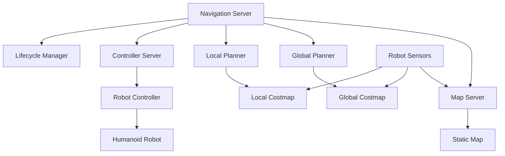

# Week 9: Navigation Systems

## Learning Objectives

By the end of this week, you will be able to:
- Understand the Nav2 framework for humanoid navigation
- Configure navigation parameters for bipedal movement
- Implement path planning and obstacle avoidance algorithms
- Integrate perception systems with navigation
- Test navigation in simulation environments

## Introduction to Nav2 for Humanoid Robots

Navigation is a critical capability for humanoid robots, enabling them to move autonomously through complex environments. The Navigation2 (Nav2) framework provides a comprehensive solution for robot navigation that can be adapted for bipedal robots.

### Key Differences from Wheeled Navigation

Humanoid navigation differs from traditional wheeled robot navigation in several ways:
- **Dynamic Stability**: Bipedal robots must maintain balance while moving
- **Footstep Planning**: Navigation must account for discrete footstep locations
- **Terrain Constraints**: Humanoid robots may have specific terrain requirements
- **Obstacle Clearance**: Need to consider the full 3D space occupied by the robot

## Nav2 Architecture Overview

### Core Components

The Nav2 system consists of several key components that work together to enable navigation:

1. **Navigation Server**: Main orchestrator that coordinates navigation tasks
2. **Map Server**: Provides static and costmap representations
3. **Local Planner**: Handles short-term path following and obstacle avoidance
4. **Global Planner**: Computes long-term path planning
5. **Controller Server**: Manages the control interface with the robot
6. **Lifecycle Manager**: Manages the lifecycle of navigation components

### Navigation Stack Components



## Setting Up Nav2 for Humanoid Robots

### Installation and Dependencies

```bash
# Install Nav2 packages
sudo apt update
sudo apt install ros-humble-navigation2 ros-humble-nav2-bringup
sudo apt install ros-humble-nav2-controller ros-humble-nav2-planners
sudo apt install ros-humble-nav2-utilities ros-humble-nav2-lifecycle-manager
```

### Configuration Files

Nav2 uses YAML configuration files to define the navigation parameters. For humanoid robots, we need to customize these parameters to account for bipedal movement:

```yaml
# nav2_params_humanoid.yaml
amcl:
  ros__parameters:
    use_sim_time: True
    alpha1: 0.2
    alpha2: 0.2
    alpha3: 0.2
    alpha4: 0.2
    alpha5: 0.2
    base_frame_id: "base_footprint"
    beam_skip_distance: 0.5
    beam_skip_error_threshold: 0.9
    beam_skip_threshold: 0.3
    do_beamskip: false
    global_frame_id: "map"
    lambda_short: 0.1
    laser_likelihood_max_dist: 2.0
    laser_max_range: 100.0
    laser_min_range: -1.0
    laser_model_type: "likelihood_field"
    max_beams: 60
    max_particles: 2000
    min_particles: 500
    odom_frame_id: "odom"
    pf_err: 0.05
    pf_z: 0.99
    recovery_alpha_fast: 0.0
    recovery_alpha_slow: 0.0
    resample_interval: 1
    robot_model_type: "nav2_amcl::DifferentialMotionModel"
    save_pose_rate: 0.5
    sigma_hit: 0.2
    tf_broadcast: true
    transform_tolerance: 1.0
    update_min_a: 0.2
    update_min_d: 0.25
    z_hit: 0.5
    z_max: 0.05
    z_rand: 0.5
    z_short: 0.05

bt_navigator:
  ros__parameters:
    use_sim_time: True
    global_frame: map
    robot_base_frame: base_footprint
    odom_topic: /odom
    default_bt_xml_filename: "navigate_w_replanning_and_recovery.xml"
    plugin_lib_names:
    - nav2_compute_path_to_pose_action_bt_node
    - nav2_follow_path_action_bt_node
    - nav2_back_up_action_bt_node
    - nav2_spin_action_bt_node
    - nav2_wait_action_bt_node
    - nav2_clear_costmap_service_bt_node
    - nav2_is_stuck_condition_bt_node
    - nav2_goal_reached_condition_bt_node
    - nav2_goal_updated_condition_bt_node
    - nav2_initial_pose_received_condition_bt_node
    - nav2_reinitialize_global_localization_service_bt_node
    - nav2_rate_controller_bt_node
    - nav2_distance_controller_bt_node
    - nav2_speed_controller_bt_node
    - nav2_truncate_path_action_bt_node
    - nav2_goal_updater_node_bt_node
    - nav2_recovery_node_bt_node
    - nav2_pipeline_sequence_bt_node
    - nav2_round_robin_node_bt_node
    - nav2_transform_available_condition_bt_node
    - nav2_time_expired_condition_bt_node
    - nav2_path_expiring_timer_condition
    - nav2_distance_traveled_condition_bt_node
    - nav2_single_trigger_bt_node
    - nav2_is_battery_low_condition_bt_node
    - nav2_navigate_through_poses_action_bt_node
    - nav2_navigate_to_pose_action_bt_node
    - nav2_remove_passed_goals_action_bt_node
    - nav2_planner_selector_bt_node
    - nav2_controller_selector_bt_node
    - nav2_goal_checker_selector_bt_node

controller_server:
  ros__parameters:
    use_sim_time: True
    controller_frequency: 20.0
    min_x_velocity_threshold: 0.001
    min_y_velocity_threshold: 0.5
    min_theta_velocity_threshold: 0.001
    progress_checker_plugin: "progress_checker"
    goal_checker_plugin: "goal_checker"
    controller_plugins: ["FollowPath"]

    # Humanoid-specific controller
    FollowPath:
      plugin: "nav2_mppi_controller::MPPIController"
      time_steps: 50
      model_dt: 0.05
      batch_size: 1000
      vx_std: 0.2
      vy_std: 0.1
      wz_std: 0.3
      vx_max: 0.8
      vx_min: -0.3
      vy_max: 1.0
      wz_max: 1.5
      xy_goal_tolerance: 0.25
      yaw_goal_tolerance: 0.25
      stateful: true
      model_plugin_name: "HumanoidModel"
      critic_names: ["BaseObstacleCritic", "GoalCritic", "PathAlignCritic", "PreferForwardCritic"]

      BaseObstacleCritic:
        cost_scaling_factor: 1.0
        inflation_cost_scaling_factor: 0.8
        obstacle_clearance: 0.25
        max_scaling_dist: 0.5

      GoalCritic:
        goal_dist_thresh: 1.0
        xy_goal_scale: 2.0
        yaw_goal_scale: 0.5

      PathAlignCritic:
        cost_power: 2
        cost_scaling_factor: 2.0
        threshold_to_consider: 1.0
        long_term_xy_scale: 1.0
        global_xy_scale: 1.0
        global_angle_scale: 0.5
        current_heading_scale: 2.0
        angle_align_wt: 2.0

      PreferForwardCritic:
        cost_power: 2
        cost_scaling_factor: 2.0
        threshold_to_consider: 0.5

local_costmap:
  local_costmap:
    ros__parameters:
      update_frequency: 5.0
      publish_frequency: 2.0
      global_frame: odom
      robot_base_frame: base_footprint
      use_sim_time: True
      rolling_window: true
      width: 6
      height: 6
      resolution: 0.05
      robot_radius: 0.3
      plugins: ["obstacle_layer", "inflation_layer"]
      inflation_layer:
        plugin: "nav2_costmap_2d::InflationLayer"
        cost_scaling_factor: 3.0
        inflation_radius: 0.55
      obstacle_layer:
        plugin: "nav2_costmap_2d::ObstacleLayer"
        enabled: True
        observation_sources: scan
        scan:
          topic: /scan
          max_obstacle_height: 2.0
          clearing: True
          marking: True
          data_type: "LaserScan"
          raytrace_max_range: 3.0
          raytrace_min_range: 0.0
          obstacle_max_range: 2.5
          obstacle_min_range: 0.0
      always_send_full_costmap: False

global_costmap:
  global_costmap:
    ros__parameters:
      update_frequency: 1.0
      publish_frequency: 1.0
      global_frame: map
      robot_base_frame: base_footprint
      use_sim_time: True
      robot_radius: 0.3
      resolution: 0.05
      plugins: ["static_layer", "obstacle_layer", "inflation_layer"]
      obstacle_layer:
        plugin: "nav2_costmap_2d::ObstacleLayer"
        enabled: True
        observation_sources: scan
        scan:
          topic: /scan
          max_obstacle_height: 2.0
          clearing: True
          marking: True
          data_type: "LaserScan"
          raytrace_max_range: 3.0
          raytrace_min_range: 0.0
          obstacle_max_range: 2.5
          obstacle_min_range: 0.0
      static_layer:
        plugin: "nav2_costmap_2d::StaticLayer"
        map_subscribe_transient_local: True
      inflation_layer:
        plugin: "nav2_costmap_2d::InflationLayer"
        cost_scaling_factor: 3.0
        inflation_radius: 0.55
      always_send_full_costmap: False

planner_server:
  ros__parameters:
    use_sim_time: True
    planner_plugins: ["GridBased"]
    GridBased:
      plugin: "nav2_navfn_planner::NavfnPlanner"
      tolerance: 0.5
      use_astar: false
      allow_unknown: true
```

## Path Planning for Bipedal Robots

### Footstep Planning

For humanoid robots, path planning must consider the discrete nature of footstep placement. The footstep planner generates a sequence of foot positions that the robot can execute while maintaining balance.

```python
# footstep_planner.py
import numpy as np
from geometry_msgs.msg import Point

class FootstepPlanner:
    def __init__(self):
        self.step_length = 0.3  # meters
        self.step_width = 0.2   # meters
        self.max_step_height = 0.1  # meters

    def plan_footsteps(self, path, robot_pose):
        """
        Plan footstep positions along a given path
        """
        footsteps = []

        # Start with current robot pose
        current_left_foot = self.calculate_initial_left_foot(robot_pose)
        current_right_foot = self.calculate_initial_right_foot(robot_pose)

        # Alternate footsteps based on path direction
        for i, waypoint in enumerate(path):
            if i % 2 == 0:  # Left foot step
                foot_pos = self.calculate_next_foot_position(
                    current_left_foot, waypoint, 'left')
                footsteps.append(('left', foot_pos))
                current_left_foot = foot_pos
            else:  # Right foot step
                foot_pos = self.calculate_next_foot_position(
                    current_right_foot, waypoint, 'right')
                footsteps.append(('right', foot_pos))
                current_right_foot = foot_pos

        return footsteps

    def calculate_next_foot_position(self, current_foot, target, foot_type):
        """
        Calculate the next foot position based on target and current position
        """
        # Simplified calculation - in practice, this would be more complex
        direction = np.array([target.x - current_foot.x,
                             target.y - current_foot.y])
        distance = np.linalg.norm(direction)

        if distance > self.step_length:
            direction = direction / distance  # Normalize
            step_distance = min(self.step_length, distance)
            new_pos = Point()
            new_pos.x = current_foot.x + direction[0] * step_distance
            new_pos.y = current_foot.y + direction[1] * step_distance
            new_pos.z = target.z  # Maintain height
            return new_pos
        else:
            return target
```

### Dynamic Path Planning

Dynamic path planning for humanoid robots must consider:
- Balance constraints
- Terrain traversability
- Step height limitations
- Gait pattern stability

## Obstacle Avoidance for Humanoid Robots

### Humanoid-Specific Obstacle Considerations

Humanoid robots face unique obstacle challenges:
- Need to consider 3D space (height restrictions)
- Footstep planning around obstacles
- Balance recovery when avoiding obstacles
- Collision avoidance for upper body

### Collision Avoidance Implementation

```python
# collision_avoider.py
import math
from geometry_msgs.msg import Twist

class HumanoidCollisionAvoider:
    def __init__(self, robot_radius=0.3, safety_margin=0.2):
        self.robot_radius = robot_radius
        self.safety_margin = safety_margin
        self.min_obstacle_distance = robot_radius + safety_margin

    def avoid_obstacles(self, laser_scan, current_velocity):
        """
        Adjust velocity to avoid obstacles
        """
        min_distance = float('inf')
        closest_angle = 0

        # Find closest obstacle in scan
        for i, range_val in enumerate(laser_scan.ranges):
            if range_val < min_distance and not math.isinf(range_val):
                min_distance = range_val
                closest_angle = i * laser_scan.angle_increment + laser_scan.angle_min

        # Adjust velocity based on obstacle proximity
        if min_distance < self.min_obstacle_distance:
            # Slow down or stop based on proximity
            reduction_factor = min_distance / self.min_obstacle_distance
            new_velocity = Twist()
            new_velocity.linear.x = current_velocity.linear.x * reduction_factor * 0.5
            new_velocity.angular.z = current_velocity.angular.z
            return new_velocity
        else:
            # Check if we need to turn away from obstacles
            left_obstacle = self.check_sector_obstacles(
                laser_scan, -math.pi/4, math.pi/4)
            right_obstacle = self.check_sector_obstacles(
                laser_scan, -math.pi/2, -math.pi/4)

            if left_obstacle and not right_obstacle:
                # Turn right to avoid left obstacles
                new_velocity = Twist()
                new_velocity.linear.x = current_velocity.linear.x * 0.7
                new_velocity.angular.z = -0.5  # Turn right
                return new_velocity
            elif right_obstacle and not left_obstacle:
                # Turn left to avoid right obstacles
                new_velocity = Twist()
                new_velocity.linear.x = current_velocity.linear.x * 0.7
                new_velocity.angular.z = 0.5  # Turn left
                return new_velocity

        # No adjustments needed
        return current_velocity

    def check_sector_obstacles(self, laser_scan, start_angle, end_angle):
        """
        Check if there are obstacles in a specific angular sector
        """
        for i, range_val in enumerate(laser_scan.ranges):
            angle = i * laser_scan.angle_increment + laser_scan.angle_min
            if start_angle <= angle <= end_angle:
                if range_val < self.min_obstacle_distance and not math.isinf(range_val):
                    return True
        return False
```

## Integration with Perception Systems

### Sensor Fusion for Navigation

Navigation systems must integrate data from multiple sensors:
- LIDAR for obstacle detection
- IMU for balance information
- Cameras for visual navigation
- Joint encoders for step tracking

### Perception-Navigation Interface

```python
# perception_nav_interface.py
from sensor_msgs.msg import LaserScan, Image
from nav_msgs.msg import OccupancyGrid
from geometry_msgs.msg import PoseWithCovarianceStamped

class PerceptionNavigationInterface:
    def __init__(self):
        self.local_map = None
        self.global_map = None
        self.robot_pose = None

    def update_local_map(self, laser_scan):
        """
        Update local costmap based on laser scan data
        """
        # Process laser scan to create local occupancy grid
        local_grid = self.process_laser_scan(laser_scan)
        self.local_map = local_grid

    def update_global_map(self, global_map_msg):
        """
        Update global map from SLAM or static map
        """
        self.global_map = global_map_msg

    def get_traversable_area(self):
        """
        Determine traversable areas based on perception data
        """
        if self.local_map is not None:
            traversable = []
            for i, cell in enumerate(self.local_map.data):
                if cell < 50:  # Threshold for obstacle (0-100 scale)
                    x, y = self.map_index_to_world(i, self.local_map)
                    traversable.append((x, y))
            return traversable
        return []

    def process_laser_scan(self, scan):
        """
        Process laser scan to create local occupancy grid
        """
        # Simplified processing - in practice, this would be more sophisticated
        grid_resolution = 0.1  # meters per cell
        grid_size = 20  # cells per side (2m x 2m area)

        occupancy_grid = OccupancyGrid()
        occupancy_grid.header.frame_id = "map"
        occupancy_grid.info.resolution = grid_resolution
        occupancy_grid.info.width = grid_size
        occupancy_grid.info.height = grid_size
        occupancy_grid.info.origin.position.x = -grid_size * grid_resolution / 2
        occupancy_grid.info.origin.position.y = -grid_size * grid_resolution / 2

        # Initialize grid with unknown values
        occupancy_grid.data = [-1] * (grid_size * grid_size)

        return occupancy_grid
```

## Practical Example: Humanoid Navigation in Gazebo

Let's create a complete example that demonstrates navigation for a humanoid robot in simulation:

```python
# humanoid_navigation_demo.py
import rclpy
from rclpy.node import Node
from geometry_msgs.msg import Twist, PoseStamped
from nav_msgs.msg import Odometry
from sensor_msgs.msg import LaserScan
import tf2_ros
import math

class HumanoidNavigationDemo(Node):
    def __init__(self):
        super().__init__('humanoid_navigation_demo')

        # Publishers
        self.cmd_vel_pub = self.create_publisher(Twist, '/cmd_vel', 10)
        self.goal_pub = self.create_publisher(PoseStamped, '/goal_pose', 10)

        # Subscribers
        self.odom_sub = self.create_subscription(
            Odometry, '/odom', self.odom_callback, 10)
        self.scan_sub = self.create_subscription(
            LaserScan, '/scan', self.scan_callback, 10)

        # TF buffer for transforms
        self.tf_buffer = tf2_ros.Buffer()
        self.tf_listener = tf2_ros.TransformListener(self.tf_buffer, self)

        # Robot state
        self.current_pose = None
        self.current_twist = None
        self.scan_data = None

        # Navigation parameters
        self.linear_speed = 0.3
        self.angular_speed = 0.5
        self.goal_tolerance = 0.5

        # Timer for navigation loop
        self.nav_timer = self.create_timer(0.1, self.navigation_loop)

    def odom_callback(self, msg):
        """Callback for odometry data"""
        self.current_pose = msg.pose.pose
        self.current_twist = msg.twist.twist

    def scan_callback(self, msg):
        """Callback for laser scan data"""
        self.scan_data = msg

    def navigation_loop(self):
        """Main navigation control loop"""
        if self.current_pose is None or self.scan_data is None:
            return

        # Simple navigation to fixed goal (x=5, y=5)
        goal_x, goal_y = 5.0, 5.0

        # Calculate distance to goal
        dx = goal_x - self.current_pose.position.x
        dy = goal_y - self.current_pose.position.y
        distance_to_goal = math.sqrt(dx*dx + dy*dy)

        # Check if goal reached
        if distance_to_goal < self.goal_tolerance:
            self.stop_robot()
            self.get_logger().info('Goal reached!')
            return

        # Calculate desired orientation
        desired_yaw = math.atan2(dy, dx)
        current_yaw = self.get_yaw_from_quaternion(self.current_pose.orientation)

        # Calculate angular error
        angle_error = desired_yaw - current_yaw
        # Normalize angle to [-pi, pi]
        while angle_error > math.pi:
            angle_error -= 2 * math.pi
        while angle_error < -math.pi:
            angle_error += 2 * math.pi

        # Create velocity command
        cmd_vel = Twist()

        # Simple proportional control for orientation
        if abs(angle_error) > 0.1:  # 0.1 rad tolerance
            cmd_vel.angular.z = max(-self.angular_speed,
                                  min(self.angular_speed,
                                      angle_error * 2.0))
        else:
            # Move forward if oriented correctly
            cmd_vel.linear.x = min(self.linear_speed, distance_to_goal)

        # Check for obstacles and adjust
        if self.scan_data:
            min_range = min(self.scan_data.ranges)
            if min_range < 0.5:  # Obstacle too close
                cmd_vel.linear.x = 0.0
                cmd_vel.angular.z = 0.5  # Turn to avoid

        self.cmd_vel_pub.publish(cmd_vel)

    def get_yaw_from_quaternion(self, quat):
        """Extract yaw from quaternion"""
        siny_cosp = 2 * (quat.w * quat.z + quat.x * quat.y)
        cosy_cosp = 1 - 2 * (quat.y * quat.y + quat.z * quat.z)
        return math.atan2(siny_cosp, cosy_cosp)

    def stop_robot(self):
        """Stop the robot"""
        cmd_vel = Twist()
        self.cmd_vel_pub.publish(cmd_vel)

def main(args=None):
    rclpy.init(args=args)
    node = HumanoidNavigationDemo()

    try:
        rclpy.spin(node)
    except KeyboardInterrupt:
        pass
    finally:
        node.destroy_node()
        rclpy.shutdown()

if __name__ == '__main__':
    main()
```

## Launch Configuration for Navigation

Create a launch file to start the navigation stack:

```xml
<!-- humanoid_nav.launch.py -->
from launch import LaunchDescription
from launch.actions import DeclareLaunchArgument
from launch.substitutions import LaunchConfiguration
from launch_ros.actions import Node
from nav2_common.launch import RewrittenYaml

def generate_launch_description():
    use_sim_time = LaunchConfiguration('use_sim_time')

    lifecycle_nodes = ['controller_server',
                       'planner_server',
                       'recoveries_server',
                       'bt_navigator',
                       'waypoint_follower']

    return LaunchDescription([
        DeclareLaunchArgument(
            'use_sim_time',
            default_value='True',
            description='Use simulation (Gazebo) clock if true'),

        Node(
            package='nav2_controller',
            executable='controller_server',
            output='screen',
            parameters=[{'use_sim_time': use_sim_time}]),

        Node(
            package='nav2_planner',
            executable='planner_server',
            output='screen',
            parameters=[{'use_sim_time': use_sim_time}]),

        Node(
            package='nav2_recoveries',
            executable='recoveries_server',
            output='screen',
            parameters=[{'use_sim_time': use_sim_time}]),

        Node(
            package='nav2_bt_navigator',
            executable='bt_navigator',
            output='screen',
            parameters=[{'use_sim_time': use_sim_time}]),

        Node(
            package='nav2_waypoint_follower',
            executable='waypoint_follower',
            output='screen',
            parameters=[{'use_sim_time': use_sim_time}]),

        Node(
            package='nav2_lifecycle_manager',
            executable='lifecycle_manager',
            name='lifecycle_manager',
            output='screen',
            parameters=[{'use_sim_time': use_sim_time},
                       {'autostart': True},
                       {'node_names': lifecycle_nodes}]),
    ])
```

## Testing and Validation

### Simulation Testing

Test navigation in Gazebo with various scenarios:
- Static obstacle avoidance
- Dynamic obstacle avoidance
- Path following accuracy
- Balance maintenance during navigation

### Performance Metrics

Monitor navigation performance using:
- Time to reach goal
- Path efficiency (actual distance vs. optimal path)
- Obstacle avoidance success rate
- Robot stability during navigation

## Best Practices for Humanoid Navigation

### Safety Considerations
- Implement emergency stop functionality
- Monitor robot balance during navigation
- Validate footstep plans before execution
- Use appropriate safety margins

### Performance Optimization
- Optimize costmap resolution for your robot
- Tune controller parameters for humanoid dynamics
- Implement efficient path planning algorithms
- Use appropriate sensor fusion techniques

## Summary

This week covered navigation systems for humanoid robots using the Nav2 framework. You learned about:
- Nav2 architecture and components
- Configuration for humanoid-specific navigation
- Footstep planning for bipedal movement
- Obstacle avoidance techniques
- Integration with perception systems
- Practical implementation in simulation

Next week, we'll continue with AI decision making and advanced navigation techniques.