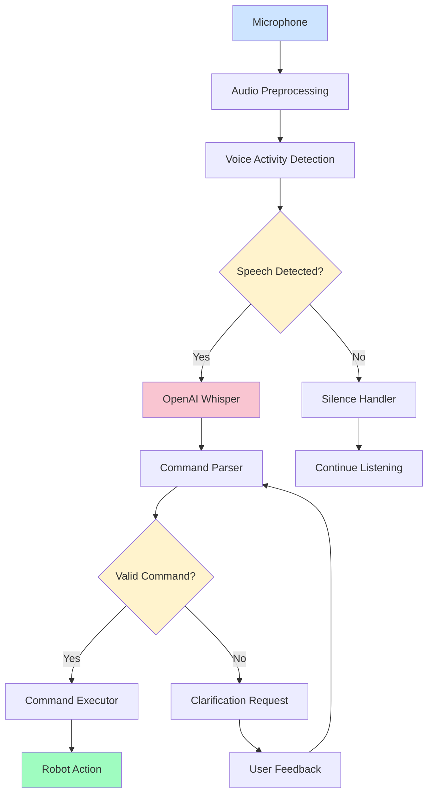

# Week 11: Voice Command Systems

## Learning Objectives

By the end of this week, you will be able to:
- Integrate OpenAI Whisper for voice command recognition
- Process and interpret voice commands for humanoid robots
- Implement natural language understanding for robot commands
- Create robust voice command processing pipelines
- Handle voice command errors and ambiguities

## Introduction to Voice Command Systems

Voice command systems enable natural human-robot interaction by allowing users to control robots using spoken language. For humanoid robots, voice command systems are particularly important as they enable intuitive interaction without requiring physical interfaces.

### Key Components of Voice Command Systems

1. **Speech Recognition**: Converting speech to text
2. **Natural Language Understanding**: Interpreting the meaning of commands
3. **Command Mapping**: Translating understood commands to robot actions
4. **Feedback Generation**: Providing confirmation and status to users

## OpenAI Whisper Integration

### Overview of Whisper

OpenAI Whisper is a state-of-the-art speech recognition model that can convert speech to text with high accuracy. It supports multiple languages and can handle various accents and background noise conditions.

### Installation and Setup

```bash
# Install Whisper and related dependencies
pip install openai-whisper
pip install pyaudio  # For audio capture
pip install soundfile  # For audio file handling
```

### Basic Whisper Usage

```python
import whisper
import torch

# Load the Whisper model
model = whisper.load_model("base")  # Options: tiny, base, small, medium, large

# Transcribe audio file
result = model.transcribe("command.wav")
print(result["text"])
```

### Real-time Voice Processing

```python
# voice_processor.py
import pyaudio
import wave
import numpy as np
import whisper
import threading
import queue
import time
from std_msgs.msg import String
import rclpy
from rclpy.node import Node

class VoiceCommandProcessor(Node):
    def __init__(self):
        super().__init__('voice_command_processor')

        # Publisher for recognized commands
        self.command_pub = self.create_publisher(String, '/voice_command', 10)

        # Initialize Whisper model
        self.get_logger().info('Loading Whisper model...')
        self.model = whisper.load_model("base")
        self.get_logger().info('Whisper model loaded successfully')

        # Audio parameters
        self.chunk = 1024
        self.format = pyaudio.paInt16
        self.channels = 1
        self.rate = 16000  # Whisper works best at 16kHz
        self.record_seconds = 5  # Maximum recording time

        # Initialize PyAudio
        self.audio = pyaudio.PyAudio()

        # Create audio queue for processing
        self.audio_queue = queue.Queue()

        # Start audio recording thread
        self.recording = True
        self.recording_thread = threading.Thread(target=self.record_audio)
        self.recording_thread.start()

        # Start processing thread
        self.processing_thread = threading.Thread(target=self.process_audio)
        self.processing_thread.start()

        self.get_logger().info('Voice command processor initialized')

    def record_audio(self):
        """Record audio from microphone"""
        stream = self.audio.open(
            format=self.format,
            channels=self.channels,
            rate=self.rate,
            input=True,
            frames_per_buffer=self.chunk
        )

        self.get_logger().info('Started recording... Speak now!')

        while self.recording:
            # Record audio in chunks
            frames = []
            for _ in range(0, int(self.rate / self.chunk * self.record_seconds)):
                data = stream.read(self.chunk, exception_on_overflow=False)
                frames.append(data)

            # Add audio data to queue for processing
            self.audio_queue.put(b''.join(frames))

        stream.stop_stream()
        stream.close()

    def process_audio(self):
        """Process audio data and recognize speech"""
        while self.recording:
            try:
                # Get audio data from queue
                audio_data = self.audio_queue.get(timeout=1)

                # Convert to numpy array
                audio_array = np.frombuffer(audio_data, dtype=np.int16)
                audio_float = audio_array.astype(np.float32) / 32768.0  # Normalize to [-1, 1]

                # Transcribe using Whisper
                result = self.model.transcribe(audio_float)

                # Check if there's actual speech
                if result["text"].strip():
                    self.get_logger().info(f'Recognized: {result["text"]}')

                    # Process the recognized command
                    self.process_command(result["text"])
                else:
                    self.get_logger().info('No speech detected')

            except queue.Empty:
                continue
            except Exception as e:
                self.get_logger().error(f'Error processing audio: {e}')

    def process_command(self, text):
        """Process the recognized command text"""
        # Clean and normalize the command
        command = text.strip().lower()

        # Publish the recognized command
        cmd_msg = String()
        cmd_msg.data = command
        self.command_pub.publish(cmd_msg)

        # Log the command
        self.get_logger().info(f'Published command: {command}')

    def stop_recording(self):
        """Stop the recording and processing"""
        self.recording = False
        self.audio.terminate()

def main(args=None):
    rclpy.init(args=args)
    processor = VoiceCommandProcessor()

    try:
        rclpy.spin(processor)
    except KeyboardInterrupt:
        processor.get_logger().info('Shutting down voice command processor')
    finally:
        processor.stop_recording()
        processor.destroy_node()
        rclpy.shutdown()

if __name__ == '__main__':
    main()
```

## Natural Language Understanding for Robot Commands

### Command Parsing

For humanoid robots, we need to parse natural language commands and convert them into specific robot actions. Here's an approach to command parsing:

```python
# command_parser.py
import re
from typing import Dict, List, Tuple

class CommandParser:
    def __init__(self):
        # Define command patterns
        self.movement_patterns = [
            (r'move forward|go forward|move ahead|go ahead', 'move_forward'),
            (r'move backward|go backward|move back|go back', 'move_backward'),
            (r'turn left|rotate left|turn anticlockwise', 'turn_left'),
            (r'turn right|rotate right|turn clockwise', 'turn_right'),
            (r'stop|halt|freeze|stand still', 'stop'),
            (r'walk to (.+)', 'walk_to'),
            (r'go to (.+)', 'go_to'),
        ]

        self.action_patterns = [
            (r'pick up (.+)|grasp (.+)|grab (.+)', 'pick_up'),
            (r'put down (.+)|release (.+)|drop (.+)', 'put_down'),
            (r'wave|waving|wave hello', 'wave'),
            (r'point to (.+)|point at (.+)', 'point_to'),
            (r'sit down|sit|sit position', 'sit'),
            (r'stand up|stand|stand position', 'stand'),
        ]

        self.question_patterns = [
            (r'what is|what\'s', 'query_object'),
            (r'where is|where\'s', 'query_location'),
            (r'how many', 'query_count'),
            (r'can you see|do you see|is there', 'query_detection'),
        ]

    def parse_command(self, text: str) -> Dict:
        """Parse natural language command and return structured representation"""
        text = text.lower().strip()

        # Try movement patterns first
        for pattern, command_type in self.movement_patterns:
            match = re.search(pattern, text)
            if match:
                if match.groups():
                    return {
                        'type': command_type,
                        'arguments': match.groups(),
                        'original': text
                    }
                else:
                    return {
                        'type': command_type,
                        'arguments': [],
                        'original': text
                    }

        # Try action patterns
        for pattern, command_type in self.action_patterns:
            match = re.search(pattern, text)
            if match:
                if match.groups():
                    return {
                        'type': command_type,
                        'arguments': match.groups(),
                        'original': text
                    }
                else:
                    return {
                        'type': command_type,
                        'arguments': [],
                        'original': text
                    }

        # Try question patterns
        for pattern, command_type in self.question_patterns:
            match = re.search(pattern, text)
            if match:
                if match.groups():
                    return {
                        'type': command_type,
                        'arguments': match.groups(),
                        'original': text
                    }
                else:
                    return {
                        'type': command_type,
                        'arguments': [],
                        'original': text
                    }

        # If no pattern matches, return unknown
        return {
            'type': 'unknown',
            'arguments': [text],
            'original': text
        }

    def validate_command(self, parsed_command: Dict) -> bool:
        """Validate if the parsed command is appropriate for the robot"""
        # Define valid commands for humanoid robot
        valid_commands = [
            'move_forward', 'move_backward', 'turn_left', 'turn_right', 'stop',
            'walk_to', 'go_to', 'pick_up', 'put_down', 'wave', 'point_to',
            'sit', 'stand', 'query_object', 'query_location', 'query_detection'
        ]

        return parsed_command['type'] in valid_commands

# Example usage
def test_command_parser():
    parser = CommandParser()

    test_commands = [
        "Please move forward 2 meters",
        "Turn left and go to the kitchen",
        "Can you see the red ball?",
        "Pick up the cup from the table",
        "Where is the nearest chair?",
        "Wave to me"
    ]

    for cmd in test_commands:
        parsed = parser.parse_command(cmd)
        is_valid = parser.validate_command(parsed)
        print(f"Command: '{cmd}' -> {parsed} (Valid: {is_valid})")

if __name__ == "__main__":
    test_command_parser()
```

## Voice Command Integration with ROS 2

### Command Execution Node

```python
# voice_command_executor.py
import rclpy
from rclpy.node import Node
from std_msgs.msg import String
from geometry_msgs.msg import Twist
from sensor_msgs.msg import JointState
import math

class VoiceCommandExecutor(Node):
    def __init__(self):
        super().__init__('voice_command_executor')

        # Subscriber for voice commands
        self.command_sub = self.create_subscription(
            String, '/voice_command', self.command_callback, 10)

        # Publishers for robot control
        self.cmd_vel_pub = self.create_publisher(Twist, '/cmd_vel', 10)
        self.joint_pub = self.create_publisher(JointState, '/joint_commands', 10)

        # Command parser
        self.parser = CommandParser()

        # Robot state
        self.is_moving = False
        self.current_speed = 0.0

        self.get_logger().info('Voice command executor initialized')

    def command_callback(self, msg):
        """Process incoming voice commands"""
        command_text = msg.data
        self.get_logger().info(f'Received voice command: {command_text}')

        # Parse the command
        parsed_command = self.parser.parse_command(command_text)

        if not self.parser.validate_command(parsed_command):
            self.get_logger().warn(f'Invalid command: {command_text}')
            self.speak_response("Sorry, I don't understand that command")
            return

        # Execute the command
        self.execute_command(parsed_command)

    def execute_command(self, parsed_command):
        """Execute the parsed command"""
        cmd_type = parsed_command['type']
        args = parsed_command['arguments']

        if cmd_type == 'move_forward':
            self.move_forward()
        elif cmd_type == 'move_backward':
            self.move_backward()
        elif cmd_type == 'turn_left':
            self.turn_left()
        elif cmd_type == 'turn_right':
            self.turn_right()
        elif cmd_type == 'stop':
            self.stop_robot()
        elif cmd_type in ['walk_to', 'go_to']:
            if args:
                location = args[0]
                self.navigate_to_location(location)
            else:
                self.speak_response("Please specify a location")
        elif cmd_type == 'wave':
            self.wave()
        elif cmd_type == 'sit':
            self.sit_down()
        elif cmd_type == 'stand':
            self.stand_up()
        elif cmd_type in ['query_object', 'query_location', 'query_detection']:
            self.handle_query(parsed_command)
        else:
            self.speak_response("Command not implemented yet")

    def move_forward(self):
        """Move robot forward"""
        cmd_vel = Twist()
        cmd_vel.linear.x = 0.3  # 0.3 m/s forward
        cmd_vel.angular.z = 0.0
        self.cmd_vel_pub.publish(cmd_vel)
        self.is_moving = True
        self.speak_response("Moving forward")

    def move_backward(self):
        """Move robot backward"""
        cmd_vel = Twist()
        cmd_vel.linear.x = -0.3  # 0.3 m/s backward
        cmd_vel.angular.z = 0.0
        self.cmd_vel_pub.publish(cmd_vel)
        self.is_moving = True
        self.speak_response("Moving backward")

    def turn_left(self):
        """Turn robot left"""
        cmd_vel = Twist()
        cmd_vel.linear.x = 0.0
        cmd_vel.angular.z = 0.5  # 0.5 rad/s counterclockwise
        self.cmd_vel_pub.publish(cmd_vel)
        self.is_moving = True
        self.speak_response("Turning left")

    def turn_right(self):
        """Turn robot right"""
        cmd_vel = Twist()
        cmd_vel.linear.x = 0.0
        cmd_vel.angular.z = -0.5  # 0.5 rad/s clockwise
        self.cmd_vel_pub.publish(cmd_vel)
        self.is_moving = True
        self.speak_response("Turning right")

    def stop_robot(self):
        """Stop robot movement"""
        cmd_vel = Twist()
        cmd_vel.linear.x = 0.0
        cmd_vel.angular.z = 0.0
        self.cmd_vel_pub.publish(cmd_vel)
        self.is_moving = False
        self.speak_response("Stopping")

    def navigate_to_location(self, location):
        """Navigate to a specific location"""
        # In a real implementation, this would use navigation stack
        # For now, we'll just acknowledge the command
        self.speak_response(f"Moving to {location}")

    def wave(self):
        """Perform waving motion"""
        # Create joint state message for waving
        joint_state = JointState()
        joint_state.name = ['right_shoulder_pitch', 'right_elbow_yaw']
        joint_state.position = [0.5, 0.3]  # Example positions
        self.joint_pub.publish(joint_state)
        self.speak_response("Waving")

    def sit_down(self):
        """Move to sitting position"""
        # Create joint state message for sitting
        joint_state = JointState()
        joint_state.name = ['hip_pitch', 'knee_pitch']  # Example joints
        joint_state.position = [-0.5, 0.8]  # Example positions for sitting
        self.joint_pub.publish(joint_state)
        self.speak_response("Sitting down")

    def stand_up(self):
        """Move to standing position"""
        # Create joint state message for standing
        joint_state = JointState()
        joint_state.name = ['hip_pitch', 'knee_pitch']  # Example joints
        joint_state.position = [0.0, 0.0]  # Example positions for standing
        self.joint_pub.publish(joint_state)
        self.speak_response("Standing up")

    def handle_query(self, parsed_command):
        """Handle query commands"""
        cmd_type = parsed_command['type']
        args = parsed_command['arguments']

        if cmd_type == 'query_object':
            if args:
                self.speak_response(f"I can tell you about {args[0]}")
            else:
                self.speak_response("What object would you like to know about?")
        elif cmd_type == 'query_location':
            if args:
                self.speak_response(f"I can look for {args[0]}")
            else:
                self.speak_response("What are you looking for?")
        elif cmd_type == 'query_detection':
            if args:
                self.speak_response(f"I will check if I can see {args[0]}")
            else:
                self.speak_response("What should I look for?")

    def speak_response(self, text):
        """Generate speech response (placeholder)"""
        self.get_logger().info(f"Robot says: {text}")
        # In a real system, this would trigger text-to-speech

def main(args=None):
    rclpy.init(args=args)
    executor = VoiceCommandExecutor()

    try:
        rclpy.spin(executor)
    except KeyboardInterrupt:
        executor.get_logger().info('Shutting down voice command executor')
    finally:
        executor.destroy_node()
        rclpy.shutdown()

if __name__ == '__main__':
    main()
```

## Robust Voice Command Processing

### Error Handling and Ambiguity Resolution

```python
# robust_voice_processor.py
import rclpy
from rclpy.node import Node
from std_msgs.msg import String
from std_srvs.srv import Trigger
import threading
import time
from collections import deque

class RobustVoiceProcessor(Node):
    def __init__(self):
        super().__init__('robust_voice_processor')

        # Publishers and subscribers
        self.command_pub = self.create_publisher(String, '/voice_command', 10)
        self.feedback_pub = self.create_publisher(String, '/voice_feedback', 10)

        # Service for manual command correction
        self.correction_srv = self.create_service(
            Trigger, 'correct_command', self.correct_command_callback)

        # Command history for context
        self.command_history = deque(maxlen=10)
        self.last_recognized = ""
        self.confidence_threshold = 0.7

        # Confidence estimation (simplified)
        self.confidence_estimator = ConfidenceEstimator()

        # Voice activity detection
        self.voice_activity_detector = VoiceActivityDetector()

        self.get_logger().info('Robust voice processor initialized')

    def process_command_with_confidence(self, text, audio_level=1.0):
        """Process command with confidence estimation"""
        # Estimate confidence in recognition
        confidence = self.confidence_estimator.estimate(text, audio_level)

        if confidence < self.confidence_threshold:
            self.request_clarification(text, confidence)
        else:
            self.execute_confident_command(text)

    def request_clarification(self, text, confidence):
        """Request clarification for low-confidence commands"""
        feedback_msg = String()
        feedback_msg.data = f"Did you say: '{text}'? (confidence: {confidence:.2f}) Please confirm or repeat."
        self.feedback_pub.publish(feedback_msg)

        # Store for potential correction
        self.last_recognized = text

    def execute_confident_command(self, text):
        """Execute command with high confidence"""
        # Publish the command
        cmd_msg = String()
        cmd_msg.data = text
        self.command_pub.publish(cmd_msg)

        # Add to history
        self.command_history.append({
            'text': text,
            'timestamp': time.time(),
            'confidence': 1.0
        })

        # Provide feedback
        feedback_msg = String()
        feedback_msg.data = f"Executing: {text}"
        self.feedback_pub.publish(feedback_msg)

    def correct_command_callback(self, request, response):
        """Handle manual command correction"""
        if self.last_recognized:
            # In a real system, this would prompt for correct command
            self.get_logger().info(f"Command correction requested for: {self.last_recognized}")
            response.success = True
            response.message = "Ready for command correction"
        else:
            response.success = False
            response.message = "No recent command to correct"

        return response

class ConfidenceEstimator:
    """Simple confidence estimation based on various factors"""
    def __init__(self):
        self.common_commands = [
            'move forward', 'move backward', 'turn left', 'turn right',
            'stop', 'go to', 'pick up', 'wave', 'sit', 'stand'
        ]

    def estimate(self, text, audio_level):
        """Estimate confidence in recognition"""
        confidence = 0.5  # Base confidence

        # Check if command is in common commands
        text_lower = text.lower()
        for cmd in self.common_commands:
            if cmd in text_lower:
                confidence += 0.2
                break

        # Adjust based on audio level (too quiet or too loud reduces confidence)
        if 0.2 <= audio_level <= 0.8:
            confidence += 0.1
        else:
            confidence -= 0.1

        # Very short or very long texts reduce confidence
        word_count = len(text.split())
        if 2 <= word_count <= 10:
            confidence += 0.1
        else:
            confidence -= 0.1

        # Ensure confidence is between 0 and 1
        return max(0.0, min(1.0, confidence))

class VoiceActivityDetector:
    """Simple voice activity detection"""
    def __init__(self):
        self.silence_threshold = 0.01
        self.speech_frames = 0
        self.total_frames = 0

    def is_speech_present(self, audio_data):
        """Detect if speech is present in audio data"""
        # Calculate energy of audio frame
        energy = sum(x*x for x in audio_data) / len(audio_data)
        return energy > self.silence_threshold

def main(args=None):
    rclpy.init(args=args)
    processor = RobustVoiceProcessor()

    try:
        rclpy.spin(processor)
    except KeyboardInterrupt:
        processor.get_logger().info('Shutting down robust voice processor')
    finally:
        processor.destroy_node()
        rclpy.shutdown()

if __name__ == '__main__':
    main()
```

## Voice Command System Architecture

### System Components

The voice command system for humanoid robots consists of several key components:



## Practical Example: Voice-Controlled Humanoid Robot

Let's create a complete example that demonstrates voice control for a humanoid robot:

```python
# complete_voice_robot.py
import rclpy
from rclpy.node import Node
from std_msgs.msg import String, Bool
from geometry_msgs.msg import Twist
from sensor_msgs.msg import JointState
import whisper
import pyaudio
import numpy as np
import threading
import queue
import time

class VoiceControlledHumanoid(Node):
    def __init__(self):
        super().__init__('voice_controlled_humanoid')

        # Publishers
        self.command_pub = self.create_publisher(String, '/parsed_command', 10)
        self.cmd_vel_pub = self.create_publisher(Twist, '/cmd_vel', 10)
        self.joint_pub = self.create_publisher(JointState, '/joint_commands', 10)
        self.feedback_pub = self.create_publisher(String, '/voice_feedback', 10)

        # Initialize Whisper model
        self.get_logger().info('Loading Whisper model...')
        self.model = whisper.load_model("base")
        self.get_logger().info('Whisper model loaded')

        # Audio parameters
        self.chunk = 1024
        self.format = pyaudio.paInt16
        self.channels = 1
        self.rate = 16000
        self.record_seconds = 3  # Shorter for more responsive interaction

        # Initialize PyAudio
        self.audio = pyaudio.PyAudio()

        # Command parser
        self.command_parser = CommandParser()

        # Audio processing queue
        self.audio_queue = queue.Queue()
        self.command_queue = queue.Queue()

        # Control flags
        self.recording = True
        self.system_active = True

        # Start audio processing thread
        self.audio_thread = threading.Thread(target=self.audio_processing_loop)
        self.audio_thread.start()

        # Start command processing thread
        self.command_thread = threading.Thread(target=self.command_processing_loop)
        self.command_thread.start()

        self.get_logger().info('Voice controlled humanoid initialized')

    def audio_processing_loop(self):
        """Main audio processing loop"""
        stream = self.audio.open(
            format=self.format,
            channels=self.channels,
            rate=self.rate,
            input=True,
            frames_per_buffer=self.chunk
        )

        self.get_logger().info('Voice control active. Speak to the robot!')

        while self.recording:
            # Record a short audio clip
            frames = []
            for _ in range(0, int(self.rate / self.chunk * self.record_seconds)):
                data = stream.read(self.chunk, exception_on_overflow=False)
                frames.append(data)

            # Convert to audio array
            audio_data = b''.join(frames)
            audio_array = np.frombuffer(audio_data, dtype=np.int16)
            audio_float = audio_array.astype(np.float32) / 32768.0

            # Transcribe
            try:
                result = self.model.transcribe(audio_float)
                text = result["text"].strip()

                if text:  # Only process non-empty results
                    self.get_logger().info(f'Heard: {text}')
                    self.command_queue.put(text)
            except Exception as e:
                self.get_logger().error(f'Whisper error: {e}')

        stream.stop_stream()
        stream.close()

    def command_processing_loop(self):
        """Process recognized commands"""
        while self.system_active:
            try:
                # Get command from queue
                command_text = self.command_queue.get(timeout=1)

                # Parse command
                parsed = self.command_parser.parse_command(command_text)

                if self.command_parser.validate_command(parsed):
                    # Publish parsed command
                    cmd_msg = String()
                    cmd_msg.data = parsed['type']
                    self.command_pub.publish(cmd_msg)

                    # Execute command
                    self.execute_parsed_command(parsed)

                    # Provide feedback
                    feedback_msg = String()
                    feedback_msg.data = f"Executing: {parsed['original']}"
                    self.feedback_pub.publish(feedback_msg)
                else:
                    # Invalid command
                    feedback_msg = String()
                    feedback_msg.data = f"Unknown command: {command_text}"
                    self.feedback_pub.publish(feedback_msg)

            except queue.Empty:
                continue
            except KeyboardInterrupt:
                self.system_active = False

    def execute_parsed_command(self, parsed_command):
        """Execute the parsed command"""
        cmd_type = parsed_command['type']
        args = parsed_command['arguments']

        if cmd_type == 'move_forward':
            self.move_forward()
        elif cmd_type == 'move_backward':
            self.move_backward()
        elif cmd_type == 'turn_left':
            self.turn_left()
        elif cmd_type == 'turn_right':
            self.turn_right()
        elif cmd_type == 'stop':
            self.stop_robot()
        elif cmd_type == 'wave':
            self.wave()
        elif cmd_type == 'sit':
            self.sit_down()
        elif cmd_type == 'stand':
            self.stand_up()
        # Add more commands as needed

    def move_forward(self):
        """Move robot forward"""
        cmd_vel = Twist()
        cmd_vel.linear.x = 0.3
        self.cmd_vel_pub.publish(cmd_vel)

    def move_backward(self):
        """Move robot backward"""
        cmd_vel = Twist()
        cmd_vel.linear.x = -0.3
        self.cmd_vel_pub.publish(cmd_vel)

    def turn_left(self):
        """Turn robot left"""
        cmd_vel = Twist()
        cmd_vel.angular.z = 0.5
        self.cmd_vel_pub.publish(cmd_vel)

    def turn_right(self):
        """Turn robot right"""
        cmd_vel = Twist()
        cmd_vel.angular.z = -0.5
        self.cmd_vel_pub.publish(cmd_vel)

    def stop_robot(self):
        """Stop robot movement"""
        cmd_vel = Twist()
        cmd_vel.linear.x = 0.0
        cmd_vel.angular.z = 0.0
        self.cmd_vel_pub.publish(cmd_vel)

    def wave(self):
        """Perform waving motion"""
        joint_state = JointState()
        joint_state.name = ['right_shoulder_pitch', 'right_elbow_yaw']
        joint_state.position = [0.5, 0.3]
        self.joint_pub.publish(joint_state)

    def sit_down(self):
        """Move to sitting position"""
        joint_state = JointState()
        joint_state.name = ['hip_pitch', 'knee_pitch']
        joint_state.position = [-0.5, 0.8]
        self.joint_pub.publish(joint_state)

    def stand_up(self):
        """Move to standing position"""
        joint_state = JointState()
        joint_state.name = ['hip_pitch', 'knee_pitch']
        joint_state.position = [0.0, 0.0]
        self.joint_pub.publish(joint_state)

    def destroy_node(self):
        """Clean up resources"""
        self.recording = False
        self.system_active = False
        self.audio.terminate()
        super().destroy_node()

def main(args=None):
    rclpy.init(args=args)
    robot = VoiceControlledHumanoid()

    try:
        rclpy.spin(robot)
    except KeyboardInterrupt:
        robot.get_logger().info('Shutting down voice controlled humanoid')
    finally:
        robot.destroy_node()
        rclpy.shutdown()

if __name__ == '__main__':
    main()
```

## Best Practices for Voice Command Systems

### 1. Robustness
- Implement voice activity detection to avoid processing silence
- Use confidence thresholds to filter uncertain recognitions
- Provide feedback to users about recognition status
- Implement fallback mechanisms for failed recognitions

### 2. Performance
- Optimize audio processing for real-time performance
- Use appropriate Whisper model size for your hardware
- Implement audio buffering to handle processing delays
- Consider using streaming models for better responsiveness

### 3. User Experience
- Provide clear audio feedback when listening
- Implement natural language understanding for flexible commands
- Support command cancellation and correction
- Maintain context across multiple interactions

## Summary

This week covered voice command systems for humanoid robots using OpenAI Whisper. You learned about:
- Whisper integration and real-time audio processing
- Natural language understanding for robot commands
- ROS 2 integration for voice command execution
- Robust processing with error handling and ambiguity resolution
- Complete system architecture for voice-controlled robots

In the next week, we'll explore how to integrate Large Language Models for cognitive planning and more sophisticated robot behavior.