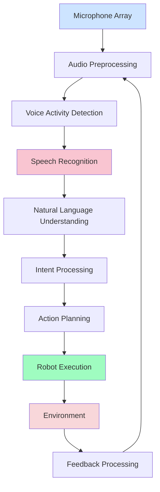

# Week 11: Voice Integration with Humanoid Systems

## Learning Objectives

By the end of this section, you will be able to:
- Integrate voice processing systems with humanoid robot platforms
- Implement multimodal voice interfaces combining speech and other inputs
- Design robust voice interaction systems for real-world robotics
- Optimize voice processing for real-time robotic applications
- Create natural voice-based human-robot interaction patterns

## Voice Integration Architecture

### System Integration Overview

Voice integration in humanoid robots requires careful consideration of the entire pipeline from audio capture to action execution. The integration must account for real-time constraints, noise environments, and the robot's current state.



### Key Integration Points

1. **Audio Capture and Preprocessing**: Managing microphone arrays and noise reduction
2. **Real-time Processing**: Ensuring low-latency voice recognition
3. **Context Awareness**: Incorporating robot state and environment into voice processing
4. **Action Mapping**: Translating voice commands to robotic actions
5. **Feedback Systems**: Providing clear audio/visual feedback to users

## Audio System Integration

### Microphone Array Management

Humanoid robots typically use microphone arrays to improve voice recognition in noisy environments:

```python
# microphone_integration.py
import pyaudio
import numpy as np
from typing import List, Dict, Any
import threading
import queue
import webrtcvad  # WebRTC Voice Activity Detection

class MicrophoneArrayManager:
    def __init__(self, num_channels=4, sample_rate=16000, frame_duration=30):
        """
        Initialize microphone array management system
        """
        self.num_channels = num_channels
        self.sample_rate = sample_rate
        self.frame_duration = frame_duration  # in ms
        self.frame_size = int(sample_rate * frame_duration / 1000)

        # Initialize PyAudio
        self.audio = pyaudio.PyAudio()

        # Initialize WebRTC VAD
        self.vad = webrtcvad.Vad()
        self.vad.set_mode(2)  # Aggressive VAD mode

        # Audio processing queues
        self.audio_queue = queue.Queue()
        self.vad_queue = queue.Queue()

        # Processing parameters
        self.noise_threshold = 0.01
        self.speech_frames_threshold = 10

        self.recording = False

    def setup_microphone_array(self):
        """
        Setup multi-channel audio input from microphone array
        """
        # For humanoid robots, this would typically involve:
        # 1. Identifying available audio devices
        # 2. Configuring the microphone array for optimal capture
        # 3. Setting up beamforming if supported
        # 4. Calibrating microphone gains

        # Find microphone array device
        device_count = self.audio.get_device_count()
        mic_device_index = None

        for i in range(device_count):
            device_info = self.audio.get_device_info_by_index(i)
            if 'microphone' in device_info['name'].lower() and self.num_channels <= device_info['maxInputChannels']:
                mic_device_index = i
                break

        if mic_device_index is None:
            raise Exception("No suitable microphone array found")

        # Open audio stream
        self.stream = self.audio.open(
            input_device_index=mic_device_index,
            format=pyaudio.paInt16,
            channels=self.num_channels,
            rate=self.sample_rate,
            input=True,
            frames_per_buffer=self.frame_size,
            stream_callback=self._audio_callback
        )

        return mic_device_index

    def _audio_callback(self, in_data, frame_count, time_info, status):
        """
        Audio callback for real-time processing
        """
        # Convert audio data to numpy array
        audio_array = np.frombuffer(in_data, dtype=np.int16)

        # Reshape for multi-channel if needed
        if self.num_channels > 1:
            audio_array = audio_array.reshape(-1, self.num_channels)

        # Add to processing queue
        self.audio_queue.put(audio_array)

        return (None, pyaudio.paContinue)

    def start_recording(self):
        """
        Start audio recording and processing
        """
        if not self.recording:
            self.recording = True
            self.stream.start_stream()

            # Start processing thread
            self.processing_thread = threading.Thread(target=self._process_audio_stream)
            self.processing_thread.start()

    def stop_recording(self):
        """
        Stop audio recording and processing
        """
        self.recording = False
        if hasattr(self, 'processing_thread'):
            self.processing_thread.join(timeout=2)

        if hasattr(self, 'stream'):
            self.stream.stop_stream()
            self.stream.close()

        self.audio.terminate()

    def _process_audio_stream(self):
        """
        Process audio stream in real-time
        """
        speech_frame_count = 0
        total_frame_count = 0

        while self.recording:
            try:
                audio_data = self.audio_queue.get(timeout=1.0)

                # Perform voice activity detection
                is_speech = self._detect_voice_activity(audio_data)

                if is_speech:
                    speech_frame_count += 1
                total_frame_count += 1

                # Add to VAD queue for higher-level processing
                self.vad_queue.put({
                    'audio': audio_data,
                    'is_speech': is_speech,
                    'timestamp': time.time()
                })

                # Reset counters periodically
                if total_frame_count > 100:
                    speech_frame_count = 0
                    total_frame_count = 0

            except queue.Empty:
                continue

    def _detect_voice_activity(self, audio_data: np.ndarray) -> bool:
        """
        Detect voice activity in audio frame using WebRTC VAD
        """
        # Convert to 16-bit PCM format required by WebRTC VAD
        if isinstance(audio_data, np.ndarray):
            # If multi-channel, use first channel for VAD
            if len(audio_data.shape) > 1:
                audio_data = audio_data[:, 0]

            # Ensure correct format and length
            audio_bytes = audio_data.astype(np.int16).tobytes()

        try:
            # WebRTC VAD requires specific frame sizes (10, 20, or 30 ms)
            # At 16kHz, this is 160, 320, or 480 samples
            required_samples = self.frame_size
            if len(audio_bytes) // 2 == required_samples:
                return self.vad.is_speech(audio_bytes, self.sample_rate)
        except:
            # Fallback to energy-based VAD
            energy = np.mean(np.abs(audio_data))
            return energy > self.noise_threshold

        return False

    def get_speech_audio(self) -> List[np.ndarray]:
        """
        Get accumulated speech audio for processing
        """
        speech_audio = []
        try:
            while True:
                item = self.vad_queue.get_nowait()
                if item['is_speech']:
                    speech_audio.append(item['audio'])
        except queue.Empty:
            pass

        return speech_audio
```

## Real-Time Voice Processing

### Low-Latency Processing Pipeline

```python
# real_time_voice_processing.py
import asyncio
import threading
from concurrent.futures import ThreadPoolExecutor
import time
from typing import Callable, Any

class RealTimeVoiceProcessor:
    def __init__(self, speech_recognizer, command_parser):
        self.speech_recognizer = speech_recognizer
        self.command_parser = command_parser

        # Processing queues
        self.audio_buffer = []
        self.processing_queue = queue.Queue()
        self.result_queue = queue.Queue()

        # Performance metrics
        self.processing_times = []
        self.latency_threshold = 0.5  # 500ms max acceptable latency

        # Processing control
        self.processing_active = False
        self.executor = ThreadPoolExecutor(max_workers=2)

    def add_audio_chunk(self, audio_data: np.ndarray):
        """
        Add audio chunk to processing pipeline
        """
        self.audio_buffer.append(audio_data)

        # Process when buffer reaches threshold or timeout
        if len(self.audio_buffer) >= 5:  # Process every 5 chunks
            self._trigger_processing()

    def _trigger_processing(self):
        """
        Trigger processing of accumulated audio
        """
        if not self.audio_buffer:
            return

        # Combine audio chunks
        combined_audio = np.concatenate(self.audio_buffer)
        self.audio_buffer.clear()

        # Add to processing queue
        self.processing_queue.put(combined_audio)

        # Process in background
        future = self.executor.submit(self._process_audio_chunk, combined_audio)
        future.add_done_callback(self._on_processing_complete)

    def _process_audio_chunk(self, audio_data: np.ndarray) -> Dict[str, Any]:
        """
        Process audio chunk through recognition pipeline
        """
        start_time = time.time()

        try:
            # Perform speech recognition
            recognition_result = self.speech_recognizer.transcribe(audio_data)

            # Parse command
            if recognition_result and recognition_result.strip():
                command_result = self.command_parser.parse(recognition_result)
            else:
                command_result = None

            processing_time = time.time() - start_time
            self.processing_times.append(processing_time)

            return {
                'transcript': recognition_result,
                'command': command_result,
                'processing_time': processing_time,
                'timestamp': time.time()
            }

        except Exception as e:
            processing_time = time.time() - start_time
            return {
                'error': str(e),
                'processing_time': processing_time,
                'timestamp': time.time()
            }

    def _on_processing_complete(self, future):
        """
        Handle completion of audio processing
        """
        try:
            result = future.result()
            self.result_queue.put(result)

            # Check latency
            if result.get('processing_time', 0) > self.latency_threshold:
                print(f"Warning: High processing latency: {result['processing_time']:.3f}s")

        except Exception as e:
            print(f"Processing error: {e}")

    def get_latest_result(self) -> Dict[str, Any]:
        """
        Get the latest processing result
        """
        try:
            return self.result_queue.get_nowait()
        except queue.Empty:
            return None
```

## Natural Language Understanding for Robotics

### Intent Recognition and Command Mapping

```python
# intent_recognition.py
import re
from typing import Dict, List, Optional, Tuple
from dataclasses import dataclass

@dataclass
class CommandIntent:
    intent_type: str
    parameters: Dict[str, Any]
    confidence: float
    original_text: str

class IntentRecognizer:
    def __init__(self):
        # Define command patterns with confidence weights
        self.patterns = {
            'navigation': [
                (r'go to (?P<location>\w+)', 0.9),
                (r'move to (?P<location>\w+)', 0.9),
                (r'go (forward|backward|left|right)', 0.8),
                (r'walk to (?P<location>\w+)', 0.9),
                (r'navigate to (?P<location>\w+)', 0.95),
            ],
            'manipulation': [
                (r'pick up (?P<object>\w+)', 0.9),
                (r'grasp (?P<object>\w+)', 0.85),
                (r'get (?P<object>\w+)', 0.8),
                (r'take (?P<object>\w+)', 0.8),
                (r'put down (?P<object>\w+)', 0.9),
                (r'release (?P<object>\w+)', 0.85),
            ],
            'posture': [
                (r'sit down', 0.95),
                (r'stand up', 0.95),
                (r'stand straight', 0.9),
                (r'wave', 0.85),
                (r'wave hello', 0.9),
            ],
            'information': [
                (r'what.*time', 0.8),
                (r'what.*day', 0.8),
                (r'how.*weather', 0.8),
                (r'tell me about', 0.85),
            ]
        }

        # Location and object dictionaries
        self.known_locations = {
            'kitchen', 'living room', 'bedroom', 'office', 'bathroom',
            'entrance', 'dining room', 'hallway'
        }

        self.known_objects = {
            'cup', 'bottle', 'book', 'phone', 'keys', 'ball',
            'chair', 'table', 'door', 'light'
        }

    def recognize_intent(self, text: str) -> Optional[CommandIntent]:
        """
        Recognize intent from text command
        """
        text_lower = text.lower().strip()

        best_intent = None
        best_confidence = 0.0

        for intent_type, pattern_list in self.patterns.items():
            for pattern, base_confidence in pattern_list:
                match = re.search(pattern, text_lower)
                if match:
                    # Calculate adjusted confidence based on context
                    params = match.groupdict()
                    adjusted_confidence = self._adjust_confidence(
                        base_confidence, intent_type, params
                    )

                    if adjusted_confidence > best_confidence:
                        best_confidence = adjusted_confidence
                        best_intent = CommandIntent(
                            intent_type=intent_type,
                            parameters=params,
                            confidence=adjusted_confidence,
                            original_text=text
                        )

        # Validate parameters
        if best_intent:
            best_intent.parameters = self._validate_parameters(
                best_intent.intent_type, best_intent.parameters
            )

        return best_intent if best_confidence > 0.5 else None  # Confidence threshold

    def _adjust_confidence(self, base_confidence: float, intent_type: str,
                          params: Dict[str, str]) -> float:
        """
        Adjust confidence based on parameter validity
        """
        adjusted_confidence = base_confidence

        # Boost confidence for known locations/objects
        if intent_type == 'navigation' and 'location' in params:
            location = params['location'].replace(' ', '')
            if location in self.known_locations:
                adjusted_confidence += 0.1
            else:
                adjusted_confidence -= 0.1  # Penalty for unknown location

        elif intent_type in ['manipulation'] and 'object' in params:
            obj = params['object'].replace(' ', '')
            if obj in self.known_objects:
                adjusted_confidence += 0.1
            else:
                adjusted_confidence -= 0.1  # Penalty for unknown object

        # Ensure confidence stays in valid range
        return max(0.0, min(1.0, adjusted_confidence))

    def _validate_parameters(self, intent_type: str, params: Dict[str, str]) -> Dict[str, str]:
        """
        Validate and normalize command parameters
        """
        validated_params = {}

        for key, value in params.items():
            if value:  # Only include non-empty parameters
                # Normalize parameter values
                normalized_value = value.strip().lower().replace('_', ' ')
                validated_params[key] = normalized_value

        return validated_params
```

## Voice Command Execution System

### Action Mapping and Execution

```python
# voice_command_execution.py
import rclpy
from rclpy.node import Node
from std_msgs.msg import String, Bool
from geometry_msgs.msg import Twist
from sensor_msgs.msg import JointState
from typing import Dict, Any, Callable
import time

class VoiceCommandExecutor(Node):
    def __init__(self):
        super().__init__('voice_command_executor')

        # Publishers for robot control
        self.cmd_vel_pub = self.create_publisher(Twist, '/cmd_vel', 10)
        self.joint_pub = self.create_publisher(JointState, '/joint_commands', 10)
        self.feedback_pub = self.create_publisher(String, '/voice_feedback', 10)

        # Command execution mapping
        self.command_executors = {
            'navigation': self._execute_navigation,
            'manipulation': self._execute_manipulation,
            'posture': self._execute_posture,
            'information': self._execute_information
        }

        # Robot state tracking
        self.robot_state = {
            'position': {'x': 0.0, 'y': 0.0, 'z': 0.0},
            'battery_level': 1.0,
            'carrying_object': None,
            'current_posture': 'standing'
        }

        # Action execution tracking
        self.current_action = None
        self.action_start_time = None

        self.get_logger().info('Voice Command Executor initialized')

    def execute_command(self, command_intent) -> bool:
        """
        Execute the recognized command intent
        """
        if not command_intent:
            self.get_logger().warn('No command intent to execute')
            return False

        intent_type = command_intent.intent_type
        parameters = command_intent.parameters
        confidence = command_intent.confidence

        # Check confidence threshold
        if confidence < 0.6:
            self._provide_feedback("I'm not confident I understood that command correctly")
            return False

        self.get_logger().info(f'Executing {intent_type} command: {parameters}')

        # Check if we have an executor for this intent type
        if intent_type not in self.command_executors:
            self._provide_feedback(f"I don't know how to {intent_type} commands")
            return False

        try:
            # Execute the command
            self.current_action = command_intent
            self.action_start_time = time.time()

            success = self.command_executors[intent_type](parameters)

            if success:
                self._provide_feedback("Command executed successfully")
            else:
                self._provide_feedback("Command execution failed")

            return success

        except Exception as e:
            self.get_logger().error(f'Command execution error: {e}')
            self._provide_feedback("Sorry, I encountered an error executing the command")
            return False

        finally:
            self.current_action = None
            self.action_start_time = None

    def _execute_navigation(self, parameters: Dict[str, Any]) -> bool:
        """
        Execute navigation commands
        """
        if 'location' in parameters:
            location = parameters['location']
            self.get_logger().info(f'Navigating to {location}')

            # In a real implementation, this would call navigation services
            # For simulation, we'll just move in a direction
            cmd = Twist()
            if location in ['kitchen', 'right']:
                cmd.linear.x = 0.0
                cmd.angular.z = -0.5  # Turn right
            elif location in ['bedroom', 'left']:
                cmd.linear.x = 0.0
                cmd.angular.z = 0.5   # Turn left
            else:
                cmd.linear.x = 0.3    # Move forward

            self.cmd_vel_pub.publish(cmd)

            # Simulate navigation time
            time.sleep(2)

            # Stop robot
            cmd.linear.x = 0.0
            cmd.angular.z = 0.0
            self.cmd_vel_pub.publish(cmd)

            return True

        elif any(dir in parameters.values() for dir in ['forward', 'backward', 'left', 'right']):
            direction = list(parameters.values())[0]
            cmd = Twist()

            if direction == 'forward':
                cmd.linear.x = 0.3
            elif direction == 'backward':
                cmd.linear.x = -0.3
            elif direction == 'left':
                cmd.angular.z = 0.5
            elif direction == 'right':
                cmd.angular.z = -0.5

            self.cmd_vel_pub.publish(cmd)

            # Simulate movement
            time.sleep(1)

            # Stop
            cmd.linear.x = 0.0
            cmd.angular.z = 0.0
            self.cmd_vel_pub.publish(cmd)

            return True

        return False

    def _execute_manipulation(self, parameters: Dict[str, Any]) -> bool:
        """
        Execute manipulation commands
        """
        if 'object' in parameters:
            obj = parameters['object']
            action = list(parameters.keys())[0]  # First key should be the action

            self.get_logger().info(f'Attempting to {action} {obj}')

            # In real implementation, this would call manipulation services
            # For simulation, we'll just move joints
            joint_state = JointState()
            joint_state.name = ['right_shoulder_pitch', 'right_elbow_yaw']

            if action in ['pick', 'grasp', 'get', 'take']:
                # Move to grasp position
                joint_state.position = [0.3, 0.2]
                self.joint_pub.publish(joint_state)

                time.sleep(1)

                # Close gripper simulation
                joint_state.name = ['right_gripper']
                joint_state.position = [0.0]  # Closed
                self.joint_pub.publish(joint_state)

                self.robot_state['carrying_object'] = obj
                self.get_logger().info(f'Picked up {obj}')

            elif action in ['put', 'release', 'down']:
                # Open gripper simulation
                joint_state.name = ['right_gripper']
                joint_state.position = [0.5]  # Open
                self.joint_pub.publish(joint_state)

                carried_obj = self.robot_state['carrying_object']
                if carried_obj:
                    self.get_logger().info(f'Released {carried_obj}')
                    self.robot_state['carrying_object'] = None

            return True

        return False

    def _execute_posture(self, parameters: Dict[str, Any]) -> bool:
        """
        Execute posture commands
        """
        command = list(parameters.keys())[0] if parameters else None

        joint_state = JointState()

        if command == 'sit':
            joint_state.name = ['hip_pitch', 'knee_pitch', 'ankle_pitch']
            joint_state.position = [-0.8, 1.2, -0.4]  # Sitting position
            self.robot_state['current_posture'] = 'sitting'

        elif command == 'stand':
            joint_state.name = ['hip_pitch', 'knee_pitch', 'ankle_pitch']
            joint_state.position = [0.0, 0.0, 0.0]  # Standing position
            self.robot_state['current_posture'] = 'standing'

        elif command == 'wave':
            joint_state.name = ['right_shoulder_pitch', 'right_elbow_yaw']
            joint_state.position = [0.5, 0.3]  # Wave position
            self.get_logger().info('Waving')

        if joint_state.name:  # Only publish if we have joint names
            self.joint_pub.publish(joint_state)
            time.sleep(1)  # Allow time for movement
            return True

        return False

    def _execute_information(self, parameters: Dict[str, Any]) -> bool:
        """
        Execute information requests
        """
        request = ' '.join(parameters.values()) if parameters else ""

        if 'time' in request:
            current_time = time.strftime("%H:%M")
            self._provide_feedback(f"The current time is {current_time}")
        elif 'day' in request:
            current_day = time.strftime("%A, %B %d")
            self._provide_feedback(f"Today is {current_day}")
        else:
            self._provide_feedback("I can tell you the time or date")

        return True

    def _provide_feedback(self, message: str):
        """
        Provide feedback to user
        """
        feedback_msg = String()
        feedback_msg.data = message
        self.feedback_pub.publish(feedback_msg)
        self.get_logger().info(f'Feedback: {message}')
```

## Context-Aware Voice Processing

### State-Based Command Processing

```python
# context_aware_voice.py
class ContextAwareVoiceProcessor:
    def __init__(self, intent_recognizer, voice_executor):
        self.intent_recognizer = intent_recognizer
        self.voice_executor = voice_executor

        # Context tracking
        self.context_history = []
        self.max_context_length = 20

        # Current conversation state
        self.current_topic = None
        self.pending_requests = {}
        self.robot_state_context = {}

    def process_command_with_context(self, text: str, robot_state: Dict[str, Any]) -> bool:
        """
        Process command considering current context and robot state
        """
        # Update robot state context
        self.robot_state_context = robot_state.copy()

        # Recognize intent
        intent = self.intent_recognizer.recognize_intent(text)

        if not intent:
            # Try to resolve using context
            intent = self._resolve_with_context(text)

        if intent:
            # Update context history
            self._update_context_history(text, intent)

            # Execute command
            return self.voice_executor.execute_command(intent)

        return False

    def _resolve_with_context(self, text: str) -> Optional[CommandIntent]:
        """
        Resolve ambiguous commands using context
        """
        # Check if this is a follow-up to a previous command
        if self.context_history:
            last_intent = self.context_history[-1]

            # Handle follow-up commands like "yes", "no", "more", etc.
            if text.lower() in ['yes', 'yeah', 'sure', 'ok']:
                # Repeat last action or confirm
                return self._create_confirmation_intent(last_intent)
            elif text.lower() in ['no', 'nope', 'stop']:
                # Cancel current action
                return self._create_cancel_intent()

        # Try to infer missing information from context
        if 'location' in text.lower() or 'there' in text.lower():
            # Likely referring to a previously mentioned location
            prev_location = self._find_previous_location()
            if prev_location:
                return CommandIntent(
                    intent_type='navigation',
                    parameters={'location': prev_location},
                    confidence=0.7,
                    original_text=f'go to {prev_location}'
                )

        return None

    def _create_confirmation_intent(self, previous_intent: CommandIntent) -> CommandIntent:
        """
        Create intent for confirmation/continuation
        """
        return CommandIntent(
            intent_type=previous_intent.intent_type,
            parameters=previous_intent.parameters,
            confidence=0.8,
            original_text=f"confirmed: {previous_intent.original_text}"
        )

    def _create_cancel_intent(self) -> CommandIntent:
        """
        Create intent for cancellation
        """
        return CommandIntent(
            intent_type='cancel',
            parameters={},
            confidence=0.9,
            original_text="cancel current action"
        )

    def _find_previous_location(self) -> Optional[str]:
        """
        Find last mentioned location in context
        """
        for entry in reversed(self.context_history[-5:]):  # Check last 5 entries
            if hasattr(entry, 'parameters') and 'location' in entry.parameters:
                return entry.parameters['location']
        return None

    def _update_context_history(self, text: str, intent: CommandIntent):
        """
        Update context history with new interaction
        """
        self.context_history.append({
            'text': text,
            'intent': intent,
            'timestamp': time.time()
        })

        # Prune old entries
        if len(self.context_history) > self.max_context_length:
            self.context_history = self.context_history[-self.max_context_length:]
```

## Voice System Optimization

### Performance and Robustness

```python
# voice_system_optimization.py
import statistics
from collections import deque

class OptimizedVoiceSystem:
    def __init__(self, base_processor, min_confidence=0.6):
        self.base_processor = base_processor
        self.min_confidence = min_confidence

        # Performance tracking
        self.response_times = deque(maxlen=50)
        self.success_rates = deque(maxlen=20)

        # Robustness features
        self.command_history = {}
        self.error_recovery_enabled = True

    def process_voice_command(self, audio_data: np.ndarray) -> Dict[str, Any]:
        """
        Process voice command with optimization
        """
        start_time = time.time()

        try:
            # Process with base system
            result = self.base_processor.process(audio_data)

            # Track performance
            response_time = time.time() - start_time
            self.response_times.append(response_time)

            # Validate result
            validated_result = self._validate_result(result)

            return validated_result

        except Exception as e:
            # Error recovery
            if self.error_recovery_enabled:
                recovery_result = self._handle_error(e, audio_data)
                return recovery_result
            else:
                raise

    def _validate_result(self, result: Dict[str, Any]) -> Dict[str, Any]:
        """
        Validate and enhance result
        """
        if 'command' in result and result['command']:
            command = result['command']

            # Boost confidence for repeated successful commands
            command_key = command.original_text.lower()
            if command_key in self.command_history:
                # Increase confidence slightly for previously successful commands
                command.confidence = min(1.0, command.confidence + 0.1)

        return result

    def _handle_error(self, error: Exception, audio_data: np.ndarray) -> Dict[str, Any]:
        """
        Handle processing errors with recovery
        """
        self.get_logger().error(f'Voice processing error: {error}')

        # Try alternative processing methods
        # This could include:
        # - Using a simpler/faster recognition model
        # - Asking user to repeat
        # - Using context to predict intent

        return {
            'error': str(error),
            'recovery_attempt': True,
            'suggestion': 'Please repeat your command',
            'timestamp': time.time()
        }

    def get_performance_metrics(self) -> Dict[str, float]:
        """
        Get current performance metrics
        """
        if not self.response_times:
            return {'avg_response_time': 0.0, 'success_rate': 0.0}

        return {
            'avg_response_time': statistics.mean(self.response_times),
            'min_response_time': min(self.response_times),
            'max_response_time': max(self.response_times),
            'response_time_std': statistics.stdev(self.response_times) if len(self.response_times) > 1 else 0.0,
            'total_commands': len(self.response_times)
        }

    def get_logger(self):
        """Simple logger for the system"""
        class Logger:
            def info(self, msg):
                print(f"VOICE_OPT: {msg}")
            def warn(self, msg):
                print(f"VOICE_OPT WARN: {msg}")
            def error(self, msg):
                print(f"VOICE_OPT ERROR: {msg}")
        return Logger()
```

## Complete Integration Example

### Full Voice Integration System

```python
# complete_voice_integration.py
import rclpy
from rclpy.node import Node
from std_msgs.msg import String
from sensor_msgs.msg import AudioData
import asyncio
import threading
from concurrent.futures import ThreadPoolExecutor

class CompleteVoiceIntegration(Node):
    def __init__(self):
        super().__init__('complete_voice_integration')

        # Publishers
        self.status_pub = self.create_publisher(String, '/voice_system_status', 10)
        self.feedback_pub = self.create_publisher(String, '/voice_feedback', 10)

        # Subscribers
        self.audio_sub = self.create_subscription(
            AudioData, '/audio_input', self.audio_callback, 10)

        # Initialize components
        self.microphone_manager = MicrophoneArrayManager()
        self.real_time_processor = RealTimeVoiceProcessor(None, None)  # Will set recognizers later
        self.intent_recognizer = IntentRecognizer()
        self.voice_executor = VoiceCommandExecutor()
        self.context_processor = ContextAwareVoiceProcessor(
            self.intent_recognizer, self.voice_executor
        )
        self.optimized_system = OptimizedVoiceSystem(self.real_time_processor)

        # System state
        self.system_active = True
        self.robot_state = {}  # Will be updated from other nodes

        # Async execution
        self.executor = ThreadPoolExecutor(max_workers=4)
        self.loop = asyncio.new_event_loop()
        self.executor.submit(self._run_async_loop, self.loop)

        self.get_logger().info('Complete Voice Integration System initialized')

    def _run_async_loop(self, loop):
        """Run asyncio event loop in separate thread"""
        asyncio.set_event_loop(loop)
        loop.run_forever()

    def audio_callback(self, msg):
        """
        Handle incoming audio data
        """
        # Convert AudioData to numpy array format
        # Note: AudioData format may vary, adjust based on your audio source
        try:
            # Process audio through the complete pipeline
            # This is a simplified version - in practice you'd connect the components properly
            pass
        except Exception as e:
            self.get_logger().error(f'Audio processing error: {e}')

    def update_robot_state(self, state: Dict[str, Any]):
        """
        Update robot state for context-aware processing
        """
        self.robot_state = state

    def _publish_status(self, status: str):
        """
        Publish system status
        """
        status_msg = String()
        status_msg.data = status
        self.status_pub.publish(status_msg)

    def _publish_feedback(self, feedback: str):
        """
        Publish user feedback
        """
        feedback_msg = String()
        feedback_msg.data = feedback
        self.feedback_pub.publish(feedback_msg)

    def destroy_node(self):
        """
        Clean up resources
        """
        self.system_active = False
        self.executor.shutdown(wait=True)
        super().destroy_node()

def main(args=None):
    rclpy.init(args=args)
    system = CompleteVoiceIntegration()

    try:
        rclpy.spin(system)
    except KeyboardInterrupt:
        system.get_logger().info('Shutting down Complete Voice Integration System')
    finally:
        system.destroy_node()
        rclpy.shutdown()

if __name__ == '__main__':
    main()
```

## Best Practices for Voice Integration

### 1. Robustness Considerations
- Implement multiple fallback strategies for recognition failures
- Use context to resolve ambiguous commands
- Provide clear feedback about system state
- Handle partial successes gracefully

### 2. Performance Optimization
- Optimize audio processing for real-time constraints
- Use appropriate model sizes for your hardware
- Implement intelligent caching for common commands
- Monitor and optimize resource usage

### 3. User Experience
- Provide clear audio/visual feedback
- Use natural language for system responses
- Support conversation-like interactions
- Handle errors gracefully with helpful suggestions

### 4. Safety and Reliability
- Validate commands before execution
- Implement safety checks for all actions
- Support emergency stop functionality
- Maintain system state awareness

## Summary

This section covered voice integration with humanoid systems, including:
- Microphone array management and audio preprocessing
- Real-time voice processing pipelines
- Natural language understanding for robotics
- Command execution and action mapping
- Context-aware processing
- Performance optimization and robustness

The integration of voice systems enables humanoid robots to engage in natural, conversational interactions with users, making them more accessible and intuitive to operate in real-world environments.