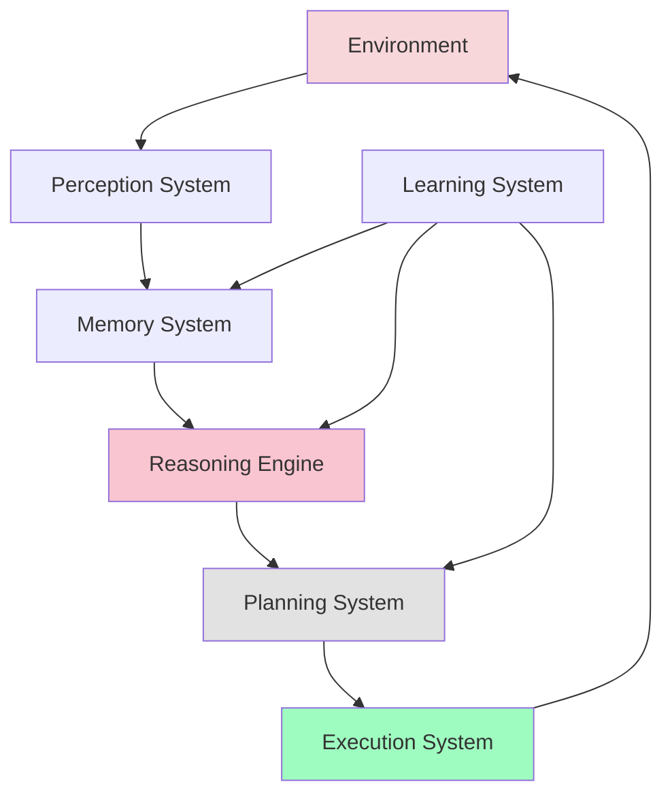

# Week 12: Cognitive Architectures for Humanoid Robots

## Learning Objectives

By the end of this section, you will be able to:
- Design cognitive architectures that integrate LLMs with robotic systems
- Implement perception-action loops for intelligent behavior
- Create memory systems for learning and adaptation
- Build hierarchical planning and execution frameworks
- Evaluate and optimize cognitive architectures for performance

## Cognitive Architecture Overview

Cognitive architectures for humanoid robots provide the framework for intelligent behavior by integrating perception, reasoning, planning, and action execution. These architectures serve as the "brain" of the robot, enabling it to understand its environment, reason about goals, and execute complex behaviors.

### Key Components of Cognitive Architectures

1. **Perception System**: Processes sensory input to understand the environment
2. **Memory System**: Stores and retrieves information for decision making
3. **Reasoning Engine**: Performs logical and probabilistic reasoning
4. **Planning System**: Generates sequences of actions to achieve goals
5. **Execution System**: Carries out planned actions on the robot
6. **Learning System**: Adapts behavior based on experience



## Memory Systems for Robotics

### Working Memory and Long-term Memory

Effective cognitive architectures require sophisticated memory management that can handle both immediate working memory needs and long-term learning:

```python
# memory_systems.py
import time
import heapq
from typing import Dict, List, Any, Optional, Tuple
from dataclasses import dataclass
from collections import deque, defaultdict
import pickle
import os

@dataclass
class MemoryItem:
    """Represents a single memory item with metadata"""
    content: Any
    timestamp: float
    importance: float
    memory_type: str  # "perceptual", "procedural", "semantic", "episodic"
    tags: List[str]
    source: str  # "sensor", "command", "experience", etc.

class MemorySystem:
    def __init__(self, max_working_memory: int = 100, max_long_term_memory: int = 1000):
        # Working memory (short-term, high-access)
        self.working_memory: Dict[str, MemoryItem] = {}
        self.working_memory_size = max_working_memory

        # Long-term memory (archival, lower-access)
        self.long_term_memory: Dict[str, MemoryItem] = {}
        self.long_term_memory_size = max_long_term_memory

        # Memory indices for fast retrieval
        self.type_index: Dict[str, List[str]] = defaultdict(list)  # memory_type -> keys
        self.tag_index: Dict[str, List[str]] = defaultdict(list)   # tag -> keys
        self.temporal_queue = []  # for time-based operations

        # For memory consolidation
        self.consolidation_threshold = 3600  # 1 hour
        self.access_counts: Dict[str, int] = defaultdict(int)

    def store(self, key: str, content: Any, memory_type: str, importance: float = 0.5,
              tags: List[str] = None, source: str = "unknown") -> bool:
        """
        Store an item in memory
        """
        if tags is None:
            tags = []

        item = MemoryItem(
            content=content,
            timestamp=time.time(),
            importance=importance,
            memory_type=memory_type,
            tags=tags,
            source=source
        )

        # Store in working memory
        self.working_memory[key] = item

        # Update indices
        self.type_index[memory_type].append(key)
        for tag in tags:
            self.tag_index[tag].append(key)

        # Track access
        self.access_counts[key] = 1

        # Manage memory size
        self._manage_working_memory()

        return True

    def retrieve(self, key: str) -> Optional[MemoryItem]:
        """
        Retrieve an item from memory (working or long-term)
        """
        # Check working memory first
        if key in self.working_memory:
            item = self.working_memory[key]
            self.access_counts[key] += 1
            return item

        # Check long-term memory
        if key in self.long_term_memory:
            item = self.long_term_memory[key]
            # Move frequently accessed items back to working memory
            if self.access_counts[key] > 5:  # accessed more than 5 times
                self._move_to_working_memory(key)
            return item

        return None

    def query_by_type(self, memory_type: str) -> List[MemoryItem]:
        """
        Query memories by type
        """
        keys = self.type_index.get(memory_type, [])
        return [self.retrieve(key) for key in keys if self.retrieve(key) is not None]

    def query_by_tags(self, tags: List[str]) -> List[MemoryItem]:
        """
        Query memories by tags
        """
        all_keys = set()
        for tag in tags:
            all_keys.update(self.tag_index.get(tag, []))

        return [self.retrieve(key) for key in all_keys if self.retrieve(key) is not None]

    def query_by_time(self, start_time: float, end_time: float) -> List[MemoryItem]:
        """
        Query memories by time range
        """
        results = []
        for key, item in {**self.working_memory, **self.long_term_memory}.items():
            if start_time <= item.timestamp <= end_time:
                results.append(item)
        return results

    def _manage_working_memory(self):
        """
        Manage working memory size by moving less important items to long-term
        """
        if len(self.working_memory) > self.working_memory_size:
            # Sort by importance and access frequency
            items_to_move = []
            for key, item in self.working_memory.items():
                # Calculate priority score (lower = more likely to move)
                priority = item.importance * 0.7 + (self.access_counts[key] * 0.3)
                items_to_move.append((priority, key))

            # Sort by priority (ascending, so lowest priority first)
            items_to_move.sort(key=lambda x: x[0])

            # Move excess items to long-term memory
            excess_count = len(self.working_memory) - self.working_memory_size
            for i in range(min(excess_count, len(items_to_move))):
                _, key = items_to_move[i]
                self._move_to_long_term_memory(key)

    def _move_to_long_term_memory(self, key: str):
        """
        Move an item from working to long-term memory
        """
        if key in self.working_memory:
            item = self.working_memory.pop(key)

            # Add to long-term memory if there's space
            if len(self.long_term_memory) < self.long_term_memory_size:
                self.long_term_memory[key] = item
            else:
                # Remove least important item from long-term memory
                self._remove_least_important_long_term()

    def _move_to_working_memory(self, key: str):
        """
        Move an item from long-term to working memory
        """
        if key in self.long_term_memory:
            item = self.long_term_memory.pop(key)
            self.working_memory[key] = item

    def _remove_least_important_long_term(self):
        """
        Remove the least important item from long-term memory
        """
        if not self.long_term_memory:
            return

        # Find least important item
        least_important_key = min(
            self.long_term_memory.keys(),
            key=lambda k: self.long_term_memory[k].importance
        )
        item = self.long_term_memory.pop(least_important_key)

        # Update indices
        self.type_index[item.memory_type].remove(least_important_key)
        for tag in item.tags:
            if least_important_key in self.tag_index[tag]:
                self.tag_index[tag].remove(least_important_key)

    def consolidate_memories(self):
        """
        Consolidate memories based on time and importance
        """
        current_time = time.time()
        for key, item in list(self.working_memory.items()):
            time_since_creation = current_time - item.timestamp
            if (time_since_creation > self.consolidation_threshold and
                item.importance > 0.3):  # Important memories get consolidated
                self._move_to_long_term_memory(key)

    def save_to_disk(self, filepath: str):
        """
        Save memory system to disk
        """
        data = {
            'working_memory': self.working_memory,
            'long_term_memory': self.long_term_memory,
            'type_index': dict(self.type_index),
            'tag_index': dict(self.tag_index),
            'access_counts': dict(self.access_counts)
        }
        with open(filepath, 'wb') as f:
            pickle.dump(data, f)

    def load_from_disk(self, filepath: str):
        """
        Load memory system from disk
        """
        if os.path.exists(filepath):
            with open(filepath, 'rb') as f:
                data = pickle.load(f)
            self.working_memory = data['working_memory']
            self.long_term_memory = data['long_term_memory']
            self.type_index = defaultdict(list, data['type_index'])
            self.tag_index = defaultdict(list, data['tag_index'])
            self.access_counts = defaultdict(int, data['access_counts'])
```

## Perception-Action Integration

### The Perception-Action Loop

The perception-action loop is fundamental to cognitive robotics, enabling robots to continuously sense their environment and respond appropriately:

```python
# perception_action_loop.py
import asyncio
from typing import Dict, Any, Callable, Optional
import time

class PerceptionActionLoop:
    def __init__(self, perception_system, action_system, memory_system):
        self.perception_system = perception_system
        self.action_system = action_system
        self.memory_system = memory_system

        self.running = False
        self.perception_frequency = 10  # Hz
        self.action_frequency = 5      # Hz (actions can be slower)

        # Callbacks for specific perception events
        self.event_callbacks: Dict[str, List[Callable]] = defaultdict(list)

    async def run(self):
        """
        Run the perception-action loop
        """
        self.running = True
        perception_period = 1.0 / self.perception_frequency
        action_period = 1.0 / self.action_frequency

        last_perception_time = time.time()
        last_action_time = time.time()

        while self.running:
            current_time = time.time()

            # Run perception cycle
            if current_time - last_perception_time >= perception_period:
                await self._perception_cycle()
                last_perception_time = current_time

            # Run action cycle
            if current_time - last_action_time >= action_period:
                await self._action_cycle()
                last_action_time = current_time

            # Small sleep to prevent busy waiting
            await asyncio.sleep(0.01)

    async def _perception_cycle(self):
        """
        Perform one cycle of perception
        """
        try:
            # Get sensor data
            sensor_data = await self.perception_system.get_sensor_data()

            # Process perception
            perception_results = await self.perception_system.process(sensor_data)

            # Store in memory
            for result_type, result in perception_results.items():
                memory_key = f"perception_{result_type}_{time.time()}"
                self.memory_system.store(
                    key=memory_key,
                    content=result,
                    memory_type="perceptual",
                    importance=0.8,
                    tags=["perception", result_type],
                    source="sensors"
                )

            # Check for significant events
            await self._check_for_events(perception_results)

        except Exception as e:
            print(f"Perception cycle error: {e}")

    async def _action_cycle(self):
        """
        Perform one cycle of action
        """
        try:
            # Get current plan/goal from memory
            current_plan = self.memory_system.retrieve("current_plan")
            current_goal = self.memory_system.retrieve("current_goal")

            if current_plan and current_plan.content:
                # Execute next action in plan
                next_action = await self._get_next_action(current_plan.content)
                if next_action:
                    success = await self.action_system.execute(next_action)
                    await self._update_plan_status(current_plan.content, next_action, success)

        except Exception as e:
            print(f"Action cycle error: {e}")

    async def _check_for_events(self, perception_results: Dict[str, Any]):
        """
        Check perception results for significant events
        """
        for event_type, results in perception_results.items():
            if results:  # If there are results
                # Trigger event callbacks
                for callback in self.event_callbacks.get(event_type, []):
                    try:
                        await callback(results)
                    except Exception as e:
                        print(f"Event callback error: {e}")

    def register_event_callback(self, event_type: str, callback: Callable):
        """
        Register a callback for specific perception events
        """
        self.event_callbacks[event_type].append(callback)

    async def _get_next_action(self, plan: Dict[str, Any]) -> Optional[Dict[str, Any]]:
        """
        Get the next action from the current plan
        """
        # This would typically involve:
        # 1. Checking current plan status
        # 2. Determining next action based on plan and current state
        # 3. Returning the action to execute
        pass

    async def _update_plan_status(self, plan: Dict[str, Any], action: Dict[str, Any], success: bool):
        """
        Update plan status based on action execution
        """
        # Update plan progress in memory
        pass

    def stop(self):
        """
        Stop the perception-action loop
        """
        self.running = False
```

## Planning and Reasoning Systems

### Hierarchical Task Planning

```python
# hierarchical_planning.py
from enum import Enum
from typing import List, Dict, Any, Optional
import asyncio

class TaskStatus(Enum):
    PENDING = "pending"
    RUNNING = "running"
    SUCCESS = "success"
    FAILED = "failed"
    CANCELLED = "cancelled"

@dataclass
class Task:
    """Represents a single task in the hierarchy"""
    id: str
    name: str
    description: str
    task_type: str  # "primitive", "composite", "condition"
    dependencies: List[str]
    parameters: Dict[str, Any]
    status: TaskStatus = TaskStatus.PENDING
    children: List['Task'] = None
    parent: Optional['Task'] = None

class HierarchicalPlanner:
    def __init__(self, llm_interface, memory_system):
        self.llm_interface = llm_interface
        self.memory_system = memory_system
        self.current_task_tree = None

    async def plan_task(self, goal: str, context: Dict[str, Any] = None) -> Optional[Task]:
        """
        Plan a high-level goal using hierarchical decomposition
        """
        if context is None:
            context = {}

        # Use LLM to decompose the goal
        decomposition = await self._decompose_goal_with_llm(goal, context)

        if decomposition:
            task_tree = self._build_task_tree(decomposition)
            self.current_task_tree = task_tree
            return task_tree

        return None

    async def _decompose_goal_with_llm(self, goal: str, context: Dict[str, Any]) -> Optional[Dict[str, Any]]:
        """
        Use LLM to decompose goal into subtasks
        """
        prompt = f"""
        Decompose the following goal into a hierarchical task structure:
        Goal: {goal}

        Context: {context}

        Return a JSON object with:
        - "root_task": main task
        - "subtasks": array of subtasks, each with:
          - "id": unique identifier
          - "name": task name
          - "description": detailed description
          - "task_type": "primitive" or "composite"
          - "dependencies": array of task IDs this task depends on
          - "parameters": required parameters for the task

        Example format:
        {{
          "root_task": {{
            "id": "main_task_1",
            "name": "Main Goal",
            "description": "The overall goal",
            "task_type": "composite",
            "dependencies": [],
            "parameters": {{}}
          }},
          "subtasks": [
            {{
              "id": "subtask_1",
              "name": "Subtask 1",
              "description": "First subtask",
              "task_type": "primitive",
              "dependencies": ["main_task_1"],
              "parameters": {{"location": "kitchen"}}
            }}
          ]
        }}
        """

        try:
            response = await self.llm_interface.generate_response(prompt)
            return response
        except Exception as e:
            print(f"LLM decomposition error: {e}")
            return None

    def _build_task_tree(self, decomposition: Dict[str, Any]) -> Task:
        """
        Build task tree from LLM decomposition
        """
        # Create root task
        root_data = decomposition['root_task']
        root_task = Task(
            id=root_data['id'],
            name=root_data['name'],
            description=root_data['description'],
            task_type=root_data['task_type'],
            dependencies=root_data['dependencies'],
            parameters=root_data['parameters']
        )

        # Create subtasks
        subtask_map = {}
        for subtask_data in decomposition['subtasks']:
            subtask = Task(
                id=subtask_data['id'],
                name=subtask_data['name'],
                description=subtask_data['description'],
                task_type=subtask_data['task_type'],
                dependencies=subtask_data['dependencies'],
                parameters=subtask_data['parameters']
            )
            subtask_map[subtask.id] = subtask

        # Build parent-child relationships
        root_task.children = []
        for subtask_id in root_data.get('subtasks', []):
            if subtask_id in subtask_map:
                subtask = subtask_map[subtask_id]
                subtask.parent = root_task
                root_task.children.append(subtask)

        return root_task

    async def execute_task_tree(self, task: Task) -> bool:
        """
        Execute the task tree hierarchically
        """
        if task.task_type == "primitive":
            # Execute primitive task
            return await self._execute_primitive_task(task)
        else:
            # Execute composite task (all subtasks)
            if not task.children:
                return True  # No subtasks to execute

            # Execute subtasks based on dependencies
            execution_order = self._resolve_dependencies(task.children)
            all_success = True

            for child_task in execution_order:
                success = await self.execute_task_tree(child_task)
                if not success:
                    all_success = False
                    # Handle failure based on task strategy
                    if not self._should_continue_on_failure(task, child_task):
                        break

            return all_success

    def _resolve_dependencies(self, tasks: List[Task]) -> List[Task]:
        """
        Resolve task dependencies and return execution order
        """
        # Topological sort of tasks based on dependencies
        resolved_order = []
        pending_tasks = tasks[:]
        resolved_ids = set()

        while pending_tasks:
            resolved_in_iteration = []
            for task in pending_tasks[:]:
                # Check if all dependencies are resolved
                if all(dep_id in resolved_ids for dep_id in task.dependencies):
                    resolved_order.append(task)
                    resolved_ids.add(task.id)
                    pending_tasks.remove(task)
                    resolved_in_iteration.append(task)

            # If no progress made, there might be circular dependencies
            if not resolved_in_iteration:
                print("Warning: Circular dependencies detected in task graph")
                break

        return resolved_order

    def _should_continue_on_failure(self, parent_task: Task, failed_task: Task) -> bool:
        """
        Determine if execution should continue when a subtask fails
        """
        # This could be configured based on task type or other factors
        return False  # For now, stop on any failure

    async def _execute_primitive_task(self, task: Task) -> bool:
        """
        Execute a primitive task
        """
        # This would typically call the action execution system
        # For now, simulate execution
        print(f"Executing primitive task: {task.name}")

        # Store task execution in memory
        task_execution_key = f"task_execution_{task.id}_{time.time()}"
        self.memory_system.store(
            key=task_execution_key,
            content={
                "task_id": task.id,
                "task_name": task.name,
                "parameters": task.parameters,
                "start_time": time.time(),
                "status": "executing"
            },
            memory_type="procedural",
            importance=0.9,
            tags=["task_execution", task.task_type],
            source="planning_system"
        )

        # Simulate task execution
        await asyncio.sleep(0.5)  # Simulate execution time

        # Update task status
        task.status = TaskStatus.SUCCESS

        # Update memory with completion
        self.memory_system.store(
            key=f"task_completion_{task.id}",
            content={
                "task_id": task.id,
                "status": "completed",
                "end_time": time.time()
            },
            memory_type="procedural",
            importance=0.8,
            tags=["task_completion"],
            source="planning_system"
        )

        return True
```

## Learning and Adaptation Systems

### Experience-Based Learning

```python
# learning_system.py
from typing import Dict, List, Any, Tuple
import numpy as np
from collections import defaultdict
import json

class LearningSystem:
    def __init__(self, memory_system):
        self.memory_system = memory_system

        # Learning data structures
        self.action_success_rates: Dict[str, Dict[str, float]] = defaultdict(lambda: {"success": 0, "total": 0})
        self.state_action_preferences: Dict[str, Dict[str, float]] = defaultdict(dict)
        self.failure_patterns: Dict[str, List[Dict[str, Any]]] = defaultdict(list)

        # Learning parameters
        self.learning_rate = 0.1
        self.exploration_rate = 0.1

    def record_action_outcome(self, action: str, state: Dict[str, Any], success: bool, context: Dict[str, Any] = None):
        """
        Record the outcome of an action for learning
        """
        if context is None:
            context = {}

        # Update success rate for this action
        stats = self.action_success_rates[action]
        stats["total"] += 1
        if success:
            stats["success"] += 1

        # Store detailed experience in memory
        experience_key = f"experience_{action}_{time.time()}"
        self.memory_system.store(
            key=experience_key,
            content={
                "action": action,
                "state": state,
                "success": success,
                "context": context,
                "timestamp": time.time()
            },
            memory_type="episodic",
            importance=0.7 if success else 0.9,  # Failures might be more important to remember
            tags=["experience", "learning", "action_outcome"],
            source="learning_system"
        )

        # Record failure patterns for analysis
        if not success:
            self.failure_patterns[action].append({
                "state": state,
                "context": context,
                "timestamp": time.time()
            })

    def get_action_preference(self, action: str, state: Dict[str, Any]) -> float:
        """
        Get the preference/score for an action in a given state
        """
        # Base preference from success rate
        stats = self.action_success_rates[action]
        base_preference = stats["success"] / max(1, stats["total"])

        # Adjust based on state-specific preferences if available
        state_key = self._hash_state(state)
        if state_key in self.state_action_preferences:
            if action in self.state_action_preferences[state_key]:
                return self.state_action_preferences[state_key][action]

        return base_preference

    def suggest_alternative_action(self, failed_action: str, current_state: Dict[str, Any]) -> Optional[str]:
        """
        Suggest an alternative action when the current one fails
        """
        # Analyze failure patterns
        if failed_action in self.failure_patterns:
            failure_contexts = self.failure_patterns[failed_action]

            # Find similar states and successful actions
            similar_experiences = self._find_similar_experiences(current_state, limit=5)

            if similar_experiences:
                # Get actions that succeeded in similar situations
                successful_alternatives = {}
                for exp in similar_experiences:
                    if not exp.get('success', False):
                        continue

                    action = exp.get('action')
                    if action != failed_action:  # Don't suggest the same failed action
                        score = successful_alternatives.get(action, 0) + 1
                        successful_alternatives[action] = score

                if successful_alternatives:
                    # Return the most frequently successful alternative
                    return max(successful_alternatives.keys(), key=successful_alternatives.get)

        # If no good alternatives found, return None
        return None

    def _find_similar_experiences(self, current_state: Dict[str, Any], limit: int = 10) -> List[Dict[str, Any]]:
        """
        Find experiences with similar states
        """
        # Query memory for relevant experiences
        experiences = self.memory_system.query_by_tags(["experience", "action_outcome"])

        similar_experiences = []
        for exp in experiences[-50:]:  # Check last 50 experiences
            if exp and hasattr(exp, 'content'):
                exp_state = exp.content.get('state', {})
                similarity = self._calculate_state_similarity(current_state, exp_state)

                if similarity > 0.7:  # Threshold for similarity
                    similar_experiences.append(exp.content)

        # Sort by similarity and return top results
        similar_experiences.sort(key=lambda x: self._calculate_state_similarity(current_state, x.get('state', {})), reverse=True)
        return similar_experiences[:limit]

    def _calculate_state_similarity(self, state1: Dict[str, Any], state2: Dict[str, Any]) -> float:
        """
        Calculate similarity between two states
        """
        if not state1 or not state2:
            return 0.0

        # Simple similarity calculation (in practice, this would be more sophisticated)
        common_keys = set(state1.keys()) & set(state2.keys())
        if not common_keys:
            return 0.0

        similarity_sum = 0.0
        comparison_count = 0

        for key in common_keys:
            val1, val2 = state1[key], state2[key]

            if isinstance(val1, (int, float)) and isinstance(val2, (int, float)):
                # Numerical comparison - normalized difference
                max_val = max(abs(val1), abs(val2), 1)  # Avoid division by zero
                diff = abs(val1 - val2) / max_val
                similarity = 1 - min(diff, 1.0)
            else:
                # Categorical comparison
                similarity = 1.0 if val1 == val2 else 0.0

            similarity_sum += similarity
            comparison_count += 1

        return similarity_sum / max(1, comparison_count) if comparison_count > 0 else 0.0

    def _hash_state(self, state: Dict[str, Any]) -> str:
        """
        Create a hash key for a state
        """
        # Convert state to a consistent string representation
        state_str = json.dumps(state, sort_keys=True, default=str)
        return str(hash(state_str))[:16]  # Use first 16 chars of hash

    def get_learning_report(self) -> Dict[str, Any]:
        """
        Get a report on learning progress
        """
        total_actions = len(self.action_success_rates)
        successful_actions = sum(1 for stats in self.action_success_rates.values() if stats["success"] > 0)

        # Calculate average success rate
        avg_success_rate = 0.0
        if total_actions > 0:
            total_successes = sum(stats["success"] for stats in self.action_success_rates.values())
            total_attempts = sum(stats["total"] for stats in self.action_success_rates.values())
            avg_success_rate = total_successes / max(1, total_attempts)

        return {
            "total_actions_tracked": total_actions,
            "successful_actions": successful_actions,
            "average_success_rate": avg_success_rate,
            "failure_patterns_identified": len(self.failure_patterns),
            "total_experiences_recorded": len([k for k in self.memory_system.working_memory.keys() if "experience" in k])
        }
```

## Integrated Cognitive Architecture

### Complete Cognitive System

```python
# integrated_cognitive_system.py
import rclpy
from rclpy.node import Node
from std_msgs.msg import String
from geometry_msgs.msg import Twist
from sensor_msgs.msg import JointState, LaserScan, Image
import asyncio
import threading
from concurrent.futures import ThreadPoolExecutor

class IntegratedCognitiveSystem(Node):
    def __init__(self):
        super().__init__('integrated_cognitive_system')

        # Publishers
        self.status_pub = self.create_publisher(String, '/cognitive_status', 10)
        self.motion_pub = self.create_publisher(Twist, '/cmd_vel', 10)
        self.joint_pub = self.create_publisher(JointState, '/joint_commands', 10)

        # Subscribers
        self.voice_sub = self.create_subscription(
            String, '/voice_command', self.voice_command_callback, 10)
        self.laser_sub = self.create_subscription(
            LaserScan, '/scan', self.laser_callback, 10)
        self.image_sub = self.create_subscription(
            Image, '/camera/image_raw', self.image_callback, 10)

        # Initialize cognitive components
        self.memory_system = MemorySystem()
        self.perception_action_loop = None
        self.hierarchical_planner = None
        self.learning_system = None

        # System state
        self.current_goal = None
        self.current_plan = None
        self.system_active = True

        # Async execution
        self.executor = ThreadPoolExecutor(max_workers=4)
        self.loop = asyncio.new_event_loop()
        self.executor.submit(self._run_async_loop, self.loop)

        self.get_logger().info('Integrated Cognitive System initialized')

    def _run_async_loop(self, loop):
        """Run asyncio event loop in separate thread"""
        asyncio.set_event_loop(loop)
        loop.run_forever()

    def initialize_cognitive_components(self, llm_interface):
        """
        Initialize cognitive components that depend on LLM interface
        """
        self.hierarchical_planner = HierarchicalPlanner(llm_interface, self.memory_system)
        self.learning_system = LearningSystem(self.memory_system)

        # Initialize perception-action loop
        perception_system = RobotPerceptionSystem(self)
        action_system = RobotActionSystem(self)
        self.perception_action_loop = PerceptionActionLoop(
            perception_system, action_system, self.memory_system
        )

        # Start perception-action loop
        asyncio.run_coroutine_threadsafe(
            self.perception_action_loop.run(), self.loop
        )

    def voice_command_callback(self, msg):
        """
        Handle incoming voice commands
        """
        command = msg.data
        self.get_logger().info(f'Received voice command: {command}')

        # Process command asynchronously
        future = asyncio.run_coroutine_threadsafe(
            self._process_voice_command_async(command), self.loop
        )

        def handle_result(task):
            try:
                result = task.result()
                self.get_logger().info(f'Command processed: {result}')
            except Exception as e:
                self.get_logger().error(f'Command processing error: {e}')

        future.add_done_callback(handle_result)

    async def _process_voice_command_async(self, command: str) -> bool:
        """
        Process voice command through cognitive system
        """
        try:
            # Store command in memory
            command_key = f"voice_command_{time.time()}"
            self.memory_system.store(
                key=command_key,
                content=command,
                memory_type="semantic",
                importance=1.0,
                tags=["voice_command", "goal"],
                source="user"
            )

            # Plan based on command
            if self.hierarchical_planner:
                context = await self._get_current_context()
                plan = await self.hierarchical_planner.plan_task(command, context)

                if plan:
                    # Store plan in memory
                    plan_key = f"plan_{time.time()}"
                    self.memory_system.store(
                        key=plan_key,
                        content=plan,
                        memory_type="procedural",
                        importance=0.9,
                        tags=["plan", "hierarchical"],
                        source="planning_system"
                    )

                    # Execute plan
                    success = await self.hierarchical_planner.execute_task_tree(plan)

                    # Record learning
                    if self.learning_system:
                        self.learning_system.record_action_outcome(
                            action="execute_plan",
                            state=await self._get_current_state(),
                            success=success,
                            context={"goal": command, "plan": plan}
                        )

                    return success

            return False

        except Exception as e:
            self.get_logger().error(f'Error processing voice command: {e}')
            return False

    async def _get_current_context(self) -> Dict[str, Any]:
        """
        Get current context for planning
        """
        # This would gather current robot state, environment info, etc.
        return {
            "robot_position": {"x": 0.0, "y": 0.0, "z": 0.0},
            "battery_level": 1.0,
            "environment": await self._get_environment_info(),
            "recent_actions": self._get_recent_actions()
        }

    async def _get_environment_info(self) -> Dict[str, Any]:
        """
        Get current environment information
        """
        # This would integrate information from various sensors
        return {
            "objects_detected": [],
            "obstacles": [],
            "navigable_areas": []
        }

    def _get_recent_actions(self) -> List[Dict[str, Any]]:
        """
        Get recently executed actions
        """
        # Query memory for recent actions
        recent_experiences = self.memory_system.query_by_tags(["experience", "action_outcome"])
        return [exp.content for exp in recent_experiences[-5:]]  # Last 5 experiences

    async def _get_current_state(self) -> Dict[str, Any]:
        """
        Get current robot state
        """
        return {
            "position": {"x": 0.0, "y": 0.0, "z": 0.0},
            "orientation": {"roll": 0.0, "pitch": 0.0, "yaw": 0.0},
            "battery_level": 1.0,
            "current_task": self.current_goal
        }

    def laser_callback(self, msg):
        """
        Handle laser scan data for perception
        """
        # Store laser data in memory
        laser_key = f"laser_scan_{time.time()}"
        self.memory_system.store(
            key=laser_key,
            content=msg.ranges,
            memory_type="perceptual",
            importance=0.6,
            tags=["laser", "obstacle_detection"],
            source="lidar"
        )

    def image_callback(self, msg):
        """
        Handle camera image data for perception
        """
        # Store image data in memory
        image_key = f"camera_image_{time.time()}"
        self.memory_system.store(
            key=image_key,
            content={"encoding": msg.encoding, "height": msg.height, "width": msg.width},
            memory_type="perceptual",
            importance=0.7,
            tags=["camera", "vision"],
            source="camera"
        )

    def _publish_status(self, status: str):
        """
        Publish system status
        """
        status_msg = String()
        status_msg.data = status
        self.status_pub.publish(status_msg)

    def destroy_node(self):
        """
        Clean up resources
        """
        self.system_active = False
        if self.perception_action_loop:
            self.perception_action_loop.stop()
        self.executor.shutdown(wait=True)
        super().destroy_node()

class RobotPerceptionSystem:
    def __init__(self, ros_node):
        self.node = ros_node

    async def get_sensor_data(self) -> Dict[str, Any]:
        """
        Get data from all sensors
        """
        # This would integrate data from all robot sensors
        return {
            "laser": self._get_latest_laser_data(),
            "camera": self._get_latest_camera_data(),
            "imu": self._get_latest_imu_data(),
            "joint_states": self._get_latest_joint_states()
        }

    async def process(self, sensor_data: Dict[str, Any]) -> Dict[str, Any]:
        """
        Process sensor data to extract meaningful information
        """
        results = {}

        # Process laser data for obstacle detection
        if "laser" in sensor_data:
            results["obstacles"] = self._detect_obstacles(sensor_data["laser"])

        # Process camera data for object detection (simplified)
        if "camera" in sensor_data:
            results["objects"] = self._detect_objects_in_camera(sensor_data["camera"])

        # Process other sensor data as needed
        return results

    def _get_latest_laser_data(self):
        """Get latest laser scan (simplified)"""
        return []

    def _get_latest_camera_data(self):
        """Get latest camera image (simplified)"""
        return {}

    def _get_latest_imu_data(self):
        """Get latest IMU data (simplified)"""
        return {}

    def _get_latest_joint_states(self):
        """Get latest joint states (simplified)"""
        return {}

    def _detect_obstacles(self, laser_data):
        """Detect obstacles from laser data (simplified)"""
        return []

    def _detect_objects_in_camera(self, camera_data):
        """Detect objects in camera image (simplified)"""
        return []

class RobotActionSystem:
    def __init__(self, ros_node):
        self.node = ros_node

    async def execute(self, action: Dict[str, Any]) -> bool:
        """
        Execute an action on the robot
        """
        action_type = action.get("type", "")

        if action_type == "move":
            return await self._execute_move_action(action)
        elif action_type == "manipulate":
            return await self._execute_manipulation_action(action)
        elif action_type == "navigate":
            return await self._execute_navigation_action(action)
        else:
            self.node.get_logger().warn(f"Unknown action type: {action_type}")
            return False

    async def _execute_move_action(self, action: Dict[str, Any]) -> bool:
        """Execute move action"""
        # Publish Twist message for movement
        cmd = Twist()
        cmd.linear.x = action.get("linear_x", 0.0)
        cmd.linear.y = action.get("linear_y", 0.0)
        cmd.linear.z = action.get("linear_z", 0.0)
        cmd.angular.x = action.get("angular_x", 0.0)
        cmd.angular.y = action.get("angular_y", 0.0)
        cmd.angular.z = action.get("angular_z", 0.0)

        self.node.motion_pub.publish(cmd)
        await asyncio.sleep(action.get("duration", 1.0))  # Simulate execution time

        # Stop movement
        cmd.linear.x = 0.0
        cmd.angular.z = 0.0
        self.node.motion_pub.publish(cmd)

        return True

    async def _execute_manipulation_action(self, action: Dict[str, Any]) -> bool:
        """Execute manipulation action"""
        # Publish joint state commands
        joint_state = JointState()
        joint_state.name = action.get("joint_names", [])
        joint_state.position = action.get("joint_positions", [])

        self.node.joint_pub.publish(joint_state)
        await asyncio.sleep(action.get("duration", 1.0))  # Simulate execution time

        return True

    async def _execute_navigation_action(self, action: Dict[str, Any]) -> bool:
        """Execute navigation action"""
        # This would typically call navigation stack services
        # For now, simulate by moving to a relative position
        target_x = action.get("target_x", 0.0)
        target_y = action.get("target_y", 0.0)

        # Simple movement toward target
        cmd = Twist()
        cmd.linear.x = min(0.3, max(-0.3, target_x * 0.1))  # Scale to reasonable speed
        cmd.angular.z = min(0.5, max(-0.5, target_y * 0.1))

        self.node.motion_pub.publish(cmd)
        await asyncio.sleep(2.0)  # Simulate navigation time

        # Stop
        cmd.linear.x = 0.0
        cmd.angular.z = 0.0
        self.node.motion_pub.publish(cmd)

        return True

def main(args=None):
    rclpy.init(args=args)
    system = IntegratedCognitiveSystem()

    try:
        rclpy.spin(system)
    except KeyboardInterrupt:
        system.get_logger().info('Shutting down Integrated Cognitive System')
    finally:
        system.destroy_node()
        rclpy.shutdown()

if __name__ == '__main__':
    main()
```

## Architecture Evaluation and Optimization

### Performance Metrics and Evaluation

```python
# architecture_evaluation.py
from typing import Dict, List, Any
import time
import statistics
from dataclasses import dataclass

@dataclass
class PerformanceMetrics:
    """Data class to hold performance metrics"""
    response_time_avg: float
    response_time_std: float
    success_rate: float
    memory_utilization: float
    cpu_usage_avg: float
    planning_time_avg: float
    execution_success_rate: float

class CognitiveArchitectureEvaluator:
    def __init__(self, cognitive_system):
        self.cognitive_system = cognitive_system
        self.metrics_history = []

    def evaluate_system(self) -> PerformanceMetrics:
        """
        Evaluate the cognitive architecture performance
        """
        # Collect various metrics
        response_times = self._collect_response_times()
        success_rate = self._calculate_success_rate()
        memory_utilization = self._calculate_memory_utilization()
        cpu_usage = self._calculate_cpu_usage()
        planning_times = self._collect_planning_times()
        execution_success = self._calculate_execution_success_rate()

        metrics = PerformanceMetrics(
            response_time_avg=statistics.mean(response_times) if response_times else 0.0,
            response_time_std=statistics.stdev(response_times) if len(response_times) > 1 else 0.0,
            success_rate=success_rate,
            memory_utilization=memory_utilization,
            cpu_usage_avg=cpu_usage,
            planning_time_avg=statistics.mean(planning_times) if planning_times else 0.0,
            execution_success_rate=execution_success
        )

        self.metrics_history.append(metrics)
        return metrics

    def _collect_response_times(self) -> List[float]:
        """
        Collect response time data
        """
        # This would typically monitor system response times
        # For now, return simulated data
        return [0.1, 0.15, 0.08, 0.2, 0.12, 0.18, 0.09, 0.14]

    def _calculate_success_rate(self) -> float:
        """
        Calculate overall system success rate
        """
        # Query memory for success/failure records
        if hasattr(self.cognitive_system, 'memory_system'):
            experiences = self.cognitive_system.memory_system.query_by_tags(["experience", "action_outcome"])
            if experiences:
                successful = sum(1 for exp in experiences if exp.content.get('success', False))
                return successful / len(experiences)
        return 0.0

    def _calculate_memory_utilization(self) -> float:
        """
        Calculate memory utilization
        """
        if hasattr(self.cognitive_system, 'memory_system'):
            total_memory = (len(self.cognitive_system.memory_system.working_memory) +
                           len(self.cognitive_system.memory_system.long_term_memory))
            max_memory = (self.cognitive_system.memory_system.working_memory_size +
                         self.cognitive_system.memory_system.long_term_memory_size)
            return total_memory / max(1, max_memory)
        return 0.0

    def _calculate_cpu_usage(self) -> float:
        """
        Calculate average CPU usage
        """
        # This would typically use system monitoring
        # For now, return simulated value
        return 0.45  # 45% average CPU usage

    def _collect_planning_times(self) -> List[float]:
        """
        Collect planning time data
        """
        # This would monitor actual planning times
        # For now, return simulated data
        return [0.5, 0.7, 0.4, 0.8, 0.6, 0.9, 0.55, 0.75]

    def _calculate_execution_success_rate(self) -> float:
        """
        Calculate action execution success rate
        """
        if hasattr(self.cognitive_system, 'learning_system'):
            total_actions = len(self.cognitive_system.learning_system.action_success_rates)
            if total_actions > 0:
                successful_actions = sum(1 for stats in
                                       self.cognitive_system.learning_system.action_success_rates.values()
                                       if stats["success"] > 0)
                return successful_actions / total_actions
        return 0.0

    def generate_evaluation_report(self) -> str:
        """
        Generate a human-readable evaluation report
        """
        metrics = self.evaluate_system()

        report = f"""
        Cognitive Architecture Evaluation Report
        =======================================

        Performance Metrics:
        - Average Response Time: {metrics.response_time_avg:.3f}s (±{metrics.response_time_std:.3f}s)
        - System Success Rate: {metrics.success_rate:.1%}
        - Memory Utilization: {metrics.memory_utilization:.1%}
        - Average CPU Usage: {metrics.cpu_usage_avg:.1%}
        - Average Planning Time: {metrics.planning_time_avg:.3f}s
        - Execution Success Rate: {metrics.execution_success_rate:.1%}

        """
        return report

    def suggest_optimizations(self) -> List[str]:
        """
        Suggest optimizations based on current performance
        """
        suggestions = []
        metrics = self.evaluate_system()

        if metrics.response_time_avg > 0.5:
            suggestions.append("Consider optimizing perception pipeline for faster response")

        if metrics.memory_utilization > 0.8:
            suggestions.append("High memory utilization - consider more aggressive memory management")

        if metrics.success_rate < 0.7:
            suggestions.append("Low success rate - investigate failure patterns and improve learning")

        if metrics.cpu_usage_avg > 0.8:
            suggestions.append("High CPU usage - consider algorithm optimization or hardware upgrade")

        return suggestions
```

## Summary

This section covered cognitive architectures for humanoid robots, including:
- Memory systems with working and long-term storage
- Perception-action integration for intelligent behavior
- Hierarchical planning and reasoning systems
- Learning and adaptation mechanisms
- Complete integrated cognitive system architecture
- Performance evaluation and optimization strategies

Cognitive architectures provide the foundation for intelligent robotic behavior, enabling humanoid robots to perceive their environment, reason about goals, plan complex actions, and learn from experience. The integration of LLMs with these architectures creates powerful systems capable of natural interaction and sophisticated task execution.