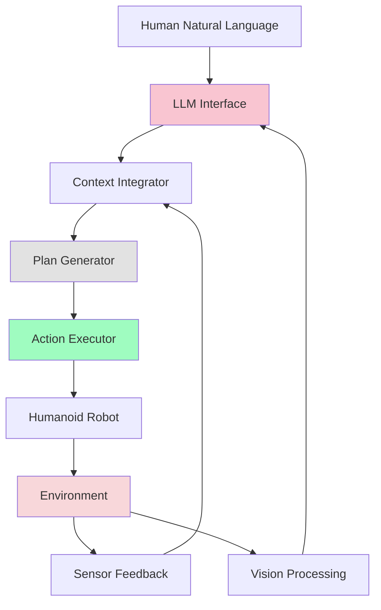

# Week 12: LLM Integration with Humanoid Robots

## Learning Objectives

By the end of this section, you will be able to:
- Integrate Large Language Models (LLMs) with humanoid robot systems
- Design cognitive architectures that combine LLMs with robotic capabilities
- Implement context-aware planning using LLM reasoning
- Create multimodal interfaces combining text, vision, and action
- Optimize LLM usage for real-time robotic applications

## LLM Integration Overview

Large Language Models have revolutionized artificial intelligence, providing unprecedented capabilities for natural language understanding and reasoning. For humanoid robots, LLM integration enables sophisticated cognitive planning, natural language interaction, and high-level task decomposition that bridges the gap between human intentions and robotic actions.

### Key Benefits of LLM Integration

1. **Natural Language Understanding**: Process complex, ambiguous human commands
2. **Reasoning and Planning**: Decompose high-level goals into executable actions
3. **Context Awareness**: Consider environmental and situational context
4. **Adaptive Behavior**: Adjust plans based on feedback and changing conditions
5. **Learning from Interaction**: Improve performance through experience

### LLM Architecture for Robotics



## OpenAI API Integration

### Basic Setup and Configuration

```python
# llm_robot_integration.py
import openai
import json
import asyncio
import time
from typing import Dict, List, Any, Optional, Callable
from dataclasses import dataclass
import threading
from concurrent.futures import ThreadPoolExecutor

@dataclass
class RobotState:
    """Represents the current state of the humanoid robot"""
    position: Dict[str, float]  # x, y, z coordinates
    orientation: Dict[str, float]  # roll, pitch, yaw
    battery_level: float
    joint_positions: Dict[str, float]
    current_task: Optional[str] = None
    carrying_object: Optional[str] = None
    available_actions: List[str] = None

@dataclass
class EnvironmentState:
    """Represents the current environment state"""
    objects: List[Dict[str, Any]]  # Detected objects with properties
    locations: List[Dict[str, Any]]  # Known locations with coordinates
    obstacles: List[Dict[str, Any]]  # Obstacle information
    lighting: str  # "bright", "dim", "dark"
    time_of_day: str  # "morning", "afternoon", "evening", "night"

class LLMRobotInterface:
    def __init__(self, api_key: str, model: str = "gpt-4-turbo"):
        """
        Initialize the LLM-robot interface
        """
        openai.api_key = api_key
        self.model = model
        self.executor = ThreadPoolExecutor(max_workers=2)
        self.loop = asyncio.new_event_loop()

        # Robot state tracking
        self.robot_state = RobotState(
            position={"x": 0.0, "y": 0.0, "z": 0.0},
            orientation={"roll": 0.0, "pitch": 0.0, "yaw": 0.0},
            battery_level=1.0,
            joint_positions={},
            available_actions=["navigate", "grasp", "speak", "detect_objects", "manipulate"]
        )

        self.environment_state = EnvironmentState(
            objects=[],
            locations=[],
            obstacles=[],
            lighting="bright",
            time_of_day="afternoon"
        )

        # Action execution callbacks
        self.action_callbacks: Dict[str, Callable] = {}

        self.get_logger().info("LLM Robot Interface initialized")

    def get_logger(self):
        """Simple logger for the interface"""
        class Logger:
            def info(self, msg):
                print(f"INFO: {msg}")
            def warn(self, msg):
                print(f"WARN: {msg}")
            def error(self, msg):
                print(f"ERROR: {msg}")
        return Logger()

    def set_action_callback(self, action_type: str, callback: Callable):
        """Set callback function for executing specific actions"""
        self.action_callbacks[action_type] = callback

    def update_robot_state(self, new_state: RobotState):
        """Update the robot's current state"""
        self.robot_state = new_state

    def update_environment_state(self, new_state: EnvironmentState):
        """Update the environment state"""
        self.environment_state = new_state

    async def generate_plan(self, goal: str) -> Optional[List[Dict[str, Any]]]:
        """
        Generate a detailed action plan using LLM
        """
        # Prepare context for the LLM
        context = self._prepare_context(goal)

        # Create the planning prompt
        prompt = self._create_planning_prompt(context)

        try:
            response = await openai.ChatCompletion.acreate(
                model=self.model,
                messages=[
                    {"role": "system", "content": self._get_system_prompt()},
                    {"role": "user", "content": prompt}
                ],
                temperature=0.3,  # Lower for more consistent planning
                max_tokens=1200,
                response_format={"type": "json_object"}
            )

            # Parse the response
            response_text = response.choices[0].message.content
            plan = json.loads(response_text)
            return plan.get("actions", [])

        except Exception as e:
            self.get_logger().error(f"Error generating plan: {e}")
            return None

    def _prepare_context(self, goal: str) -> Dict[str, Any]:
        """Prepare comprehensive context for the LLM"""
        return {
            "goal": goal,
            "robot_state": {
                "position": self.robot_state.position,
                "orientation": self.robot_state.orientation,
                "battery_level": self.robot_state.battery_level,
                "carrying_object": self.robot_state.carrying_object,
                "available_actions": self.robot_state.available_actions
            },
            "environment_state": {
                "objects": self.environment_state.objects,
                "locations": self.environment_state.locations,
                "obstacles": self.environment_state.obstacles,
                "lighting": self.environment_state.lighting,
                "time_of_day": self.environment_state.time_of_day
            },
            "current_task": self.robot_state.current_task
        }

    def _create_planning_prompt(self, context: Dict[str, Any]) -> str:
        """Create a detailed prompt for LLM planning"""
        return f"""
        You are an advanced cognitive planning system for a humanoid robot. Your task is to generate a detailed, executable action plan to achieve the user's goal.

        Current Context:
        - Goal: {context['goal']}
        - Robot Position: {context['robot_state']['position']}
        - Battery Level: {context['robot_state']['battery_level']:.1%}
        - Carrying Object: {context['robot_state']['carrying_object'] or 'Nothing'}
        - Available Actions: {context['robot_state']['available_actions']}
        - Environment Objects: {context['environment_state']['objects']}
        - Known Locations: {context['environment_state']['locations']}
        - Obstacles: {context['environment_state']['obstacles']}
        - Lighting: {context['environment_state']['lighting']}
        - Time of Day: {context['environment_state']['time_of_day']}

        Generate a JSON object with an "actions" array containing specific, executable actions. Each action should include:
        - "action": The action type (e.g., "navigate", "grasp", "speak", "detect", "manipulate")
        - "parameters": Required parameters for the action
        - "description": Human-readable description of the action
        - "estimated_duration": Estimated time in seconds
        - "success_criteria": How to verify the action was successful
        - "safety_check": Any safety considerations for this action

        Consider environmental constraints, battery level, and robot capabilities when generating the plan.
        Ensure the plan is safe, feasible, and efficient.

        Example output format:
        {{
            "actions": [
                {{
                    "action": "navigate",
                    "parameters": {{"target_location": "kitchen", "avoid_obstacles": true}},
                    "description": "Navigate to the kitchen while avoiding obstacles",
                    "estimated_duration": 30,
                    "success_criteria": "Robot reaches kitchen area",
                    "safety_check": "Check for obstacles and ensure safe path"
                }}
            ]
        }}
        """

    def _get_system_prompt(self) -> str:
        """Get the system prompt for consistent LLM behavior"""
        return """
        You are an expert cognitive planning system for humanoid robots. Generate detailed, executable action plans that are:
        1. Feasible given the robot's capabilities
        2. Safe for the robot and environment
        3. Efficient in achieving the goal
        4. Context-aware and adaptive
        5. Include appropriate safety checks

        Always respond in valid JSON format with an "actions" array. Each action should be specific, executable, and include safety considerations.
        """

    async def execute_plan(self, plan: List[Dict[str, Any]]) -> bool:
        """
        Execute the generated plan step by step
        """
        for i, action in enumerate(plan):
            self.get_logger().info(f"Executing action {i+1}/{len(plan)}: {action['description']}")

            success = await self._execute_single_action(action)
            if not success:
                self.get_logger().error(f"Action failed: {action['description']}")
                return False

            self.get_logger().info(f"Action completed: {action['description']}")

        return True

    async def _execute_single_action(self, action: Dict[str, Any]) -> bool:
        """
        Execute a single action using the appropriate callback
        """
        action_type = action['action']
        parameters = action['parameters']

        # Check safety requirements
        safety_check = action.get('safety_check', '')
        if safety_check:
            self.get_logger().info(f"Safety check: {safety_check}")
            # In real implementation, perform safety verification here

        # Execute using callback if available
        if action_type in self.action_callbacks:
            try:
                success = self.action_callbacks[action_type](parameters)
                return success
            except Exception as e:
                self.get_logger().error(f"Action execution error: {e}")
                return False
        else:
            # Default action execution (simulated)
            return await self._simulate_action_execution(action)

    async def _simulate_action_execution(self, action: Dict[str, Any]) -> bool:
        """Simulate action execution for demonstration"""
        action_type = action['action']
        duration = action.get('estimated_duration', 2)

        self.get_logger().info(f"Simulating {action_type} for {duration}s")
        await asyncio.sleep(min(duration / 10, 1))  # Fast simulation

        return True  # Simulated success
```

## Cognitive Architecture Design

### Hierarchical Cognitive System

```python
# cognitive_architecture.py
import asyncio
from typing import Dict, List, Any, Optional
from dataclasses import dataclass
import time

@dataclass
class CognitiveState:
    """State for the cognitive architecture"""
    current_goal: Optional[str] = None
    active_plan: List[Dict[str, Any]] = None
    plan_index: int = 0
    execution_history: List[Dict[str, Any]] = None
    context_memory: List[Dict[str, Any]] = None

class CognitiveArchitecture:
    def __init__(self, llm_interface: LLMRobotInterface):
        self.llm_interface = llm_interface
        self.state = CognitiveState()
        self.running = False

        # Memory management
        self.max_context_items = 50
        self.context_importance_threshold = 0.3

    async def process_goal(self, goal: str) -> bool:
        """
        Process a high-level goal through the cognitive architecture
        """
        self.state.current_goal = goal
        self.get_logger().info(f"Processing goal: {goal}")

        # Generate plan using LLM
        self.get_logger().info("Generating plan...")
        plan = await self.llm_interface.generate_plan(goal)

        if not plan:
            self.get_logger().error("Failed to generate plan")
            return False

        self.state.active_plan = plan
        self.state.plan_index = 0

        # Execute the plan
        self.get_logger().info(f"Executing plan with {len(plan)} actions")
        success = await self.llm_interface.execute_plan(plan)

        if success:
            self.get_logger().info("Goal achieved successfully!")
            # Add to context memory
            self._add_to_context_memory({
                "type": "completed_goal",
                "goal": goal,
                "success": True,
                "timestamp": time.time(),
                "importance": 0.8
            })
        else:
            self.get_logger().error("Goal execution failed")
            self._add_to_context_memory({
                "type": "failed_goal",
                "goal": goal,
                "success": False,
                "timestamp": time.time(),
                "importance": 0.9
            })

        return success

    def _add_to_context_memory(self, item: Dict[str, Any]):
        """Add an item to context memory with importance-based retention"""
        if self.state.context_memory is None:
            self.state.context_memory = []

        # Add new item
        self.state.context_memory.append(item)

        # Prune old items based on importance and age
        current_time = time.time()
        filtered_memory = []

        for memory_item in self.state.context_memory:
            age = current_time - memory_item.get("timestamp", current_time)
            importance = memory_item.get("importance", 0.5)

            # Keep high-importance items or recent lower-importance items
            if importance >= self.context_importance_threshold or age < 3600:  # 1 hour
                filtered_memory.append(memory_item)

        self.state.context_memory = filtered_memory[-self.max_context_items:]  # Keep most recent

    def get_context_for_planning(self) -> Dict[str, Any]:
        """Get relevant context for planning"""
        return {
            "recent_goals": [item for item in (self.state.context_memory or [])
                           if item.get("type") == "completed_goal"][-5:],
            "failed_attempts": [item for item in (self.state.context_memory or [])
                              if item.get("type") == "failed_goal"][-3:],
            "environment_patterns": self._extract_environment_patterns()
        }

    def _extract_environment_patterns(self) -> List[Dict[str, Any]]:
        """Extract patterns from environment observations"""
        # This would analyze environment data to identify patterns
        # For example: object locations, frequently used paths, etc.
        return []

    def get_logger(self):
        """Simple logger"""
        class Logger:
            def info(self, msg):
                print(f"COGNITIVE: {msg}")
            def warn(self, msg):
                print(f"COGNITIVE WARN: {msg}")
            def error(self, msg):
                print(f"COGNITIVE ERROR: {msg}")
        return Logger()
```

## Multimodal Integration

### Vision-Language Integration

```python
# multimodal_integration.py
import base64
from io import BytesIO
import requests
from PIL import Image
import numpy as np

class MultimodalLLMInterface(LLMRobotInterface):
    def __init__(self, api_key: str, model: str = "gpt-4-vision-preview"):
        super().__init__(api_key, model)
        self.vision_model = model

    async def generate_plan_with_vision(self, goal: str, image_data: bytes) -> Optional[List[Dict[str, Any]]]:
        """
        Generate plan using both text goal and visual input
        """
        context = self._prepare_context(goal)

        # Encode image for API
        image_base64 = base64.b64encode(image_data).decode('utf-8')

        try:
            response = await openai.ChatCompletion.acreate(
                model=self.vision_model,
                messages=[
                    {"role": "system", "content": self._get_system_prompt()},
                    {
                        "role": "user",
                        "content": [
                            {"type": "text", "text": self._create_vision_planning_prompt(context)},
                            {
                                "type": "image_url",
                                "image_url": {
                                    "url": f"data:image/jpeg;base64,{image_base64}"
                                }
                            }
                        ]
                    }
                ],
                temperature=0.3,
                max_tokens=1500,
                response_format={"type": "json_object"}
            )

            response_text = response.choices[0].message.content
            plan = json.loads(response_text)
            return plan.get("actions", [])

        except Exception as e:
            self.get_logger().error(f"Error generating vision-enhanced plan: {e}")
            # Fall back to text-only planning
            return await self.generate_plan(goal)

    def _create_vision_planning_prompt(self, context: Dict[str, Any]) -> str:
        """Create prompt that incorporates visual information"""
        return f"""
        You are a cognitive planning system for a humanoid robot with vision capabilities.
        You have access to both the goal description and a visual scene.
        Use both text context and visual information to generate the best action plan.

        Text Context:
        - Goal: {context['goal']}
        - Robot State: {context['robot_state']}
        - Environment: {context['environment_state']}

        Visual Scene Analysis: Analyze the provided image to understand:
        - Object locations, types, and properties
        - Spatial relationships between objects
        - Potential obstacles or clear paths
        - Environmental context and layout
        - Surface properties and accessibility

        Generate a detailed JSON plan that leverages visual information to:
        1. Identify specific objects to interact with
        2. Plan precise navigation paths
        3. Consider object properties (size, weight, fragility)
        4. Adapt to the actual environment layout
        5. Ensure safe and efficient execution

        Example output format:
        {{
            "actions": [
                {{
                    "action": "navigate",
                    "parameters": {{"target_location": "kitchen", "visual_path": true}},
                    "description": "Navigate using visual path planning",
                    "estimated_duration": 30,
                    "success_criteria": "Robot reaches target area",
                    "safety_check": "Verify path is clear visually"
                }}
            ],
            "visual_analysis": {{
                "detected_objects": [...],
                "environment_layout": "...",
                "potential_challenges": [...]
            }}
        }}
        """

    def process_visual_scene(self, image_data: bytes) -> Dict[str, Any]:
        """
        Process visual scene to extract relevant information
        """
        # This would typically involve:
        # 1. Object detection
        # 2. Scene understanding
        # 3. Spatial relationship analysis
        # 4. Environment mapping

        # For demonstration, return a simple analysis
        return {
            "objects": ["chair", "table", "cup"],
            "layout": "open room with furniture",
            "obstacles": ["table"],
            "navigation_paths": ["left_side", "right_side"]
        }
```

## Context-Aware Planning

### Dynamic Context Integration

```python
# context_aware_planning.py
import datetime
from typing import Dict, List, Any

class ContextAwarePlanner(LLMRobotInterface):
    def __init__(self, api_key: str, model: str = "gpt-4-turbo"):
        super().__init__(api_key, model)
        self.context_history = []
        self.max_context_history = 100

    async def generate_context_aware_plan(self, goal: str) -> Optional[List[Dict[str, Any]]]:
        """
        Generate plan considering historical context and current situation
        """
        context = self._prepare_context_with_history(goal)

        prompt = self._create_context_aware_prompt(context)

        try:
            response = await openai.ChatCompletion.acreate(
                model=self.model,
                messages=[
                    {"role": "system", "content": self._get_context_aware_system_prompt()},
                    {"role": "user", "content": prompt}
                ],
                temperature=0.3,
                max_tokens=1200,
                response_format={"type": "json_object"}
            )

            response_text = response.choices[0].message.content
            plan = json.loads(response_text)

            # Add to context history
            self._add_to_context_history({
                "goal": goal,
                "plan": plan,
                "timestamp": time.time(),
                "robot_state": self.robot_state,
                "environment_state": self.environment_state
            })

            return plan.get("actions", [])

        except Exception as e:
            self.get_logger().error(f"Error generating context-aware plan: {e}")
            return None

    def _prepare_context_with_history(self, goal: str) -> Dict[str, Any]:
        """Prepare context including historical information"""
        return {
            "goal": goal,
            "current_state": self._prepare_context(goal),
            "historical_context": self.context_history[-10:],  # Last 10 interactions
            "current_time": datetime.datetime.now().isoformat(),
            "learned_patterns": self._extract_learned_patterns()
        }

    def _create_context_aware_prompt(self, context: Dict[str, Any]) -> str:
        """Create prompt with historical context"""
        return f"""
        You are a context-aware cognitive planning system for a humanoid robot.
        Consider both the current goal and historical context to generate optimal plans.

        Current Goal: {context['goal']}

        Current State:
        - Robot: {context['current_state']['robot_state']}
        - Environment: {context['current_state']['environment_state']}

        Historical Context (most recent first):
        {self._format_context_history(context['historical_context'])}

        Current Time: {context['current_time']}

        Learned Patterns:
        {json.dumps(context['learned_patterns'], indent=2)}

        Generate a plan that:
        1. Leverages past successful strategies
        2. Avoids previously failed approaches
        3. Considers time-of-day and routine patterns
        4. Adapts to the robot's learned preferences
        5. Maintains consistency with previous behaviors

        Return JSON with actions as specified previously.
        """

    def _format_context_history(self, history: List[Dict]) -> str:
        """Format context history for the prompt"""
        if not history:
            return "No previous interactions."

        formatted = []
        for i, entry in enumerate(history[-5:]):  # Show last 5
            timestamp = datetime.datetime.fromtimestamp(entry.get('timestamp', 0))
            formatted.append(
                f"{i+1}. Goal: {entry.get('goal', 'Unknown')} "
                f"at {timestamp.strftime('%H:%M')} - "
                f"Success: {entry.get('plan', {}).get('success', 'Unknown')}"
            )

        return "\n".join(formatted)

    def _extract_learned_patterns(self) -> Dict[str, Any]:
        """Extract learned patterns from context history"""
        patterns = {
            "preferred_locations": {},
            "common_goals": [],
            "successful_strategies": [],
            "avoided_approaches": []
        }

        # Analyze context history to identify patterns
        for entry in self.context_history[-20:]:  # Look at last 20 interactions
            goal = entry.get('goal', '')
            plan = entry.get('plan', {})

            # Count preferred locations
            for action in plan.get('actions', []):
                if action.get('action') == 'navigate':
                    location = action.get('parameters', {}).get('target_location')
                    if location:
                        patterns['preferred_locations'][location] = \
                            patterns['preferred_locations'].get(location, 0) + 1

            # Track common goals
            patterns['common_goals'].append(goal)

        return patterns

    def _add_to_context_history(self, entry: Dict[str, Any]):
        """Add entry to context history with pruning"""
        self.context_history.append(entry)

        # Prune old entries
        if len(self.context_history) > self.max_context_history:
            self.context_history = self.context_history[-self.max_context_history:]

    def _get_context_aware_system_prompt(self) -> str:
        """System prompt for context-aware planning"""
        return """
        You are a context-aware cognitive planning system that learns from experience.
        Use historical context to inform your planning decisions:
        - Leverage successful strategies from similar past situations
        - Avoid approaches that failed previously
        - Consider learned preferences and routines
        - Adapt plans based on time and context
        - Maintain consistency with established patterns
        - Balance learning with flexibility for new situations
        """
```

## Performance Optimization

### Efficient LLM Usage for Robotics

```python
# llm_optimization.py
import hashlib
import time
from functools import wraps
from typing import Dict, List, Any, Optional, Callable

class OptimizedLLMInterface(ContextAwarePlanner):
    def __init__(self, api_key: str, model: str = "gpt-4-turbo"):
        super().__init__(api_key, model)

        # Caching system
        self.plan_cache = {}
        self.max_cache_size = 50
        self.cache_ttl = 3600  # 1 hour TTL

        # Rate limiting
        self.request_times = []
        self.max_requests_per_minute = 30
        self.min_request_interval = 2.0  # seconds

        # Cost tracking
        self.total_tokens_used = 0
        self.total_requests = 0

    def rate_limit_check(self) -> bool:
        """Check if we're within rate limits"""
        current_time = time.time()

        # Remove old requests
        self.request_times = [t for t in self.request_times
                            if current_time - t < 60]

        # Check if we're over the limit
        if len(self.request_times) >= self.max_requests_per_minute:
            return False

        # Add current request time
        self.request_times.append(current_time)
        return True

    def create_cache_key(self, goal: str, context: Dict[str, Any]) -> str:
        """Create a cache key based on goal and relevant context"""
        cache_input = {
            "goal": goal,
            "position": context.get("robot_state", {}).get("position"),
            "battery": context.get("robot_state", {}).get("battery_level"),
            "environment_summary": self._summarize_environment(
                context.get("environment_state", {})
            )
        }

        cache_string = json.dumps(cache_input, sort_keys=True)
        return hashlib.md5(cache_string.encode()).hexdigest()

    def _summarize_environment(self, env_state: Dict[str, Any]) -> str:
        """Create a summary of environment state for caching"""
        return (f"objs:{len(env_state.get('objects', []))}_"
                f"locs:{len(env_state.get('locations', []))}_"
                f"obs:{len(env_state.get('obstacles', []))}_"
                f"light:{env_state.get('lighting')}")

    async def generate_plan_with_optimization(self, goal: str) -> Optional[List[Dict[str, Any]]]:
        """
        Generate plan with caching and rate limiting
        """
        # Check rate limits
        if not self.rate_limit_check():
            self.get_logger().warn("Rate limit exceeded, using cached plan or simple fallback")
            # Try to return cached plan or simple default
            context = self._prepare_context(goal)
            cache_key = self.create_cache_key(goal, context)
            if cache_key in self.plan_cache:
                return self.plan_cache[cache_key]['plan']
            else:
                return self._create_simple_fallback_plan(goal)

        # Check cache first
        context = self._prepare_context(goal)
        cache_key = self.create_cache_key(goal, context)

        if cache_key in self.plan_cache:
            cached_entry = self.plan_cache[cache_key]
            if time.time() - cached_entry['timestamp'] < self.cache_ttl:
                self.get_logger().info("Retrieved plan from cache")
                return cached_entry['plan']

        # Generate new plan
        plan = await self.generate_context_aware_plan(goal)

        # Cache the result
        if plan and len(self.plan_cache) < self.max_cache_size:
            self.plan_cache[cache_key] = {
                'plan': plan,
                'timestamp': time.time(),
                'goal': goal
            }

        return plan

    def _create_simple_fallback_plan(self, goal: str) -> List[Dict[str, Any]]:
        """Create a simple fallback plan when rate limited"""
        # Simple fallback based on goal keywords
        if "go to" in goal.lower() or "navigate" in goal.lower():
            return [{
                "action": "navigate",
                "parameters": {"target_location": "default"},
                "description": "Navigate to default location",
                "estimated_duration": 10,
                "success_criteria": "Reached location",
                "safety_check": "Check for obstacles"
            }]
        elif "find" in goal.lower() or "get" in goal.lower():
            return [{
                "action": "detect_objects",
                "parameters": {"object_type": "unknown"},
                "description": "Look for requested object",
                "estimated_duration": 5,
                "success_criteria": "Object detected",
                "safety_check": "Safe to operate sensors"
            }]
        else:
            return [{
                "action": "speak",
                "parameters": {"text": f"I'm currently busy, please repeat: {goal}"},
                "description": "Acknowledge request",
                "estimated_duration": 2,
                "success_criteria": "Spoken acknowledgment",
                "safety_check": "Safe to speak"
            }]

    def track_usage(self, response):
        """Track API usage for cost optimization"""
        if hasattr(response, 'usage'):
            self.total_tokens_used += response.usage.total_tokens
            self.total_requests += 1

    def get_usage_stats(self) -> Dict[str, Any]:
        """Get current usage statistics"""
        return {
            "total_requests": self.total_requests,
            "total_tokens_used": self.total_tokens_used,
            "cache_hit_rate": self._calculate_cache_hit_rate(),
            "current_rate_limit": len(self.request_times)
        }

    def _calculate_cache_hit_rate(self) -> float:
        """Calculate cache hit rate"""
        # This would require tracking cache hits vs misses
        # For now, return a placeholder
        return 0.0
```

## Real-World Integration Example

### Complete Humanoid Robot System

```python
# complete_humanoid_system.py
import rclpy
from rclpy.node import Node
from std_msgs.msg import String, Bool
from geometry_msgs.msg import Twist
from sensor_msgs.msg import JointState, Image
import asyncio
import threading
from concurrent.futures import ThreadPoolExecutor

class CompleteHumanoidSystem(Node):
    def __init__(self):
        super().__init__('complete_humanoid_system')

        # Publishers
        self.status_pub = self.create_publisher(String, '/robot_status', 10)
        self.feedback_pub = self.create_publisher(String, '/llm_feedback', 10)
        self.motion_pub = self.create_publisher(Twist, '/cmd_vel', 10)
        self.joint_pub = self.create_publisher(JointState, '/joint_commands', 10)

        # Subscribers
        self.voice_sub = self.create_subscription(
            String, '/voice_command', self.voice_command_callback, 10)
        self.image_sub = self.create_subscription(
            Image, '/camera/image_raw', self.image_callback, 10)

        # Initialize LLM system
        api_key = self.declare_parameter('openai_api_key', '').value
        if not api_key:
            self.get_logger().error('OpenAI API key not provided')
            return

        self.llm_system = OptimizedLLMInterface(api_key)
        self.cognitive_arch = CognitiveArchitecture(self.llm_system)

        # System state
        self.system_active = True
        self.current_task = None

        # Async execution
        self.executor = ThreadPoolExecutor(max_workers=3)
        self.loop = asyncio.new_event_loop()
        self.executor.submit(self._run_async_loop, self.loop)

        # Latest image for multimodal processing
        self.latest_image = None

        self.get_logger().info('Complete Humanoid System initialized')

    def _run_async_loop(self, loop):
        """Run asyncio event loop in separate thread"""
        asyncio.set_event_loop(loop)
        loop.run_forever()

    def voice_command_callback(self, msg):
        """Handle incoming voice commands"""
        command = msg.data
        self.get_logger().info(f'Received voice command: {command}')

        # Process command asynchronously
        future = asyncio.run_coroutine_threadsafe(
            self._process_voice_command_async(command), self.loop)

        # Handle the result
        def handle_result(task):
            try:
                result = task.result()
                self.get_logger().info(f'Command processed: {result}')
            except Exception as e:
                self.get_logger().error(f'Command processing error: {e}')

        future.add_done_callback(handle_result)

    async def _process_voice_command_async(self, command: str) -> bool:
        """Process voice command asynchronously"""
        try:
            # Update system status
            self._publish_status(f"Processing: {command}")

            # Use multimodal processing if image is available
            if self.latest_image is not None:
                # For this example, we'll use a simulated image
                # In real implementation, you'd process the actual image data
                plan = await self.llm_system.generate_plan_with_optimization(command)
            else:
                plan = await self.llm_system.generate_plan_with_optimization(command)

            if plan:
                self.get_logger().info(f'Generated plan with {len(plan)} actions')
                self._publish_feedback(f"Processing your request: {command}")

                # Execute the plan
                success = await self.cognitive_arch.process_goal(command)

                if success:
                    self._publish_feedback("Task completed successfully")
                else:
                    self._publish_feedback("Task execution failed")

                return success
            else:
                self._publish_feedback("Could not understand the command")
                return False

        except Exception as e:
            self.get_logger().error(f'Error processing command: {e}')
            self._publish_feedback("Sorry, I encountered an error")
            return False

    def image_callback(self, msg):
        """Handle incoming camera images"""
        # Store latest image for multimodal processing
        # In real implementation, you'd convert the ROS Image message to bytes
        self.latest_image = msg  # Store for later use
        self.get_logger().debug('Received image for multimodal processing')

    def _publish_status(self, status: str):
        """Publish system status"""
        status_msg = String()
        status_msg.data = status
        self.status_pub.publish(status_msg)

    def _publish_feedback(self, feedback: str):
        """Publish user feedback"""
        feedback_msg = String()
        feedback_msg.data = feedback
        self.feedback_pub.publish(feedback_msg)

    def destroy_node(self):
        """Clean up resources"""
        self.system_active = False
        self.executor.shutdown(wait=True)
        super().destroy_node()

def main(args=None):
    rclpy.init(args=args)
    system = CompleteHumanoidSystem()

    try:
        rclpy.spin(system)
    except KeyboardInterrupt:
        system.get_logger().info('Shutting down Complete Humanoid System')
    finally:
        system.destroy_node()
        rclpy.shutdown()

if __name__ == '__main__':
    main()
```

## Best Practices for LLM Integration

### 1. Safety and Reliability
- Always validate LLM outputs before execution
- Implement multiple safety checks and constraints
- Use conservative temperature settings for planning
- Implement fallback mechanisms for LLM failures

### 2. Performance Optimization
- Implement intelligent caching for common plans
- Use appropriate model sizes for your use case
- Monitor and optimize API usage costs
- Implement rate limiting to stay within quotas

### 3. Context Management
- Maintain relevant context history
- Implement memory management to avoid bloat
- Use structured formats for better parsing
- Consider privacy implications of stored data

### 4. Error Handling
- Implement graceful degradation when LLM fails
- Provide meaningful error messages to users
- Log failures for system improvement
- Implement retry mechanisms for transient failures

## Summary

This section covered the integration of Large Language Models with humanoid robot systems, including:
- Basic LLM integration with OpenAI API
- Cognitive architecture design for robotic planning
- Multimodal integration combining vision and language
- Context-aware planning with historical learning
- Performance optimization techniques for real-time robotics
- Complete system integration example

The integration of LLMs enables humanoid robots to understand complex natural language commands, reason about their environment, and generate sophisticated action plans that bridge the gap between human intentions and robotic capabilities.