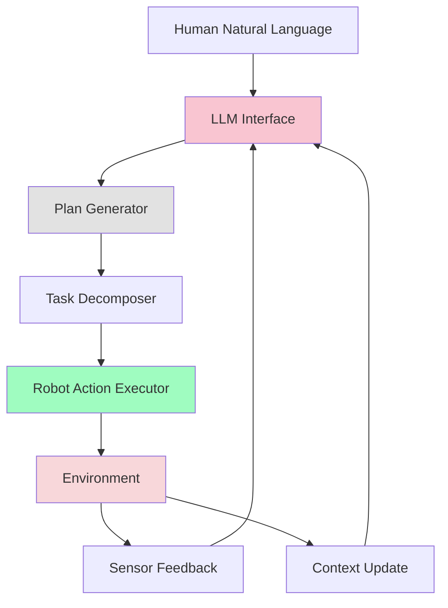

# Week 12: LLM-Based Cognitive Planning

## Learning Objectives

By the end of this week, you will be able to:
- Integrate Large Language Models (LLMs) for cognitive planning in humanoid robots
- Implement task decomposition and execution using LLMs
- Create cognitive architectures that combine LLMs with robotic systems
- Design planning algorithms that leverage LLM reasoning capabilities
- Evaluate and optimize LLM-robot integration for performance

## Introduction to LLM-Based Cognitive Planning

Large Language Models have emerged as powerful tools for cognitive planning in robotics, enabling robots to understand complex natural language instructions, reason about their environment, and generate sophisticated action sequences. For humanoid robots, LLM integration provides the ability to handle ambiguous, high-level commands and translate them into executable robotic behaviors.

### Key Capabilities of LLM-Based Planning

1. **Natural Language Understanding**: Interpret complex, ambiguous commands
2. **Reasoning and Inference**: Deduce appropriate actions based on context
3. **Task Decomposition**: Break down complex goals into manageable steps
4. **Context Awareness**: Consider environmental and situational factors
5. **Adaptive Planning**: Adjust plans based on feedback and changing conditions

## LLM Integration Architecture

### System Components

The LLM-robot integration system consists of several key components:



### Planning Pipeline

The cognitive planning pipeline follows this sequence:
1. **Input Processing**: Natural language command interpretation
2. **Context Integration**: Incorporate environmental and robot state information
3. **Plan Generation**: Generate high-level plan using LLM reasoning
4. **Task Decomposition**: Break plan into executable robotic actions
5. **Execution Monitoring**: Monitor execution and adapt as needed

## OpenAI API Integration

### Basic Setup and Configuration

```python
# llm_planner.py
import openai
import json
import time
from typing import Dict, List, Any, Optional
import asyncio
from dataclasses import dataclass

@dataclass
class RobotState:
    """Represents the current state of the robot"""
    position: Dict[str, float]  # x, y, z coordinates
    orientation: Dict[str, float]  # roll, pitch, yaw
    battery_level: float
    available_abilities: List[str]
    current_task: Optional[str] = None

@dataclass
class EnvironmentState:
    """Represents the current environment state"""
    objects: List[Dict[str, Any]]  # List of detected objects
    locations: List[Dict[str, Any]]  # List of known locations
    obstacles: List[Dict[str, Any]]  # List of obstacles
    lighting: str  # "bright", "dim", "dark"

class LLMPlanner:
    def __init__(self, api_key: str, model: str = "gpt-4-turbo"):
        """
        Initialize the LLM-based planner
        """
        openai.api_key = api_key
        self.model = model
        self.robot_state = RobotState(
            position={"x": 0.0, "y": 0.0, "z": 0.0},
            orientation={"roll": 0.0, "pitch": 0.0, "yaw": 0.0},
            battery_level=1.0,
            available_abilities=["move", "grasp", "speak", "navigate"]
        )
        self.environment_state = EnvironmentState(
            objects=[],
            locations=[],
            obstacles=[],
            lighting="bright"
        )

    def update_robot_state(self, new_state: RobotState):
        """Update the robot's current state"""
        self.robot_state = new_state

    def update_environment_state(self, new_state: EnvironmentState):
        """Update the environment state"""
        self.environment_state = new_state

    async def generate_plan(self, goal: str) -> Optional[List[Dict[str, Any]]]:
        """
        Generate a plan for achieving the specified goal using LLM
        """
        # Prepare context for the LLM
        context = self._prepare_context(goal)

        # Create the planning prompt
        prompt = self._create_planning_prompt(context)

        try:
            response = await openai.ChatCompletion.acreate(
                model=self.model,
                messages=[
                    {"role": "system", "content": self._get_system_prompt()},
                    {"role": "user", "content": prompt}
                ],
                temperature=0.3,  # Lower temperature for more consistent planning
                max_tokens=1000,
                response_format={"type": "json_object"}  # Request JSON response
            )

            # Parse the response
            plan_text = response.choices[0].message.content
            plan = json.loads(plan_text)

            return plan.get("actions", [])

        except Exception as e:
            print(f"Error generating plan: {e}")
            return None

    def _prepare_context(self, goal: str) -> Dict[str, Any]:
        """Prepare context information for the LLM"""
        return {
            "goal": goal,
            "robot_state": {
                "position": self.robot_state.position,
                "orientation": self.robot_state.orientation,
                "battery_level": self.robot_state.battery_level,
                "abilities": self.robot_state.available_abilities
            },
            "environment_state": {
                "objects": self.environment_state.objects,
                "locations": self.environment_state.locations,
                "obstacles": self.environment_state.obstacles,
                "lighting": self.environment_state.lighting
            },
            "current_task": self.robot_state.current_task
        }

    def _create_planning_prompt(self, context: Dict[str, Any]) -> str:
        """Create the planning prompt for the LLM"""
        return f"""
        You are a cognitive planning system for a humanoid robot. Your task is to generate a detailed action plan to achieve the user's goal.

        Current context:
        - Goal: {context['goal']}
        - Robot position: {context['robot_state']['position']}
        - Robot abilities: {context['robot_state']['abilities']}
        - Battery level: {context['robot_state']['battery_level']:.2%}
        - Environment objects: {context['environment_state']['objects']}
        - Known locations: {context['environment_state']['locations']}
        - Obstacles: {context['environment_state']['obstacles']}
        - Lighting conditions: {context['environment_state']['lighting']}

        Generate a JSON object with an "actions" array containing specific, executable actions. Each action should be a dictionary with:
        - "action": The action type (e.g., "navigate", "grasp", "speak", "detect")
        - "parameters": Required parameters for the action
        - "description": Human-readable description of the action
        - "estimated_duration": Estimated time in seconds

        Example output format:
        {{
            "actions": [
                {{
                    "action": "navigate",
                    "parameters": {{"target_location": "kitchen", "avoid_obstacles": true}},
                    "description": "Navigate to the kitchen while avoiding obstacles",
                    "estimated_duration": 30
                }},
                {{
                    "action": "detect",
                    "parameters": {{"object_type": "cup", "location": "kitchen"}},
                    "description": "Look for a cup in the kitchen",
                    "estimated_duration": 10
                }}
            ]
        }}
        """

    def _get_system_prompt(self) -> str:
        """Get the system prompt for consistent behavior"""
        return """
        You are a cognitive planning system for a humanoid robot. Generate detailed, executable action plans that are:
        1. Feasible given the robot's capabilities
        2. Safe for the robot and environment
        3. Efficient in achieving the goal
        4. Adaptable to environmental constraints

        Always respond in JSON format with an "actions" array. Each action should be specific and executable by the robot.
        """

    def execute_plan(self, plan: List[Dict[str, Any]]) -> bool:
        """
        Execute the generated plan step by step
        """
        for i, action in enumerate(plan):
            print(f"Executing action {i+1}/{len(plan)}: {action['description']}")

            success = self._execute_single_action(action)
            if not success:
                print(f"Action failed: {action['description']}")
                return False

            print(f"Action completed successfully")

        return True

    def _execute_single_action(self, action: Dict[str, Any]) -> bool:
        """
        Execute a single action (placeholder implementation)
        """
        action_type = action['action']
        parameters = action['parameters']

        # In a real implementation, this would call the appropriate ROS service
        # For now, we'll simulate execution
        print(f"Simulating execution of {action_type} with parameters: {parameters}")

        # Simulate action duration
        duration = action.get('estimated_duration', 5)
        time.sleep(min(duration, 1))  # Fast simulation

        # Return success (in real implementation, check actual success)
        return True
```

## Task Decomposition with LLMs

### Hierarchical Task Decomposition

LLM-based systems can decompose complex tasks into hierarchical structures:

```python
class TaskDecomposer:
    def __init__(self, llm_planner: LLMPlanner):
        self.planner = llm_planner

    async def decompose_task(self, high_level_task: str) -> Dict[str, Any]:
        """
        Decompose a high-level task into subtasks using LLM reasoning
        """
        prompt = f"""
        Decompose the following high-level task into specific, executable subtasks:
        Task: {high_level_task}

        Consider the robot's capabilities and the environment. Return a hierarchical JSON structure with:
        - "task": The main task
        - "subtasks": Array of subtasks, each with:
          - "name": Subtask name
          - "type": Type of subtask (navigation, manipulation, perception, etc.)
          - "dependencies": List of subtask indices this depends on
          - "required_capabilities": List of robot capabilities needed
          - "estimated_complexity": 1-10 scale

        Example format:
        {{
            "task": "{high_level_task}",
            "subtasks": [
                {{
                    "name": "Navigate to kitchen",
                    "type": "navigation",
                    "dependencies": [],
                    "required_capabilities": ["navigate", "avoid_obstacles"],
                    "estimated_complexity": 3
                }},
                {{
                    "name": "Find red cup",
                    "type": "perception",
                    "dependencies": [0],
                    "required_capabilities": ["object_detection", "color_recognition"],
                    "estimated_complexity": 5
                }}
            ]
        }}
        """

        try:
            response = await openai.ChatCompletion.acreate(
                model=self.planner.model,
                messages=[
                    {"role": "system", "content": "You are a task decomposition expert for robotic systems."},
                    {"role": "user", "content": prompt}
                ],
                temperature=0.2,
                response_format={"type": "json_object"}
            )

            result = json.loads(response.choices[0].message.content)
            return result

        except Exception as e:
            print(f"Error decomposing task: {e}")
            return {"task": high_level_task, "subtasks": []}

    def generate_execution_order(self, subtasks: List[Dict]) -> List[int]:
        """
        Generate execution order based on dependencies
        """
        # Simple topological sort for dependency resolution
        completed = set()
        execution_order = []

        while len(completed) < len(subtasks):
            for i, subtask in enumerate(subtasks):
                if i in completed:
                    continue

                # Check if all dependencies are completed
                dependencies = subtask.get('dependencies', [])
                if all(dep in completed for dep in dependencies):
                    execution_order.append(i)
                    completed.add(i)
                    break
            else:
                # No progress made - likely circular dependency
                print("Warning: Possible circular dependency in subtasks")
                break

        return execution_order
```

## Cognitive Architecture Integration

### Perception-Planning-Action Loop

The cognitive architecture implements a continuous loop that integrates perception, planning, and action:

```python
class CognitiveArchitecture:
    def __init__(self, llm_planner: LLMPlanner, task_decomposer: TaskDecomposer):
        self.planner = llm_planner
        self.decomposer = task_decomposer
        self.running = False

        # State tracking
        self.current_plan = []
        self.current_task_index = 0
        self.execution_history = []

        # ROS integration
        self.ros_initialized = False

    async def process_goal(self, goal: str):
        """
        Process a high-level goal through the cognitive architecture
        """
        print(f"Processing goal: {goal}")

        # Decompose the task
        print("Decomposing task...")
        task_structure = await self.decomposer.decompose_task(goal)

        # Generate detailed plan
        print("Generating detailed plan...")
        detailed_plan = await self.planner.generate_plan(goal)

        if detailed_plan:
            print("Executing plan...")
            success = self.planner.execute_plan(detailed_plan)

            if success:
                print("Goal achieved successfully!")
                return True
            else:
                print("Plan execution failed")
                return False
        else:
            print("Failed to generate plan")
            return False

    def update_states(self, robot_state: RobotState, environment_state: EnvironmentState):
        """
        Update robot and environment states
        """
        self.planner.update_robot_state(robot_state)
        self.planner.update_environment_state(environment_state)

    async def run_cognitive_loop(self):
        """
        Run the continuous cognitive loop
        """
        self.running = True

        while self.running:
            # In a real implementation, this would wait for new goals
            # For this example, we'll simulate a continuous loop
            await asyncio.sleep(1)  # Non-blocking sleep

    def stop(self):
        """Stop the cognitive architecture"""
        self.running = False
```

## LLM-ROS Integration

### ROS 2 Node for LLM Planning

```python
# llm_planning_node.py
import rclpy
from rclpy.node import Node
from std_msgs.msg import String
from geometry_msgs.msg import Pose
from sensor_msgs.msg import JointState
from llm_interfaces.srv import PlanGoal, ExecutePlan
import asyncio
import threading
from concurrent.futures import ThreadPoolExecutor

class LLMPlanningNode(Node):
    def __init__(self):
        super().__init__('llm_planning_node')

        # Publishers
        self.plan_pub = self.create_publisher(String, '/planned_actions', 10)
        self.feedback_pub = self.create_publisher(String, '/planning_feedback', 10)

        # Services
        self.plan_service = self.create_service(
            PlanGoal, 'plan_goal', self.plan_goal_callback)
        self.execute_service = self.create_service(
            ExecutePlan, 'execute_plan', self.execute_plan_callback)

        # Initialize LLM components
        api_key = self.declare_parameter('openai_api_key', '').value
        if not api_key:
            self.get_logger().error('OpenAI API key not provided')
            return

        self.planner = LLMPlanner(api_key)
        self.decomposer = TaskDecomposer(self.planner)
        self.architecture = CognitiveArchitecture(self.planner, self.decomposer)

        # Async executor
        self.executor = ThreadPoolExecutor(max_workers=2)
        self.loop = asyncio.new_event_loop()
        self.executor.submit(self._run_async_loop, self.loop)

        self.get_logger().info('LLM Planning Node initialized')

    def _run_async_loop(self, loop):
        """Run the asyncio event loop in a separate thread"""
        asyncio.set_event_loop(loop)
        loop.run_forever()

    def plan_goal_callback(self, request, response):
        """
        Service callback for planning a goal
        """
        goal = request.goal
        self.get_logger().info(f'Received planning request for goal: {goal}')

        # Run the async planning in the event loop
        future = asyncio.run_coroutine_threadsafe(
            self._plan_goal_async(goal), self.loop)

        try:
            plan = future.result(timeout=30.0)  # 30 second timeout
            if plan:
                response.success = True
                response.plan = json.dumps(plan)
                response.message = "Plan generated successfully"
            else:
                response.success = False
                response.message = "Failed to generate plan"
        except Exception as e:
            response.success = False
            response.message = f"Planning failed: {str(e)}"

        return response

    async def _plan_goal_async(self, goal: str):
        """Async method to generate plan"""
        return await self.planner.generate_plan(goal)

    def execute_plan_callback(self, request, response):
        """
        Service callback for executing a plan
        """
        plan_json = request.plan
        try:
            plan = json.loads(plan_json)
            self.get_logger().info(f'Executing plan with {len(plan)} actions')

            success = self.planner.execute_plan(plan)
            response.success = success
            response.message = "Plan executed successfully" if success else "Plan execution failed"
        except json.JSONDecodeError as e:
            response.success = False
            response.message = f"Invalid plan format: {str(e)}"
        except Exception as e:
            response.success = False
            response.message = f"Execution failed: {str(e)}"

        return response

    def update_robot_state_from_ros(self):
        """
        Update robot state from ROS topics (implementation needed)
        """
        # This would subscribe to robot state topics and update internal state
        pass

    def destroy_node(self):
        """Clean up resources"""
        self.architecture.stop()
        self.executor.shutdown(wait=True)
        super().destroy_node()

def main(args=None):
    rclpy.init(args=args)
    node = LLMPlanningNode()

    try:
        rclpy.spin(node)
    except KeyboardInterrupt:
        node.get_logger().info('Shutting down LLM Planning Node')
    finally:
        node.destroy_node()
        rclpy.shutdown()

if __name__ == '__main__':
    main()
```

## Advanced Planning Techniques

### Multi-Modal Planning

LLMs can be enhanced with multi-modal inputs for better planning:

```python
class MultiModalPlanner(LLMPlanner):
    def __init__(self, api_key: str, model: str = "gpt-4-vision-preview"):
        super().__init__(api_key, model)
        self.vision_model = model

    async def generate_plan_with_vision(self, goal: str, image_data: bytes) -> Optional[List[Dict[str, Any]]]:
        """
        Generate plan using both text goal and visual input
        """
        context = self._prepare_context(goal)

        # Encode image for API (base64 encoding)
        import base64
        image_base64 = base64.b64encode(image_data).decode('utf-8')

        try:
            response = await openai.ChatCompletion.acreate(
                model=self.vision_model,
                messages=[
                    {"role": "system", "content": self._get_system_prompt()},
                    {
                        "role": "user",
                        "content": [
                            {"type": "text", "text": self._create_planning_prompt(context)},
                            {
                                "type": "image_url",
                                "image_url": {
                                    "url": f"data:image/jpeg;base64,{image_base64}"
                                }
                            }
                        ]
                    }
                ],
                temperature=0.3,
                max_tokens=1200,
                response_format={"type": "json_object"}
            )

            plan_text = response.choices[0].message.content
            plan = json.loads(plan_text)

            return plan.get("actions", [])

        except Exception as e:
            print(f"Error generating vision-enhanced plan: {e}")
            # Fall back to text-only planning
            return await self.generate_plan(goal)

    def _create_vision_planning_prompt(self, context: Dict[str, Any]) -> str:
        """Create a prompt that incorporates visual information"""
        return f"""
        You are a cognitive planning system for a humanoid robot.
        You have access to both the goal description and a visual scene.
        Use both text context and visual information to generate the best action plan.

        Text context:
        - Goal: {context['goal']}
        - Robot state: {context['robot_state']}
        - Environment: {context['environment_state']}

        Visual scene analysis: Analyze the provided image to understand:
        - Object locations and types
        - Spatial relationships
        - Potential obstacles or clear paths
        - Environmental context

        Generate a JSON object with an "actions" array containing specific, executable actions.
        Prioritize actions that make use of visual information to improve plan accuracy.
        """
```

### Context-Aware Planning

Implement context-aware planning that considers the robot's history and environment:

```python
class ContextAwarePlanner(LLMPlanner):
    def __init__(self, api_key: str, model: str = "gpt-4-turbo"):
        super().__init__(api_key, model)
        self.action_history = []
        self.context_memory = []

    def add_to_context_memory(self, event: str, importance: float = 1.0):
        """
        Add an event to context memory with importance weighting
        """
        memory_entry = {
            "event": event,
            "timestamp": time.time(),
            "importance": importance
        }
        self.context_memory.append(memory_entry)

        # Keep only recent and important memories
        self.context_memory = [
            mem for mem in self.context_memory
            if (time.time() - mem["timestamp"]) < 3600  # Last hour
            or mem["importance"] > 0.7  # High importance
        ]

    async def generate_context_aware_plan(self, goal: str) -> Optional[List[Dict[str, Any]]]:
        """
        Generate a plan that considers historical context
        """
        context = self._prepare_context(goal)
        context["historical_context"] = self.context_memory[-10:]  # Last 10 memories

        prompt = self._create_context_aware_prompt(context)

        try:
            response = await openai.ChatCompletion.acreate(
                model=self.model,
                messages=[
                    {"role": "system", "content": self._get_context_aware_system_prompt()},
                    {"role": "user", "content": prompt}
                ],
                temperature=0.3,
                max_tokens=1000,
                response_format={"type": "json_object"}
            )

            plan_text = response.choices[0].message.content
            plan = json.loads(plan_text)

            # Add plan to action history
            self.action_history.append({
                "goal": goal,
                "plan": plan,
                "timestamp": time.time()
            })

            return plan.get("actions", [])

        except Exception as e:
            print(f"Error generating context-aware plan: {e}")
            return None

    def _create_context_aware_prompt(self, context: Dict[str, Any]) -> str:
        """Create a prompt that includes historical context"""
        return f"""
        You are a cognitive planning system for a humanoid robot.
        Consider both the current goal and the robot's recent experiences.

        Current goal: {context['goal']}

        Current state:
        - Robot position: {context['robot_state']['position']}
        - Available abilities: {context['robot_state']['abilities']}
        - Environment: {context['environment_state']}

        Recent experiences (most recent first):
        {self._format_context_memory(context['historical_context'])}

        Generate a plan that leverages past experiences to improve current task execution.
        If similar situations occurred before, consider the outcomes and adapt accordingly.

        Return JSON with "actions" array as specified previously.
        """

    def _format_context_memory(self, memory: List[Dict]) -> str:
        """Format context memory for the prompt"""
        if not memory:
            return "No recent experiences."

        formatted = []
        for i, entry in enumerate(memory):
            formatted.append(f"{i+1}. {entry['event']} (at {entry['timestamp']})")

        return "\n".join(formatted)

    def _get_context_aware_system_prompt(self) -> str:
        """System prompt for context-aware planning"""
        return """
        You are a cognitive planning system that learns from experience.
        Use historical context to inform your planning decisions:
        - If similar tasks were performed before, consider the outcomes
        - Adapt plans based on past successes and failures
        - Consider the robot's learning and improvement over time
        - Maintain consistency with previous successful strategies
        """
```

## Performance Optimization

### Caching and Efficiency

```python
import functools
import hashlib
from typing import Callable

class OptimizedLLMPlanner(ContextAwarePlanner):
    def __init__(self, api_key: str, model: str = "gpt-4-turbo"):
        super().__init__(api_key, model)
        self.plan_cache = {}
        self.max_cache_size = 100

    async def generate_plan_with_cache(self, goal: str) -> Optional[List[Dict[str, Any]]]:
        """
        Generate plan with caching to improve performance
        """
        # Create cache key from goal and context
        context = self._prepare_context(goal)
        cache_key = self._create_cache_key(goal, context)

        # Check cache first
        if cache_key in self.plan_cache:
            print("Retrieved plan from cache")
            return self.plan_cache[cache_key]

        # Generate new plan
        plan = await self.generate_context_aware_plan(goal)

        # Store in cache
        if plan and len(self.plan_cache) < self.max_cache_size:
            self.plan_cache[cache_key] = plan

        return plan

    def _create_cache_key(self, goal: str, context: Dict[str, Any]) -> str:
        """Create a cache key based on goal and relevant context"""
        cache_input = {
            "goal": goal,
            "position": context["robot_state"]["position"],
            "abilities": sorted(context["robot_state"]["abilities"]),
            "environment_summary": self._summarize_environment(context["environment_state"])
        }

        cache_string = json.dumps(cache_input, sort_keys=True)
        return hashlib.md5(cache_string.encode()).hexdigest()

    def _summarize_environment(self, env_state: Dict[str, Any]) -> str:
        """Create a summary of environment state for caching"""
        return f"objects:{len(env_state['objects'])}_locs:{len(env_state['locations'])}_obs:{len(env_state['obstacles'])}_{env_state['lighting']}"

    def clear_cache(self):
        """Clear the plan cache"""
        self.plan_cache.clear()
```

## Practical Example: LLM-Planned Household Assistant

Let's create a complete example that demonstrates LLM-based planning for a household assistant robot:

```python
# household_assistant_demo.py
import asyncio
import time
from typing import Dict, List, Any

class HouseholdAssistant:
    def __init__(self, api_key: str):
        self.planner = OptimizedLLMPlanner(api_key)
        self.current_location = "entrance"
        self.battery_level = 1.0
        self.carrying_object = None

    async def handle_request(self, request: str) -> bool:
        """
        Handle a natural language request from a user
        """
        print(f"Received request: {request}")

        # Update robot state based on current situation
        self._update_robot_state()

        # Generate plan using LLM
        plan = await self.planner.generate_plan_with_cache(request)

        if not plan:
            print("Could not generate plan for request")
            return False

        print(f"Generated plan with {len(plan)} actions")

        # Execute the plan
        success = await self._execute_plan_detailed(plan, request)

        return success

    def _update_robot_state(self):
        """Update robot state before planning"""
        robot_state = RobotState(
            position={"x": 0.0, "y": 0.0, "z": 0.0},  # Simplified
            orientation={"roll": 0.0, "pitch": 0.0, "yaw": 0.0},
            battery_level=self.battery_level,
            available_abilities=["navigate", "grasp", "speak", "detect_objects"],
            current_task="household_assistant"
        )

        # Simulate environment state (in real system, this comes from perception)
        env_state = EnvironmentState(
            objects=[
                {"name": "cup", "location": "kitchen_table", "color": "blue"},
                {"name": "book", "location": "living_room_shelf", "type": "novel"},
                {"name": "keys", "location": "entrance_table", "color": "metallic"}
            ],
            locations=[
                {"name": "kitchen", "x": 5.0, "y": 0.0},
                {"name": "living_room", "x": 0.0, "y": 3.0},
                {"name": "bedroom", "x": 5.0, "y": 3.0},
                {"name": "entrance", "x": 0.0, "y": 0.0}
            ],
            obstacles=[],
            lighting="bright"
        )

        self.planner.update_robot_state(robot_state)
        self.planner.update_environment_state(env_state)

    async def _execute_plan_detailed(self, plan: List[Dict], original_request: str) -> bool:
        """
        Execute plan with detailed feedback and monitoring
        """
        for i, action in enumerate(plan):
            print(f"Step {i+1}/{len(plan)}: {action['description']}")

            success = await self._execute_single_action_detailed(action)
            if not success:
                print(f"Action failed: {action['description']}")

                # Add to context memory for learning
                self.planner.add_to_context_memory(
                    f"Failed to execute: {action['action']} for request '{original_request}'",
                    importance=0.8
                )

                return False

            # Add to context memory for successful actions
            self.planner.add_to_context_memory(
                f"Successfully executed: {action['action']} for request '{original_request}'",
                importance=0.6
            )

            print(f"✓ Completed: {action['description']}")

        print("All actions completed successfully!")
        return True

    async def _execute_single_action_detailed(self, action: Dict[str, Any]) -> bool:
        """
        Execute a single action with detailed simulation
        """
        action_type = action['action']
        parameters = action['parameters']

        # Simulate different action types
        if action_type == "navigate":
            await self._simulate_navigation(parameters)
        elif action_type == "grasp":
            await self._simulate_grasping(parameters)
        elif action_type == "speak":
            await self._simulate_speaking(parameters)
        elif action_type == "detect":
            await self._simulate_detection(parameters)
        elif action_type == "place":
            await self._simulate_placement(parameters)
        else:
            print(f"Unknown action type: {action_type}")
            return False

        # Simulate action duration
        duration = action.get('estimated_duration', 5)
        await asyncio.sleep(min(duration / 10, 0.5))  # Fast simulation

        return True

    async def _simulate_navigation(self, params: Dict[str, Any]):
        """Simulate navigation action"""
        target = params.get('target_location', 'unknown')
        print(f"  → Navigating to {target}")
        # Update current location after navigation
        self.current_location = target

    async def _simulate_grasping(self, params: Dict[str, Any]):
        """Simulate grasping action"""
        obj = params.get('object', 'unknown')
        print(f"  → Grasping {obj}")
        self.carrying_object = obj

    async def _simulate_speaking(self, params: Dict[str, Any]):
        """Simulate speaking action"""
        text = params.get('text', 'Hello')
        print(f"  → Speaking: {text}")

    async def _simulate_detection(self, params: Dict[str, Any]):
        """Simulate object detection"""
        obj_type = params.get('object_type', 'object')
        location = params.get('location', 'current')
        print(f"  → Detecting {obj_type} in {location}")

    async def _simulate_placement(self, params: Dict[str, Any]):
        """Simulate object placement"""
        location = params.get('location', 'current')
        print(f"  → Placing object at {location}")
        self.carrying_object = None

async def main_demo():
    """
    Demonstration of LLM-based household assistant
    """
    # Note: In a real implementation, you would use your OpenAI API key
    # For this example, we'll show the structure
    print("Starting Household Assistant Demo")
    print("Note: This demo shows the structure - requires valid OpenAI API key to run")

    # assistant = HouseholdAssistant("your-api-key-here")

    demo_requests = [
        "Please bring me a cup from the kitchen",
        "Go to the living room and find my book",
        "Tell me where my keys are located"
    ]

    for request in demo_requests:
        print(f"\n--- Processing: {request} ---")
        # success = await assistant.handle_request(request)
        # print(f"Request {'succeeded' if success else 'failed'}")
        print("  [Demo mode - showing structure]")

    print("\nDemo completed!")

if __name__ == "__main__":
    asyncio.run(main_demo())
```

## Best Practices for LLM Integration

### 1. Safety and Validation
- Always validate LLM outputs before execution
- Implement safety checks and constraints
- Use conservative temperature settings for planning
- Implement fallback mechanisms for failed plans

### 2. Performance Optimization
- Cache frequently used plans
- Use appropriate model sizes for your use case
- Implement async processing for better responsiveness
- Monitor API usage and costs

### 3. Context Management
- Maintain relevant context history
- Implement memory management to avoid context bloat
- Use structured formats for better parsing
- Consider privacy and data handling requirements

### 4. Error Handling
- Implement graceful degradation when LLM fails
- Provide meaningful error messages
- Log failures for system improvement
- Implement retry mechanisms for transient failures

## Summary

This week covered LLM-based cognitive planning for humanoid robots, including:
- OpenAI API integration for robotic planning
- Task decomposition using LLM reasoning
- Cognitive architecture design with perception-planning-action loops
- Multi-modal planning with visual inputs
- Context-aware planning with memory
- Performance optimization techniques
- Complete household assistant example

In the next week, we'll combine everything into the capstone project: an autonomous humanoid system that integrates all course modules.