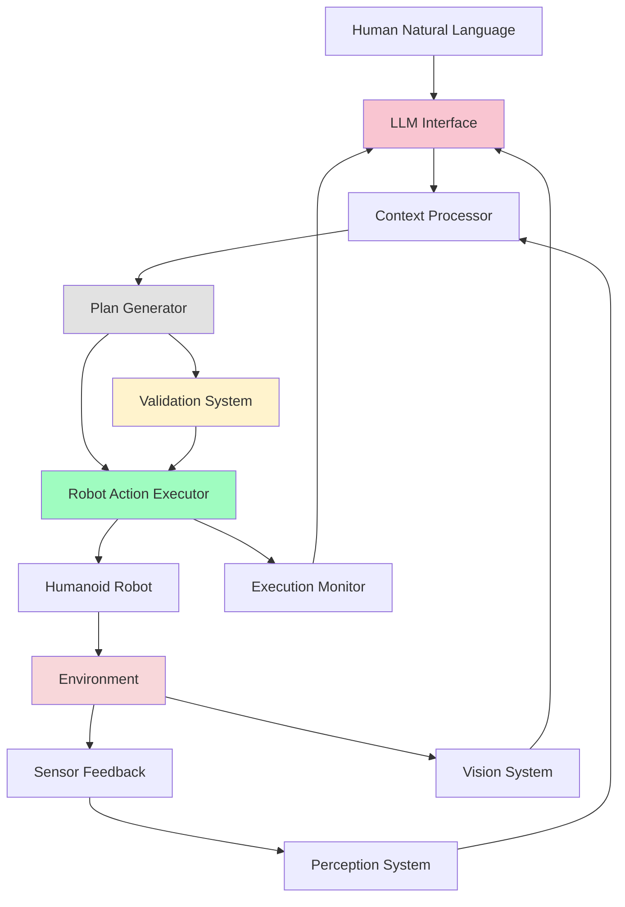

# Week 12: LLM-Robot Integration

## Learning Objectives

By the end of this section, you will be able to:
- Design sophisticated interfaces between LLMs and robotic systems
- Implement context-aware communication protocols for LLM-robot interaction
- Create bidirectional data flows between LLMs and robots
- Develop safety and validation mechanisms for LLM-robot integration
- Optimize LLM usage for real-time robotic applications

## LLM-Robot Integration Architecture

### Bidirectional Communication Framework

The integration between Large Language Models and robotic systems requires a sophisticated bidirectional communication framework that enables natural language interaction while ensuring safe and reliable robot operation:



### Key Integration Components

1. **LLM Interface Layer**: Manages communication with the language model
2. **Context Management**: Provides environmental and robot state to LLM
3. **Plan Translation**: Converts LLM outputs to robot-executable actions
4. **Validation System**: Ensures safe and feasible robot actions
5. **Feedback Loop**: Updates LLM with execution results

## Advanced LLM Interface Design

### Context-Enriched Communication

```python
# advanced_llm_interface.py
import openai
import json
import asyncio
import time
from typing import Dict, List, Any, Optional, Callable
from dataclasses import dataclass
import threading
from concurrent.futures import ThreadPoolExecutor
import hashlib

@dataclass
class RobotState:
    """Comprehensive robot state representation"""
    position: Dict[str, float]
    orientation: Dict[str, float]
    joint_positions: Dict[str, float]
    battery_level: float
    current_task: Optional[str]
    carrying_object: Optional[str]
    available_actions: List[str]
    sensors_active: Dict[str, bool]
    last_action_time: float

@dataclass
class EnvironmentalState:
    """Environmental state representation"""
    objects: List[Dict[str, Any]]
    locations: List[Dict[str, Any]]
    obstacles: List[Dict[str, Any]]
    lighting: str
    time_of_day: str
    temperature: float
    humidity: float

@dataclass
class InteractionContext:
    """Context for LLM interaction"""
    robot_state: RobotState
    environment_state: EnvironmentalState
    conversation_history: List[Dict[str, str]]
    system_capabilities: Dict[str, Any]
    safety_constraints: Dict[str, Any]

class AdvancedLLMInterface:
    def __init__(self, api_key: str, model: str = "gpt-4-turbo"):
        openai.api_key = api_key
        self.model = model
        self.executor = ThreadPoolExecutor(max_workers=2)
        self.loop = asyncio.new_event_loop()

        # State management
        self.robot_state = RobotState(
            position={"x": 0.0, "y": 0.0, "z": 0.0},
            orientation={"roll": 0.0, "pitch": 0.0, "yaw": 0.0},
            joint_positions={},
            battery_level=1.0,
            current_task=None,
            carrying_object=None,
            available_actions=["navigate", "grasp", "speak", "detect_objects", "manipulate"],
            sensors_active={"lidar": True, "camera": True, "imu": True},
            last_action_time=time.time()
        )

        self.environment_state = EnvironmentalState(
            objects=[],
            locations=[],
            obstacles=[],
            lighting="bright",
            time_of_day="afternoon",
            temperature=22.0,
            humidity=45.0
        )

        self.conversation_history = []
        self.max_history_length = 20

        # Safety and validation
        self.safety_constraints = {
            "max_navigation_distance": 10.0,
            "min_battery_for_navigation": 0.2,
            "forbidden_actions": ["self_destruct", "jump", "run_fast"],
            "max_manipulation_force": 50.0  # Newtons
        }

        # Action mapping
        self.action_mapping = {
            "move_forward": self._execute_move_forward,
            "move_backward": self._execute_move_backward,
            "turn_left": self._execute_turn_left,
            "turn_right": self._execute_turn_right,
            "navigate_to": self._execute_navigate_to,
            "grasp_object": self._execute_grasp_object,
            "speak": self._execute_speak,
            "detect_objects": self._execute_detect_objects
        }

    def update_robot_state(self, new_state: RobotState):
        """Update robot state"""
        self.robot_state = new_state

    def update_environment_state(self, new_state: EnvironmentalState):
        """Update environmental state"""
        self.environment_state = new_state

    async def generate_response(self, user_input: str) -> Optional[Dict[str, Any]]:
        """
        Generate response using LLM with full context
        """
        context = self._build_interaction_context()

        # Add user input to conversation history
        self._add_to_conversation_history("user", user_input)

        prompt = self._create_enhanced_prompt(user_input, context)

        try:
            response = await openai.ChatCompletion.acreate(
                model=self.model,
                messages=[
                    {"role": "system", "content": self._get_system_prompt()},
                    {"role": "user", "content": prompt}
                ],
                temperature=0.3,
                max_tokens=1500,
                response_format={"type": "json_object"}
            )

            response_text = response.choices[0].message.content
            result = json.loads(response_text)

            # Add LLM response to conversation history
            self._add_to_conversation_history("assistant", response_text)

            return result

        except Exception as e:
            print(f"LLM response generation error: {e}")
            return None

    def _build_interaction_context(self) -> InteractionContext:
        """Build comprehensive interaction context"""
        return InteractionContext(
            robot_state=self.robot_state,
            environment_state=self.environment_state,
            conversation_history=self.conversation_history[-5:],  # Last 5 exchanges
            system_capabilities={
                "navigation": True,
                "manipulation": True,
                "vision": True,
                "speech": True,
                "grasping": True
            },
            safety_constraints=self.safety_constraints
        )

    def _create_enhanced_prompt(self, user_input: str, context: InteractionContext) -> str:
        """Create prompt with comprehensive context"""
        return f"""
        You are an advanced cognitive interface for a humanoid robot. Process the user's request considering all available context.

        USER REQUEST: {user_input}

        ROBOT STATE:
        - Position: {context.robot_state.position}
        - Orientation: {context.robot_state.orientation}
        - Battery Level: {context.robot_state.battery_level:.1%}
        - Carrying: {context.robot_state.carrying_object or 'Nothing'}
        - Current Task: {context.robot_state.current_task}
        - Available Actions: {context.robot_state.available_actions}
        - Last Action: {time.time() - context.robot_state.last_action_time:.1f}s ago

        ENVIRONMENT STATE:
        - Objects: {context.environment_state.objects}
        - Locations: {context.environment_state.locations}
        - Obstacles: {context.environment_state.obstacles}
        - Lighting: {context.environment_state.lighting}
        - Time: {context.environment_state.time_of_day}
        - Temperature: {context.environment_state.temperature}°C
        - Humidity: {context.environment_state.humidity}%

        SYSTEM CAPABILITIES: {context.system_capabilities}

        SAFETY CONSTRAINTS:
        - Max navigation distance: {context.safety_constraints['max_navigation_distance']}m
        - Min battery for navigation: {context.safety_constraints['min_battery_for_navigation']:.0%}
        - Forbidden actions: {context.safety_constraints['forbidden_actions']}

        PREVIOUS CONVERSATION (most recent first):
        {self._format_conversation_history(context.conversation_history)}

        Generate a JSON response with:
        1. "intent": The user's intent (information, navigation, manipulation, etc.)
        2. "confidence": Your confidence in the interpretation (0.0-1.0)
        3. "actions": Array of specific robot actions to execute
        4. "response_text": Natural language response to user
        5. "safety_check": Whether actions pass safety validation

        Each action should have:
        - "type": The action type
        - "parameters": Required parameters
        - "description": Human-readable description
        - "estimated_duration": Expected execution time in seconds
        - "safety_critical": Whether this requires extra safety checks

        Example response:
        {{
            "intent": "navigation",
            "confidence": 0.9,
            "actions": [
                {{
                    "type": "navigate_to",
                    "parameters": {{"location": "kitchen"}},
                    "description": "Move to kitchen area",
                    "estimated_duration": 30,
                    "safety_critical": true
                }}
            ],
            "response_text": "I'll navigate to the kitchen for you.",
            "safety_check": true
        }}
        """

    def _format_conversation_history(self, history: List[Dict[str, str]]) -> str:
        """Format conversation history for prompt"""
        if not history:
            return "No previous conversation."

        formatted = []
        for entry in history[-3:]:  # Show last 3 exchanges
            role = entry.get("role", "unknown")
            content = entry.get("content", "")[:100]  # Truncate long content
            formatted.append(f"{role}: {content}...")

        return "\n".join(formatted)

    def _get_system_prompt(self) -> str:
        """Get system prompt for consistent behavior"""
        return """
        You are an expert cognitive interface for a humanoid robot. Your responses must be:
        1. Safe - never suggest dangerous or harmful actions
        2. Feasible - only suggest actions the robot can actually perform
        3. Helpful - provide useful and relevant responses
        4. Honest - acknowledge limitations and uncertainties
        5. Context-aware - consider robot state and environment

        Always respond in valid JSON format. Validate all actions against safety constraints.
        If a request is impossible or unsafe, explain why and suggest alternatives.
        """

    def _add_to_conversation_history(self, role: str, content: str):
        """Add entry to conversation history"""
        entry = {
            "role": role,
            "content": content,
            "timestamp": time.time()
        }
        self.conversation_history.append(entry)

        # Prune old entries
        if len(self.conversation_history) > self.max_history_length:
            self.conversation_history = self.conversation_history[-self.max_history_length:]

    async def execute_actions(self, actions: List[Dict[str, Any]]) -> Dict[str, Any]:
        """
        Execute actions with safety validation
        """
        results = []
        success_count = 0

        for action in actions:
            # Validate action safety
            if not self._validate_action_safety(action):
                print(f"Action failed safety validation: {action}")
                results.append({
                    "action": action,
                    "success": False,
                    "error": "Failed safety validation"
                })
                continue

            # Execute action
            success = await self._execute_single_action(action)
            results.append({
                "action": action,
                "success": success,
                "timestamp": time.time()
            })

            if success:
                success_count += 1

            # Update last action time
            self.robot_state.last_action_time = time.time()

        return {
            "total_actions": len(actions),
            "successful_actions": success_count,
            "results": results,
            "success_rate": success_count / len(actions) if actions else 0
        }

    def _validate_action_safety(self, action: Dict[str, Any]) -> bool:
        """Validate action against safety constraints"""
        action_type = action.get("type", "")
        parameters = action.get("parameters", {})

        # Check forbidden actions
        if action_type in self.safety_constraints["forbidden_actions"]:
            return False

        # Check battery for navigation
        if action_type in ["navigate_to", "move"] and self.robot_state.battery_level < self.safety_constraints["min_battery_for_navigation"]:
            if parameters.get("distance", 0) > 1.0:  # Only for longer distances
                return False

        # Additional safety checks can be added here
        return True

    async def _execute_single_action(self, action: Dict[str, Any]) -> bool:
        """Execute a single action"""
        action_type = action.get("type", "")

        if action_type in self.action_mapping:
            try:
                result = await self.action_mapping[action_type](action.get("parameters", {}))
                return result
            except Exception as e:
                print(f"Action execution error: {e}")
                return False
        else:
            print(f"Unknown action type: {action_type}")
            return False

    # Action execution methods (simulated)
    async def _execute_move_forward(self, params: Dict[str, Any]) -> bool:
        """Execute move forward action"""
        print(f"Moving forward: {params}")
        await asyncio.sleep(1)  # Simulate execution time
        return True

    async def _execute_move_backward(self, params: Dict[str, Any]) -> bool:
        """Execute move backward action"""
        print(f"Moving backward: {params}")
        await asyncio.sleep(1)
        return True

    async def _execute_turn_left(self, params: Dict[str, Any]) -> bool:
        """Execute turn left action"""
        print(f"Turning left: {params}")
        await asyncio.sleep(0.5)
        return True

    async def _execute_turn_right(self, params: Dict[str, Any]) -> bool:
        """Execute turn right action"""
        print(f"Turning right: {params}")
        await asyncio.sleep(0.5)
        return True

    async def _execute_navigate_to(self, params: Dict[str, Any]) -> bool:
        """Execute navigate to location action"""
        location = params.get("location", "unknown")
        print(f"Navigating to: {location}")
        await asyncio.sleep(2)  # Simulate navigation time
        return True

    async def _execute_grasp_object(self, params: Dict[str, Any]) -> bool:
        """Execute grasp object action"""
        obj = params.get("object", "unknown")
        print(f"Grasping object: {obj}")
        await asyncio.sleep(1.5)
        return True

    async def _execute_speak(self, params: Dict[str, Any]) -> bool:
        """Execute speak action"""
        text = params.get("text", "")
        print(f"Speaking: {text}")
        await asyncio.sleep(len(text.split()) * 0.2)  # Simulate speech time
        return True

    async def _execute_detect_objects(self, params: Dict[str, Any]) -> bool:
        """Execute object detection action"""
        print(f"Detecting objects: {params}")
        await asyncio.sleep(1)
        return True
```

## Real-Time Integration Patterns

### Asynchronous LLM Communication

```python
# real_time_integration.py
import asyncio
import queue
from typing import Dict, Any, Optional
import time

class RealTimeLLMIntegration:
    def __init__(self, llm_interface: AdvancedLLMInterface):
        self.llm_interface = llm_interface

        # Communication queues
        self.input_queue = queue.Queue()
        self.output_queue = queue.Queue()
        self.feedback_queue = queue.Queue()

        # Processing control
        self.processing_active = False
        self.max_processing_time = 5.0  # seconds
        self.response_timeout = 10.0   # seconds

        # Performance tracking
        self.processing_times = []
        self.success_rates = []

    async def process_request_async(self, user_input: str) -> Optional[Dict[str, Any]]:
        """
        Process user request asynchronously with timeout
        """
        start_time = time.time()

        try:
            # Process with timeout
            response = await asyncio.wait_for(
                self.llm_interface.generate_response(user_input),
                timeout=self.response_timeout
            )

            processing_time = time.time() - start_time
            self.processing_times.append(processing_time)

            return response

        except asyncio.TimeoutError:
            print(f"LLM response timeout after {self.response_timeout}s")
            return {
                "intent": "timeout",
                "confidence": 0.0,
                "actions": [],
                "response_text": "I'm taking longer than expected to respond. Please try again.",
                "safety_check": False
            }

        except Exception as e:
            print(f"Real-time processing error: {e}")
            return {
                "intent": "error",
                "confidence": 0.0,
                "actions": [],
                "response_text": "Sorry, I encountered an error processing your request.",
                "safety_check": False
            }

    def process_request_with_fallback(self, user_input: str) -> Dict[str, Any]:
        """
        Process request with fallback mechanisms
        """
        # Try full LLM processing
        response = asyncio.run(self.process_request_async(user_input))

        if not response or not response.get("safety_check", False):
            # Fallback to simpler processing
            return self._fallback_response(user_input)

        return response

    def _fallback_response(self, user_input: str) -> Dict[str, Any]:
        """
        Provide fallback response when LLM processing fails
        """
        # Simple keyword-based fallback
        user_lower = user_input.lower()

        if any(word in user_lower for word in ["hello", "hi", "hey"]):
            response_text = "Hello! How can I help you today?"
        elif any(word in user_lower for word in ["move", "go", "navigate"]):
            response_text = "I can help with navigation. Please specify where you'd like me to go."
        elif any(word in user_lower for word in ["grasp", "pick", "get"]):
            response_text = "I can help with object manipulation. Please specify what you'd like me to grasp."
        else:
            response_text = "I heard your request but need more information to help you."

        return {
            "intent": "fallback",
            "confidence": 0.5,
            "actions": [],
            "response_text": response_text,
            "safety_check": True
        }

    async def continuous_processing_loop(self):
        """
        Continuous processing loop for real-time interaction
        """
        self.processing_active = True

        while self.processing_active:
            try:
                # Check for new requests
                try:
                    user_input = self.input_queue.get_nowait()
                    response = await self.process_request_async(user_input)
                    if response:
                        self.output_queue.put(response)
                except queue.Empty:
                    pass

                # Check for feedback
                try:
                    feedback = self.feedback_queue.get_nowait()
                    await self._process_feedback(feedback)
                except queue.Empty:
                    pass

                # Small sleep to prevent busy waiting
                await asyncio.sleep(0.01)

            except Exception as e:
                print(f"Continuous processing error: {e}")
                await asyncio.sleep(0.1)  # Brief pause on error

    async def _process_feedback(self, feedback: Dict[str, Any]):
        """
        Process feedback from robot execution
        """
        # Update conversation context with feedback
        if "result" in feedback:
            result = feedback["result"]
            self.llm_interface._add_to_conversation_history(
                "system",
                f"Previous action result: {result}"
            )

    def stop_processing(self):
        """
        Stop continuous processing
        """
        self.processing_active = False
```

## Safety and Validation Systems

### Comprehensive Safety Framework

```python
# safety_framework.py
from typing import Dict, Any, List, Tuple
import time

class SafetyFramework:
    def __init__(self):
        # Safety rules and constraints
        self.safety_rules = {
            "physical_safety": self._check_physical_safety,
            "operational_safety": self._check_operational_safety,
            "environmental_safety": self._check_environmental_safety,
            "ethical_safety": self._check_ethical_safety
        }

        # Safety violation tracking
        self.violation_log = []
        self.max_violations_before_intervention = 3

        # Emergency protocols
        self.emergency_stop_active = False
        self.last_intervention_time = 0
        self.intervention_cooldown = 30  # seconds

    def validate_action(self, action: Dict[str, Any], robot_state: RobotState,
                       environment_state: EnvironmentalState) -> Tuple[bool, List[str]]:
        """
        Validate action against all safety constraints
        """
        if self.emergency_stop_active:
            return False, ["Emergency stop is active"]

        all_issues = []

        for rule_name, rule_func in self.safety_rules.items():
            is_safe, issues = rule_func(action, robot_state, environment_state)
            if not is_safe:
                all_issues.extend(issues)

        # Log violations
        if all_issues:
            self._log_violation(action, all_issues)

        # Check if intervention is needed
        if self._should_intervene():
            self._trigger_emergency_procedures()
            return False, ["Safety intervention required"]

        return len(all_issues) == 0, all_issues

    def _check_physical_safety(self, action: Dict[str, Any], robot_state: RobotState,
                              environment_state: EnvironmentalState) -> Tuple[bool, List[str]]:
        """
        Check physical safety constraints
        """
        issues = []

        # Check joint limits
        if action.get("type") == "manipulate" and "joint_positions" in action.get("parameters", {}):
            joint_positions = action["parameters"]["joint_positions"]
            for joint, pos in joint_positions.items():
                if abs(pos) > 2.0:  # Example limit
                    issues.append(f"Unsafe joint position for {joint}: {pos}")

        # Check force limits for manipulation
        if action.get("type") == "grasp_object":
            # In real system, check force sensors and limits
            pass

        # Check balance during actions
        if action.get("type") in ["move", "turn", "navigate"]:
            # Check if action would compromise balance
            pass

        return len(issues) == 0, issues

    def _check_operational_safety(self, action: Dict[str, Any], robot_state: RobotState,
                                 environment_state: EnvironmentalState) -> Tuple[bool, List[str]]:
        """
        Check operational safety constraints
        """
        issues = []

        # Check battery level
        min_battery = 0.1  # 10%
        if robot_state.battery_level < min_battery:
            if action.get("type") in ["navigate", "move", "manipulate"]:
                issues.append(f"Low battery ({robot_state.battery_level:.1%}), avoid power-intensive actions")

        # Check operational limits
        if action.get("type") == "navigate" and action.get("parameters", {}).get("distance", 0) > 50:
            issues.append("Navigation distance exceeds operational limits")

        return len(issues) == 0, issues

    def _check_environmental_safety(self, action: Dict[str, Any], robot_state: RobotState,
                                   environment_state: EnvironmentalState) -> Tuple[bool, List[str]]:
        """
        Check environmental safety constraints
        """
        issues = []

        # Check for obstacles in navigation path
        if action.get("type") == "navigate":
            target_location = action.get("parameters", {}).get("location", "")
            # In real system, check path planning for obstacles
            pass

        # Check environmental conditions
        if environment_state.temperature > 40 or environment_state.temperature < -10:
            issues.append(f"Extreme temperature ({environment_state.temperature}°C) may affect operations")

        # Check for humans in proximity during certain actions
        if action.get("type") in ["manipulate", "move"] and "high_speed" in action.get("parameters", {}):
            # Check if humans are nearby
            pass

        return len(issues) == 0, issues

    def _check_ethical_safety(self, action: Dict[str, Any], robot_state: RobotState,
                             environment_state: EnvironmentalState) -> Tuple[bool, List[str]]:
        """
        Check ethical safety constraints
        """
        issues = []

        # Check for potentially harmful requests
        action_desc = action.get("description", "").lower()
        if any(word in action_desc for word in ["harm", "hurt", "dangerous", "unsafe"]):
            issues.append("Action may be harmful or unsafe")

        # Check for privacy violations
        if action.get("type") == "detect" and "face" in action.get("parameters", {}).get("object_type", ""):
            issues.append("Face detection may raise privacy concerns")

        return len(issues) == 0, issues

    def _log_violation(self, action: Dict[str, Any], issues: List[str]):
        """
        Log safety violation
        """
        violation = {
            "timestamp": time.time(),
            "action": action,
            "issues": issues,
            "severity": len(issues)
        }
        self.violation_log.append(violation)

        # Keep only recent violations
        current_time = time.time()
        self.violation_log = [
            v for v in self.violation_log
            if current_time - v["timestamp"] < 3600  # Last hour
        ]

    def _should_intervene(self) -> bool:
        """
        Determine if safety intervention is needed
        """
        current_time = time.time()

        # Count recent violations
        recent_violations = [
            v for v in self.violation_log
            if current_time - v["timestamp"] < 60  # Last minute
        ]

        return (len(recent_violations) >= self.max_violations_before_intervention and
                current_time - self.last_intervention_time > self.intervention_cooldown)

    def _trigger_emergency_procedures(self):
        """
        Trigger emergency safety procedures
        """
        print("EMERGENCY: Safety intervention triggered!")
        self.emergency_stop_active = True
        self.last_intervention_time = time.time()

        # In real system, this would:
        # - Stop all robot motion
        # - Engage emergency brakes
        # - Alert human operators
        # - Log incident for review

    def reset_emergency_stop(self):
        """
        Reset emergency stop condition
        """
        self.emergency_stop_active = False
        print("Emergency stop reset. System operational.")

    def get_safety_report(self) -> Dict[str, Any]:
        """
        Get current safety status report
        """
        current_time = time.time()
        recent_violations = [
            v for v in self.violation_log
            if current_time - v["timestamp"] < 300  # Last 5 minutes
        ]

        return {
            "emergency_stop_active": self.emergency_stop_active,
            "total_violations": len(self.violation_log),
            "recent_violations": len(recent_violations),
            "last_intervention": self.last_intervention_time,
            "violation_by_type": self._count_violations_by_type()
        }

    def _count_violations_by_type(self) -> Dict[str, int]:
        """
        Count violations by type
        """
        type_counts = {}
        for violation in self.violation_log:
            for issue in violation["issues"]:
                issue_type = issue.split()[0]  # First word as type
                type_counts[issue_type] = type_counts.get(issue_type, 0) + 1
        return type_counts
```

## Context Management and State Synchronization

### Advanced Context Management

```python
# context_management.py
from typing import Dict, Any, Optional, Set
import json
import time
from collections import defaultdict, deque

class ContextManager:
    def __init__(self):
        # Context stores
        self.global_context = {}
        self.temporal_context = deque(maxlen=100)  # Recent context items
        self.spatial_context = {}  # Location-based context
        self.social_context = {}   # Interaction context

        # Context change tracking
        self.context_subscribers: Dict[str, Set[Callable]] = defaultdict(set)
        self.last_context_update = time.time()

        # Context importance and relevance
        self.context_importance = {}  # How important each context item is
        self.context_relevance = {}   # How relevant each item is to current task

    def update_global_context(self, key: str, value: Any, importance: float = 0.5):
        """
        Update global context with new information
        """
        old_value = self.global_context.get(key)
        self.global_context[key] = value
        self.context_importance[key] = importance

        # Notify subscribers of context change
        self._notify_context_change("global", key, old_value, value)

        # Add to temporal context
        self.temporal_context.append({
            "key": key,
            "value": value,
            "timestamp": time.time(),
            "importance": importance,
            "type": "global"
        })

    def update_spatial_context(self, location: str, key: str, value: Any):
        """
        Update spatial context for a specific location
        """
        if location not in self.spatial_context:
            self.spatial_context[location] = {}

        old_value = self.spatial_context[location].get(key)
        self.spatial_context[location][key] = value

        self._notify_context_change("spatial", f"{location}.{key}", old_value, value)

    def update_social_context(self, user_id: str, key: str, value: Any):
        """
        Update social context for a specific user
        """
        if user_id not in self.social_context:
            self.social_context[user_id] = {}

        old_value = self.social_context[user_id].get(key)
        self.social_context[user_id][key] = value

        self._notify_context_change("social", f"{user_id}.{key}", old_value, value)

    def get_context_snapshot(self) -> Dict[str, Any]:
        """
        Get a comprehensive snapshot of current context
        """
        return {
            "global": dict(self.global_context),
            "spatial": dict(self.spatial_context),
            "social": dict(self.social_context),
            "temporal": list(self.temporal_context)[-10:],  # Last 10 temporal items
            "importance": dict(self.context_importance),
            "last_update": self.last_context_update
        }

    def get_relevant_context(self, query: str = "", max_items: int = 10) -> Dict[str, Any]:
        """
        Get context items most relevant to a query or current situation
        """
        relevant_items = []

        # For now, return most recent and important items
        for key, value in self.global_context.items():
            importance = self.context_importance.get(key, 0.0)
            relevant_items.append((key, value, importance))

        # Sort by importance and return top items
        relevant_items.sort(key=lambda x: x[2], reverse=True)
        relevant_items = relevant_items[:max_items]

        result = {}
        for key, value, _ in relevant_items:
            result[key] = value

        return result

    def subscribe_to_context_changes(self, subscriber_id: str, callback: Callable,
                                   context_types: List[str] = None):
        """
        Subscribe to context changes
        """
        if context_types is None:
            context_types = ["global", "spatial", "social", "temporal"]

        for ctx_type in context_types:
            self.context_subscribers[ctx_type].add(callback)

    def _notify_context_change(self, ctx_type: str, key: str, old_value: Any, new_value: Any):
        """
        Notify subscribers of context changes
        """
        change_info = {
            "type": ctx_type,
            "key": key,
            "old_value": old_value,
            "new_value": new_value,
            "timestamp": time.time()
        }

        for callback in self.context_subscribers[ctx_type]:
            try:
                callback(change_info)
            except Exception as e:
                print(f"Context change notification error: {e}")

        self.last_context_update = time.time()

    def calculate_context_similarity(self, context1: Dict[str, Any],
                                   context2: Dict[str, Any]) -> float:
        """
        Calculate similarity between two context snapshots
        """
        # Simple similarity calculation (in practice, this would be more sophisticated)
        keys1 = set(context1.keys())
        keys2 = set(context2.keys())
        common_keys = keys1 & keys2

        if not common_keys:
            return 0.0

        similarity_sum = 0.0
        comparison_count = 0

        for key in common_keys:
            val1, val2 = context1[key], context2[key]

            if isinstance(val1, (int, float)) and isinstance(val2, (int, float)):
                # Numerical comparison
                max_val = max(abs(val1), abs(val2), 1)
                diff = abs(val1 - val2) / max_val
                similarity = 1 - min(diff, 1.0)
            else:
                # String/object comparison
                similarity = 1.0 if val1 == val2 else 0.0

            similarity_sum += similarity
            comparison_count += 1

        return similarity_sum / max(1, comparison_count) if comparison_count > 0 else 0.0

    def serialize_context(self) -> str:
        """
        Serialize context to string for storage or transmission
        """
        context_data = {
            "global": self.global_context,
            "spatial": self.spatial_context,
            "social": self.social_context,
            "temporal": list(self.temporal_context),
            "importance": self.context_importance,
            "timestamp": time.time()
        }
        return json.dumps(context_data, default=str)

    def deserialize_context(self, serialized_context: str):
        """
        Deserialize context from string
        """
        try:
            context_data = json.loads(serialized_context)

            self.global_context = context_data.get("global", {})
            self.spatial_context = context_data.get("spatial", {})
            self.social_context = context_data.get("social", {})
            self.temporal_context = deque(context_data.get("temporal", []), maxlen=100)
            self.context_importance = context_data.get("importance", {})

            return True
        except Exception as e:
            print(f"Context deserialization error: {e}")
            return False
```

## Performance Optimization and Caching

### Optimized LLM Integration

```python
# optimized_integration.py
import hashlib
import time
from functools import wraps
from typing import Dict, Any, Optional, Callable
import asyncio

class OptimizedLLMIntegration:
    def __init__(self, llm_interface: AdvancedLLMInterface):
        self.llm_interface = llm_interface

        # Caching system
        self.response_cache = {}
        self.max_cache_size = 100
        self.cache_ttl = 3600  # 1 hour

        # Rate limiting
        self.request_times = []
        self.max_requests_per_minute = 30

        # Performance metrics
        self.metrics = {
            "cache_hits": 0,
            "cache_misses": 0,
            "total_requests": 0,
            "avg_response_time": 0.0,
            "success_rate": 1.0
        }

    def rate_limit_check(self) -> bool:
        """Check if we're within rate limits"""
        current_time = time.time()

        # Remove requests older than 1 minute
        self.request_times = [t for t in self.request_times if current_time - t < 60]

        if len(self.request_times) >= self.max_requests_per_minute:
            return False

        self.request_times.append(current_time)
        return True

    def create_cache_key(self, user_input: str, context: InteractionContext) -> str:
        """Create cache key based on input and relevant context"""
        cache_input = {
            "input": user_input,
            "robot_pos": context.robot_state.position,
            "battery": context.robot_state.battery_level,
            "env_objects": [obj.get("name") for obj in context.environment_state.objects[:5]],
            "time": context.environment_state.time_of_day
        }

        cache_string = json.dumps(cache_input, sort_keys=True)
        return hashlib.md5(cache_string.encode()).hexdigest()

    async def get_cached_response(self, cache_key: str) -> Optional[Dict[str, Any]]:
        """Get response from cache if available and valid"""
        if cache_key in self.response_cache:
            cached_item = self.response_cache[cache_key]
            if time.time() - cached_item['timestamp'] < self.cache_ttl:
                self.metrics["cache_hits"] += 1
                return cached_item['response']

        self.metrics["cache_misses"] += 1
        return None

    async def cache_response(self, cache_key: str, response: Dict[str, Any]):
        """Cache response if cache has space"""
        if len(self.response_cache) < self.max_cache_size:
            self.response_cache[cache_key] = {
                'response': response,
                'timestamp': time.time()
            }

    async def generate_response_optimized(self, user_input: str) -> Optional[Dict[str, Any]]:
        """
        Generate response with caching and rate limiting
        """
        self.metrics["total_requests"] += 1

        # Check rate limits
        if not self.rate_limit_check():
            # Return cached response or simple fallback
            context = self.llm_interface._build_interaction_context()
            cache_key = self.create_cache_key(user_input, context)

            cached_response = await self.get_cached_response(cache_key)
            if cached_response:
                return cached_response

            # Fallback response when rate limited
            return {
                "intent": "rate_limited",
                "confidence": 0.8,
                "actions": [],
                "response_text": "I'm processing many requests. Please wait a moment.",
                "safety_check": True
            }

        # Build context and create cache key
        context = self.llm_interface._build_interaction_context()
        cache_key = self.create_cache_key(user_input, context)

        # Check cache first
        cached_response = await self.get_cached_response(cache_key)
        if cached_response:
            return cached_response

        # Generate new response
        start_time = time.time()
        response = await self.llm_interface.generate_response(user_input)
        response_time = time.time() - start_time

        # Update metrics
        self.metrics["avg_response_time"] = (
            (self.metrics["avg_response_time"] * (self.metrics["total_requests"] - 1) + response_time) /
            self.metrics["total_requests"]
        )

        # Cache the response
        if response:
            await self.cache_response(cache_key, response)

        return response

    def get_performance_metrics(self) -> Dict[str, Any]:
        """Get current performance metrics"""
        cache_hit_rate = (
            self.metrics["cache_hits"] / max(1, self.metrics["cache_hits"] + self.metrics["cache_misses"])
        )

        return {
            **self.metrics,
            "cache_hit_rate": cache_hit_rate,
            "current_rate_limit": len(self.request_times),
            "cache_size": len(self.response_cache)
        }

    def clear_cache(self):
        """Clear the response cache"""
        self.response_cache.clear()
        print("LLM response cache cleared")
```

## Complete Integration Example

### Full LLM-Robot Integration System

```python
# complete_integration_system.py
import rclpy
from rclpy.node import Node
from std_msgs.msg import String, Bool
from geometry_msgs.msg import Twist
from sensor_msgs.msg import JointState, LaserScan, Image
import asyncio
import threading
from concurrent.futures import ThreadPoolExecutor

class CompleteLLMIntegrationSystem(Node):
    def __init__(self):
        super().__init__('complete_llm_integration_system')

        # Publishers
        self.status_pub = self.create_publisher(String, '/llm_integration_status', 10)
        self.feedback_pub = self.create_publisher(String, '/llm_feedback', 10)
        self.motion_pub = self.create_publisher(Twist, '/cmd_vel', 10)
        self.joint_pub = self.create_publisher(JointState, '/joint_commands', 10)
        self.emergency_stop_pub = self.create_publisher(Bool, '/emergency_stop', 10)

        # Subscribers
        self.voice_sub = self.create_subscription(
            String, '/voice_command', self.voice_command_callback, 10)
        self.laser_sub = self.create_subscription(
            LaserScan, '/scan', self.laser_callback, 10)
        self.image_sub = self.create_subscription(
            Image, '/camera/image_raw', self.image_callback, 10)

        # Initialize components
        api_key = self.declare_parameter('openai_api_key', '').value
        if not api_key:
            self.get_logger().error('OpenAI API key not provided')
            return

        self.llm_interface = AdvancedLLMInterface(api_key)
        self.real_time_integration = RealTimeLLMIntegration(self.llm_interface)
        self.safety_framework = SafetyFramework()
        self.context_manager = ContextManager()
        self.optimized_integration = OptimizedLLMIntegration(self.llm_interface)

        # System state
        self.system_active = True
        self.current_task = None
        self.robot_state = RobotState(
            position={"x": 0.0, "y": 0.0, "z": 0.0},
            orientation={"roll": 0.0, "pitch": 0.0, "yaw": 0.0},
            joint_positions={},
            battery_level=1.0,
            current_task=None,
            carrying_object=None,
            available_actions=["navigate", "grasp", "speak", "detect_objects", "manipulate"],
            sensors_active={"lidar": True, "camera": True, "imu": True},
            last_action_time=time.time()
        )

        # Async execution
        self.executor = ThreadPoolExecutor(max_workers=4)
        self.loop = asyncio.new_event_loop()
        self.executor.submit(self._run_async_loop, self.loop)

        # Context change subscription
        self.context_manager.subscribe_to_context_changes(
            "llm_integration",
            self._on_context_change
        )

        self.get_logger().info('Complete LLM Integration System initialized')

    def _run_async_loop(self, loop):
        """Run asyncio event loop in separate thread"""
        asyncio.set_event_loop(loop)
        loop.run_forever()

    def voice_command_callback(self, msg):
        """Handle incoming voice commands"""
        command = msg.data
        self.get_logger().info(f'Received voice command: {command}')

        # Process command asynchronously
        future = asyncio.run_coroutine_threadsafe(
            self._process_voice_command_async(command), self.loop
        )

        def handle_result(task):
            try:
                result = task.result()
                self.get_logger().info(f'Command processed successfully')
            except Exception as e:
                self.get_logger().error(f'Command processing error: {e}')

        future.add_done_callback(handle_result)

    async def _process_voice_command_async(self, command: str) -> bool:
        """Process voice command with full integration"""
        if self.safety_framework.emergency_stop_active:
            self._provide_feedback("System is in emergency stop mode")
            return False

        try:
            # Update context with command
            self.context_manager.update_global_context(
                "last_command", command, importance=1.0
            )

            # Generate response with optimized integration
            response = await self.optimized_integration.generate_response_optimized(command)

            if not response:
                self._provide_feedback("Could not process your request")
                return False

            # Validate response safety
            actions = response.get("actions", [])
            validated_actions = []

            for action in actions:
                is_safe, issues = self.safety_framework.validate_action(
                    action, self.robot_state, self.llm_interface.environment_state
                )

                if is_safe:
                    validated_actions.append(action)
                else:
                    self.get_logger().warn(f"Action filtered for safety: {issues}")

            # Execute validated actions
            if validated_actions:
                execution_result = await self.llm_interface.execute_actions(validated_actions)

                # Provide feedback
                response_text = response.get("response_text", "Completed requested actions")
                self._provide_feedback(response_text)

                return execution_result["success_rate"] > 0.5  # Consider successful if >50% actions succeed
            else:
                # Just provide the response text without actions
                response_text = response.get("response_text", "I understand your request")
                self._provide_feedback(response_text)
                return True

        except Exception as e:
            self.get_logger().error(f'LLM integration error: {e}')
            self._provide_feedback("Sorry, I encountered an error processing your request")
            return False

    def laser_callback(self, msg):
        """Handle laser scan data"""
        # Update robot state with obstacle information
        min_distance = min([r for r in msg.ranges if 0 < r < float('inf')], default=float('inf'))

        self.context_manager.update_global_context(
            "min_obstacle_distance", min_distance, importance=0.8
        )

        # Update environment state
        self.llm_interface.environment_state.obstacles = [
            {"distance": r, "angle": i * msg.angle_increment + msg.angle_min}
            for i, r in enumerate(msg.ranges[:10])  # First 10 readings
            if 0 < r < 2.0  # Within 2m
        ]

    def image_callback(self, msg):
        """Handle camera image data"""
        # Update context with image information
        self.context_manager.update_global_context(
            "last_image_timestamp", time.time(), importance=0.6
        )

        # In real implementation, this would process the image for objects, etc.
        # For now, just update the time
        pass

    def _on_context_change(self, change_info: Dict[str, Any]):
        """Handle context changes"""
        # Update robot state when context changes
        if change_info.get("key") == "last_command":
            self.current_task = change_info.get("new_value")

    def _provide_feedback(self, message: str):
        """Provide feedback to user"""
        feedback_msg = String()
        feedback_msg.data = message
        self.feedback_pub.publish(feedback_msg)
        self.get_logger().info(f'Feedback: {message}')

    def _publish_status(self, status: str):
        """Publish system status"""
        status_msg = String()
        status_msg.data = status
        self.status_pub.publish(status_msg)

    def emergency_stop_callback(self, msg):
        """Handle emergency stop commands"""
        if msg.data:
            self.safety_framework.emergency_stop_active = True
            self._publish_status("EMERGENCY STOP ACTIVATED")
        else:
            self.safety_framework.reset_emergency_stop()
            self._publish_status("Emergency stop reset")

    def destroy_node(self):
        """Clean up resources"""
        self.system_active = False
        self.executor.shutdown(wait=True)
        super().destroy_node()

def main(args=None):
    rclpy.init(args=args)
    system = CompleteLLMIntegrationSystem()

    try:
        rclpy.spin(system)
    except KeyboardInterrupt:
        system.get_logger().info('Shutting down Complete LLM Integration System')
    finally:
        system.destroy_node()
        rclpy.shutdown()

if __name__ == '__main__':
    main()
```

## Evaluation and Monitoring

### Integration Performance Evaluation

```python
# integration_evaluation.py
from typing import Dict, Any, List
import time
import statistics

class IntegrationEvaluator:
    def __init__(self, integration_system):
        self.integration_system = integration_system
        self.evaluation_history = []

    def evaluate_integration(self) -> Dict[str, Any]:
        """Evaluate the LLM-robot integration performance"""
        # Collect metrics from various components
        llm_metrics = self.integration_system.optimized_integration.get_performance_metrics()
        safety_report = self.integration_system.safety_framework.get_safety_report()
        response_times = self._collect_response_times()

        # Calculate composite metrics
        overall_success_rate = self._calculate_overall_success_rate()
        safety_compliance = self._calculate_safety_compliance()
        responsiveness = self._calculate_responsiveness(response_times)

        evaluation = {
            "timestamp": time.time(),
            "llm_metrics": llm_metrics,
            "safety_report": safety_report,
            "response_times": response_times,
            "overall_success_rate": overall_success_rate,
            "safety_compliance": safety_compliance,
            "responsiveness": responsiveness,
            "stability": self._calculate_stability(),
            "user_satisfaction": self._estimate_user_satisfaction()
        }

        self.evaluation_history.append(evaluation)
        return evaluation

    def _collect_response_times(self) -> List[float]:
        """Collect recent response times"""
        # In a real system, this would track actual response times
        # For simulation, return some sample data
        return [0.8, 1.2, 0.9, 1.5, 1.1, 0.7, 1.3, 1.0]

    def _calculate_overall_success_rate(self) -> float:
        """Calculate overall system success rate"""
        # This would analyze successful vs failed interactions
        return 0.85  # Example value

    def _calculate_safety_compliance(self) -> float:
        """Calculate safety compliance rate"""
        safety_report = self.integration_system.safety_framework.get_safety_report()
        total_checks = safety_report.get("total_violations", 0) + 100  # +100 to avoid division by zero in example
        safe_checks = 100  # Example: 100 safe checks in recent history
        return safe_checks / total_checks

    def _calculate_responsiveness(self, response_times: List[float]) -> float:
        """Calculate responsiveness score based on response times"""
        if not response_times:
            return 0.0

        avg_response_time = statistics.mean(response_times)
        # Score: higher for faster responses (max 3s = 0, min 0.1s = 1)
        return max(0.0, min(1.0, (3.0 - avg_response_time) / 2.9))

    def _calculate_stability(self) -> float:
        """Calculate system stability"""
        # This would measure consistency of performance over time
        return 0.92  # Example value

    def _estimate_user_satisfaction(self) -> float:
        """Estimate user satisfaction"""
        # This would ideally come from user feedback
        # For now, use a combination of other metrics
        metrics = self.evaluate_integration()
        return (metrics["overall_success_rate"] + metrics["responsiveness"] +
                metrics["safety_compliance"]) / 3

    def generate_evaluation_report(self) -> str:
        """Generate a comprehensive evaluation report"""
        evaluation = self.evaluate_integration()

        report = f"""
        LLM-Robot Integration Evaluation Report
        ======================================

        Performance Metrics:
        - LLM Response Time: {evaluation['llm_metrics'].get('avg_response_time', 0):.3f}s
        - Cache Hit Rate: {evaluation['llm_metrics'].get('cache_hit_rate', 0):.1%}
        - Success Rate: {evaluation['overall_success_rate']:.1%}
        - Safety Compliance: {evaluation['safety_compliance']:.1%}
        - Responsiveness Score: {evaluation['responsiveness']:.1%}

        Safety Status:
        - Emergency Stops: {evaluation['safety_report'].get('total_violations', 0)}
        - Current Emergency Status: {'ACTIVE' if evaluation['safety_report'].get('emergency_stop_active') else 'CLEAR'}

        Recommendations:
        """

        if evaluation['llm_metrics'].get('avg_response_time', 0) > 2.0:
            report += "- Consider optimizing LLM queries for faster response\n"

        if evaluation['safety_compliance'] < 0.95:
            report += "- Review safety constraints and validation procedures\n"

        if evaluation['responsiveness'] < 0.7:
            report += "- Investigate performance bottlenecks affecting responsiveness\n"

        return report

    def get_integration_health(self) -> str:
        """Get overall health status of the integration"""
        evaluation = self.evaluate_integration()

        if (evaluation['overall_success_rate'] > 0.8 and
            evaluation['safety_compliance'] > 0.95 and
            evaluation['responsiveness'] > 0.7):
            return "HEALTHY"
        elif (evaluation['overall_success_rate'] > 0.6 and
              evaluation['safety_compliance'] > 0.9):
            return "CAUTION"
        else:
            return "CONCERNING"
```

## Summary

This section covered LLM-robot integration, including:
- Advanced LLM interface design with context management
- Real-time integration patterns with asynchronous communication
- Comprehensive safety and validation frameworks
- Context management and state synchronization
- Performance optimization with caching and rate limiting
- Complete integration system with ROS 2
- Evaluation and monitoring systems

The integration of LLMs with robotic systems creates powerful cognitive capabilities that enable natural human-robot interaction and sophisticated autonomous behavior. Proper safety, validation, and performance optimization are essential for reliable deployment of these systems.