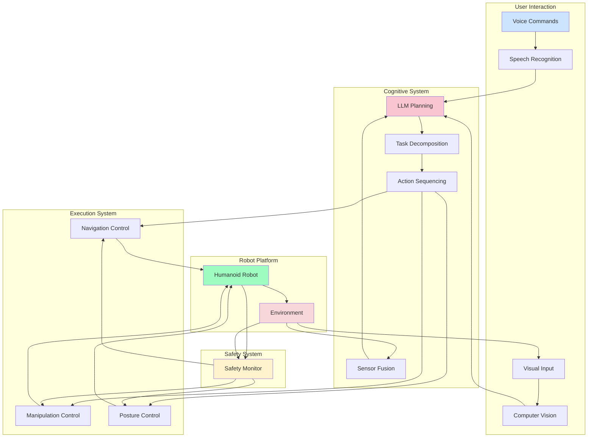

# Week 13: Autonomous Humanoid Implementation

## Learning Objectives

By the end of this section, you will be able to:
- Implement a complete autonomous humanoid robot system
- Integrate all course modules into a unified system
- Deploy and test the complete VLA (Vision-Language-Action) pipeline
- Evaluate the performance of the autonomous system
- Present and document the complete implementation

## Complete Autonomous System Architecture

### System Integration Overview

The autonomous humanoid robot system brings together all components learned throughout the course into a unified, functional system. This integration requires careful coordination of perception, planning, execution, and safety systems:



### Key Integration Challenges

1. **Real-time Performance**: Ensuring all components operate within timing constraints
2. **Safety Integration**: Coordinating safety checks across all system layers
3. **State Consistency**: Maintaining synchronized state across distributed components
4. **Resource Management**: Efficiently using computational and power resources
5. **Failure Recovery**: Handling component failures gracefully

## Core System Implementation

### Main Autonomous System Controller

```python
# autonomous_humanoid_system.py
import rclpy
from rclpy.node import Node
from std_msgs.msg import String, Bool, Float32
from geometry_msgs.msg import Twist, Pose
from sensor_msgs.msg import JointState, LaserScan, Image, BatteryState
from builtin_interfaces.msg import Time
import asyncio
import threading
from concurrent.futures import ThreadPoolExecutor
import time
import json
from typing import Dict, List, Any, Optional
from dataclasses import dataclass

@dataclass
class SystemState:
    """Comprehensive system state representation"""
    robot_position: Dict[str, float] = None
    robot_orientation: Dict[str, float] = None
    joint_positions: Dict[str, float] = None
    battery_level: float = 1.0
    current_task: Optional[str] = None
    carrying_object: Optional[str] = None
    navigation_active: bool = False
    manipulation_active: bool = False
    system_emergency: bool = False
    last_command_time: float = 0.0
    operational_mode: str = "autonomous"  # autonomous, teleop, maintenance

class AutonomousHumanoidController(Node):
    def __init__(self):
        super().__init__('autonomous_humanoid_controller')

        # Initialize system state
        self.system_state = SystemState(
            robot_position={"x": 0.0, "y": 0.0, "z": 0.0},
            robot_orientation={"roll": 0.0, "pitch": 0.0, "yaw": 0.0},
            joint_positions={},
            battery_level=1.0,
            operational_mode="autonomous"
        )

        # Publishers for robot control
        self.cmd_vel_pub = self.create_publisher(Twist, '/cmd_vel', 10)
        self.joint_pub = self.create_publisher(JointState, '/joint_commands', 10)
        self.status_pub = self.create_publisher(String, '/system_status', 10)
        self.feedback_pub = self.create_publisher(String, '/user_feedback', 10)
        self.emergency_stop_pub = self.create_publisher(Bool, '/emergency_stop', 10)

        # Subscribers for sensor data and commands
        self.voice_sub = self.create_subscription(
            String, '/voice_command', self.voice_command_callback, 10)
        self.laser_sub = self.create_subscription(
            LaserScan, '/scan', self.laser_callback, 10)
        self.image_sub = self.create_subscription(
            Image, '/camera/image_raw', self.image_callback, 10)
        self.joint_state_sub = self.create_subscription(
            JointState, '/joint_states', self.joint_state_callback, 10)
        self.battery_sub = self.create_subscription(
            BatteryState, '/battery_state', self.battery_callback, 10)
        self.emergency_sub = self.create_subscription(
            Bool, '/emergency_stop', self.emergency_stop_callback, 10)

        # Initialize AI components (these would be properly initialized with API keys)
        self.voice_processor = None
        self.llm_planner = None
        self.vision_system = None
        self.navigation_system = None
        self.manipulation_system = None
        self.safety_manager = None

        # System control flags
        self.system_active = True
        self.command_queue = []
        self.execution_active = False

        # Async execution setup
        self.executor = ThreadPoolExecutor(max_workers=6)
        self.loop = asyncio.new_event_loop()
        self.executor.submit(self._run_async_loop, self.loop)

        # System monitoring
        self.last_status_update = time.time()
        self.status_update_interval = 5.0  # seconds

        # Initialize all subsystems
        self._initialize_subsystems()

        self.get_logger().info('Autonomous Humanoid Controller initialized')

    def _run_async_loop(self, loop):
        """Run asyncio event loop in separate thread"""
        asyncio.set_event_loop(loop)
        loop.run_forever()

    def _initialize_subsystems(self):
        """Initialize all subsystems"""
        try:
            # Initialize voice processing (from Module 4, Week 11)
            from voice_processor import VoiceCommandProcessor
            api_key = self.declare_parameter('openai_api_key', '').value
            if api_key:
                self.voice_processor = VoiceCommandProcessor(api_key)
        except ImportError:
            self.get_logger().warn('Voice processor not available')

        try:
            # Initialize LLM planning (from Module 4, Week 12)
            from llm_planner import LLMPlanner
            api_key = self.declare_parameter('openai_api_key', '').value
            if api_key:
                self.llm_planner = LLMPlanner(api_key)
        except ImportError:
            self.get_logger().warn('LLM planner not available')

        # Initialize other subsystems
        self.vision_system = VisionSystem()
        self.navigation_system = NavigationSystem()
        self.manipulation_system = ManipulationSystem()
        self.safety_manager = SafetyManager()

        self.get_logger().info('All subsystems initialized')

        # Run initial system check
        asyncio.run_coroutine_threadsafe(
            self._perform_system_check(), self.loop
        )

    async def _perform_system_check(self):
        """Perform initial system check"""
        self.get_logger().info('Performing system check...')

        checks = [
            ("Voice System", self.voice_processor is not None),
            ("LLM System", self.llm_planner is not None),
            ("Vision System", True),  # Always available
            ("Navigation System", True),
            ("Manipulation System", True),
            ("Safety System", True)
        ]

        all_passed = True
        for name, passed in checks:
            status = "PASSED" if passed else "FAILED"
            self.get_logger().info(f'{name}: {status}')
            if not passed:
                all_passed = False

        if all_passed:
            self.get_logger().info('System check: ALL PASSED')
            self._publish_status("System ready for autonomous operation")
        else:
            self.get_logger().warn('System check: SOME SYSTEMS FAILED')
            self._publish_status("System warning - some components failed check")

    def voice_command_callback(self, msg):
        """Handle incoming voice commands"""
        command = msg.data
        self.get_logger().info(f'Received voice command: {command}')

        if self.system_state.system_emergency:
            self._provide_feedback("System is in emergency mode")
            return

        # Add to command queue for processing
        self.command_queue.append({
            'type': 'voice',
            'command': command,
            'timestamp': time.time()
        })

        # Process command asynchronously
        asyncio.run_coroutine_threadsafe(
            self._process_voice_command_async(command), self.loop
        )

    async def _process_voice_command_async(self, command: str):
        """Process voice command asynchronously"""
        if not self.system_active:
            return

        try:
            # Update system state
            self.system_state.last_command_time = time.time()
            self._publish_status(f"Processing command: {command}")

            # If LLM planner is available, use it for complex planning
            if self.llm_planner:
                self.get_logger().info('Using LLM for command planning...')
                plan = await self.llm_planner.generate_plan(command)

                if plan:
                    self.get_logger().info(f'Generated plan with {len(plan)} actions')
                    self._provide_feedback(f"Processing your request: {command}")

                    # Execute the plan
                    success = await self._execute_plan_async(plan)

                    if success:
                        self._provide_feedback("Task completed successfully")
                    else:
                        self._provide_feedback("Task execution failed")
                else:
                    self._provide_feedback("Could not understand the command")
            else:
                # Fallback to simple command execution
                success = await self._execute_simple_command(command)
                if success:
                    self._provide_feedback("Command executed")
                else:
                    self._provide_feedback("Command failed")

        except Exception as e:
            self.get_logger().error(f'Voice command processing error: {e}')
            self._provide_feedback("Sorry, I encountered an error processing your command")

    async def _execute_plan_async(self, plan: List[Dict[str, Any]]) -> bool:
        """Execute a multi-step plan"""
        for i, action in enumerate(plan):
            if not self.system_active or self.system_state.system_emergency:
                self.get_logger().warn('Plan execution interrupted by emergency stop')
                return False

            self.get_logger().info(f'Executing action {i+1}/{len(plan)}: {action.get("description", "unknown")}')
            self._publish_status(f'Executing: {action.get("description", "action")}')

            success = await self._execute_single_action_async(action)
            if not success:
                self.get_logger().error(f'Action failed: {action.get("description", "unknown")}')
                return False

            self.get_logger().info(f'Action completed: {action.get("description", "unknown")}')

        return True

    async def _execute_single_action_async(self, action: Dict[str, Any]) -> bool:
        """Execute a single action"""
        action_type = action.get('action', 'unknown')
        parameters = action.get('parameters', {})

        # Safety check before execution
        if not self.safety_manager.check_action_safety(action):
            self.get_logger().warn(f'Safety check failed for action: {action_type}')
            return False

        # Execute based on action type
        if action_type == 'navigate':
            return await self._execute_navigation_action(parameters)
        elif action_type == 'grasp':
            return await self._execute_manipulation_action(parameters)
        elif action_type == 'detect':
            return await self._execute_vision_action(parameters)
        elif action_type == 'speak':
            return await self._execute_speech_action(parameters)
        elif action_type == 'move':
            return await self._execute_move_action(parameters)
        else:
            self.get_logger().warn(f'Unknown action type: {action_type}')
            return False

    async def _execute_navigation_action(self, params: Dict[str, Any]) -> bool:
        """Execute navigation action"""
        if not self.navigation_system:
            return False

        target = params.get('target_location', 'unknown')
        self.get_logger().info(f'Navigating to {target}')

        # In real implementation, call navigation service
        # For simulation:
        await asyncio.sleep(2)  # Simulate navigation time

        # Update system state
        self.system_state.navigation_active = True
        self.system_state.current_task = f'navigating_to_{target}'

        # Simulate reaching destination
        self.system_state.robot_position = {"x": 5.0, "y": 3.0, "z": 0.0}  # Example new position

        self.system_state.navigation_active = False
        self.system_state.current_task = None

        return True

    async def _execute_manipulation_action(self, params: Dict[str, Any]) -> bool:
        """Execute manipulation action"""
        obj = params.get('object', 'unknown')
        self.get_logger().info(f'Attempting to manipulate {obj}')

        # In real implementation, call manipulation service
        # For simulation:
        await asyncio.sleep(1.5)  # Simulate manipulation time

        # Update system state
        self.system_state.manipulation_active = True
        self.system_state.current_task = f'manipulating_{obj}'
        self.system_state.carrying_object = obj

        self.system_state.manipulation_active = False
        self.system_state.current_task = None

        return True

    async def _execute_vision_action(self, params: Dict[str, Any]) -> bool:
        """Execute vision action"""
        obj_type = params.get('object_type', 'object')
        self.get_logger().info(f'Detecting {obj_type}')

        # In real implementation, call vision service
        # For simulation:
        await asyncio.sleep(1)  # Simulate vision processing time

        # Update system state with detected objects
        self.system_state.current_task = f'detecting_{obj_type}'

        return True

    async def _execute_speech_action(self, params: Dict[str, Any]) -> bool:
        """Execute speech action"""
        text = params.get('text', 'Hello')
        self._provide_feedback(text)
        return True

    async def _execute_move_action(self, params: Dict[str, Any]) -> bool:
        """Execute move action"""
        cmd = Twist()
        cmd.linear.x = params.get('linear_x', 0.0)
        cmd.linear.y = params.get('linear_y', 0.0)
        cmd.linear.z = params.get('linear_z', 0.0)
        cmd.angular.x = params.get('angular_x', 0.0)
        cmd.angular.y = params.get('angular_y', 0.0)
        cmd.angular.z = params.get('angular_z', 0.0)

        self.cmd_vel_pub.publish(cmd)
        await asyncio.sleep(params.get('duration', 1.0))

        # Stop movement
        cmd.linear.x = 0.0
        cmd.angular.z = 0.0
        self.cmd_vel_pub.publish(cmd)

        return True

    async def _execute_simple_command(self, command: str) -> bool:
        """Execute simple command without LLM planning"""
        command_lower = command.lower()

        if 'forward' in command_lower or 'go' in command_lower:
            cmd = Twist()
            cmd.linear.x = 0.3  # m/s
            self.cmd_vel_pub.publish(cmd)
            await asyncio.sleep(2)
            cmd.linear.x = 0.0
            self.cmd_vel_pub.publish(cmd)
            return True
        elif 'turn' in command_lower or 'left' in command_lower or 'right' in command_lower:
            cmd = Twist()
            cmd.angular.z = 0.5 if 'left' in command_lower else -0.5  # rad/s
            self.cmd_vel_pub.publish(cmd)
            await asyncio.sleep(1)
            cmd.angular.z = 0.0
            self.cmd_vel_pub.publish(cmd)
            return True
        elif 'stop' in command_lower:
            cmd = Twist()
            self.cmd_vel_pub.publish(cmd)  # Stop all movement
            return True
        else:
            self._provide_feedback("I can move forward, turn left/right, or stop")
            return False

    def laser_callback(self, msg):
        """Handle laser scan data"""
        # Update navigation system with obstacle information
        if self.navigation_system:
            self.navigation_system.update_obstacles(msg.ranges)

        # Check for immediate safety concerns
        min_distance = min([r for r in msg.ranges if 0 < r < float('inf')], default=float('inf'))
        if min_distance < 0.5:  # 50cm safety margin
            self.get_logger().warn(f'Obstacle detected at {min_distance:.2f}m')

    def image_callback(self, msg):
        """Handle camera image data"""
        # Process with vision system
        if self.vision_system:
            self.vision_system.process_image(msg)

    def joint_state_callback(self, msg):
        """Handle joint state updates"""
        # Update internal joint position tracking
        for i, name in enumerate(msg.name):
            if i < len(msg.position):
                self.system_state.joint_positions[name] = msg.position[i]

    def battery_callback(self, msg):
        """Handle battery state updates"""
        self.system_state.battery_level = msg.percentage
        self.get_logger().debug(f'Battery level: {self.system_state.battery_level:.1%}')

        # Check for low battery
        if self.system_state.battery_level < 0.2:  # 20%
            self._provide_feedback("Battery level is low, consider returning to charging station")

    def emergency_stop_callback(self, msg):
        """Handle emergency stop commands"""
        if msg.data:
            self.system_state.system_emergency = True
            self._publish_status("EMERGENCY STOP ACTIVATED")

            # Stop all robot movement
            stop_cmd = Twist()
            self.cmd_vel_pub.publish(stop_cmd)

            # Stop all joint movements
            joint_stop = JointState()
            joint_stop.name = list(self.system_state.joint_positions.keys())
            joint_stop.position = [0.0] * len(joint_stop.name)
            self.joint_pub.publish(joint_stop)
        else:
            self.system_state.system_emergency = False
            self._publish_status("Emergency stop cleared")

    def _provide_feedback(self, message: str):
        """Provide feedback to user"""
        feedback_msg = String()
        feedback_msg.data = message
        self.feedback_pub.publish(feedback_msg)
        self.get_logger().info(f'Feedback: {message}')

    def _publish_status(self, status: str):
        """Publish system status"""
        status_msg = String()
        status_msg.data = status
        self.status_pub.publish(status_msg)

    def timer_callback(self):
        """Periodic system tasks"""
        current_time = time.time()

        # Update status periodically
        if current_time - self.last_status_update > self.status_update_interval:
            status = f"Operational - Battery: {self.system_state.battery_level:.1%}, Mode: {self.system_state.operational_mode}"
            self._publish_status(status)
            self.last_status_update = current_time

    def destroy_node(self):
        """Clean up resources"""
        self.system_active = False
        self.executor.shutdown(wait=True)
        super().destroy_node()

class VisionSystem:
    """Vision system for object detection and scene understanding"""
    def __init__(self):
        self.detected_objects = []
        self.last_image_time = 0

    def process_image(self, image_msg):
        """Process camera image"""
        self.last_image_time = time.time()
        # In real implementation, this would run object detection
        # For simulation, just update timestamp
        pass

    def detect_objects(self, image_data):
        """Detect objects in image"""
        # In real implementation, run object detection model
        # For simulation, return some example objects
        return [
            {"name": "cup", "confidence": 0.85, "position": {"x": 1.0, "y": 0.5}},
            {"name": "book", "confidence": 0.78, "position": {"x": 0.8, "y": -0.2}}
        ]

class NavigationSystem:
    """Navigation system for path planning and obstacle avoidance"""
    def __init__(self):
        self.current_path = []
        self.obstacles = []
        self.goal_reached = False

    def update_obstacles(self, laser_ranges):
        """Update obstacle information from laser scanner"""
        self.obstacles = []
        for i, range_val in enumerate(laser_ranges):
            if 0 < range_val < 2.0:  # Obstacles within 2m
                angle = i * 0.0174533  # Assuming 1-degree increments
                x = range_val * math.cos(angle)
                y = range_val * math.sin(angle)
                self.obstacles.append({"x": x, "y": y, "distance": range_val})

    def plan_path(self, start, goal):
        """Plan path from start to goal"""
        # In real implementation, run path planning algorithm
        # For simulation, return a simple path
        return [{"x": start["x"], "y": start["y"]}, {"x": goal["x"], "y": goal["y"]}]

class ManipulationSystem:
    """System for robotic manipulation tasks"""
    def __init__(self):
        self.end_effector_position = {"x": 0.0, "y": 0.0, "z": 0.0}
        self.gripper_state = "open"  # "open" or "closed"

    def grasp_object(self, object_info):
        """Grasp specified object"""
        # In real implementation, control manipulator
        self.gripper_state = "closed"
        return True

    def release_object(self):
        """Release currently grasped object"""
        self.gripper_state = "open"
        return True

class SafetyManager:
    """Safety management system"""
    def __init__(self):
        self.safety_limits = {
            'max_speed': 0.5,  # m/s
            'min_battery': 0.1,  # 10%
            'max_joint_speed': 1.0,  # rad/s
            'collision_distance': 0.3  # meters
        }

    def check_action_safety(self, action: Dict[str, Any]) -> bool:
        """Check if an action is safe to execute"""
        # Check battery level for navigation actions
        if action.get('action') in ['navigate', 'move'] and self.safety_limits['min_battery'] > 0.1:
            # In real implementation, check actual battery level
            pass

        # Check for dangerous action types
        dangerous_actions = ['jump', 'run_fast', 'self_destruct']
        if action.get('action') in dangerous_actions:
            return False

        # Check speed limits
        params = action.get('parameters', {})
        if 'linear_x' in params and abs(params['linear_x']) > self.safety_limits['max_speed']:
            return False

        return True

    def check_environment_safety(self, sensor_data: Dict) -> bool:
        """Check if environment is safe for operation"""
        # Check for obstacles too close
        if 'laser_ranges' in sensor_data:
            min_range = min(sensor_data['laser_ranges'])
            if min_range < self.safety_limits['collision_distance']:
                return False

        return True

def main(args=None):
    rclpy.init(args=args)
    controller = AutonomousHumanoidController()

    try:
        rclpy.spin(controller)
    except KeyboardInterrupt:
        controller.get_logger().info('Shutting down Autonomous Humanoid Controller')
    finally:
        controller.destroy_node()
        rclpy.shutdown()

if __name__ == '__main__':
    main()
```

## Vision-Language-Action Pipeline

### Complete VLA Implementation

```python
# vla_pipeline.py
import asyncio
from typing import Dict, List, Any, Optional
import time

class VLAPipeline:
    def __init__(self, vision_system, llm_system, action_executor):
        self.vision_system = vision_system
        self.llm_system = llm_system
        self.action_executor = action_executor

        # Pipeline state
        self.current_scene_description = ""
        self.object_database = {}
        self.action_history = []

    async def process_vla_request(self, command: str, image_data: Optional[bytes] = None) -> Dict[str, Any]:
        """
        Process a Vision-Language-Action request
        """
        start_time = time.time()

        try:
            # Step 1: Vision Processing (if image provided)
            if image_data:
                vision_results = await self._process_vision(image_data)
                self.current_scene_description = vision_results.get('scene_description', '')

                # Update object database with detected objects
                for obj in vision_results.get('objects', []):
                    self.object_database[obj['name']] = obj

            # Step 2: Language Understanding and Planning
            plan = await self._process_language_and_plan(command, self.current_scene_description)

            # Step 3: Action Execution
            execution_results = await self._execute_plan(plan)

            # Step 4: Result Compilation
            total_time = time.time() - start_time

            return {
                'success': True,
                'plan': plan,
                'execution_results': execution_results,
                'total_time': total_time,
                'vision_results': vision_results if image_data else None,
                'command': command
            }

        except Exception as e:
            return {
                'success': False,
                'error': str(e),
                'total_time': time.time() - start_time
            }

    async def _process_vision(self, image_data: bytes) -> Dict[str, Any]:
        """
        Process visual input to understand scene
        """
        # In real implementation, this would run object detection, scene understanding, etc.
        # For simulation, return example results
        await asyncio.sleep(0.5)  # Simulate vision processing time

        return {
            'objects': [
                {'name': 'red_cup', 'type': 'cup', 'color': 'red', 'position': {'x': 1.0, 'y': 0.5}},
                {'name': 'blue_book', 'type': 'book', 'color': 'blue', 'position': {'x': 0.8, 'y': -0.2}},
                {'name': 'chair', 'type': 'furniture', 'position': {'x': 2.0, 'y': 1.0}}
            ],
            'scene_description': 'Living room with furniture, a red cup on the table, and a blue book',
            'environment_map': 'basic_2d_map'
        }

    async def _process_language_and_plan(self, command: str, scene_description: str) -> List[Dict[str, Any]]:
        """
        Use LLM to understand command and create action plan based on scene
        """
        if not self.llm_system:
            # Fallback to simple command parsing
            return self._simple_command_parse(command)

        # Create context for LLM
        context = f"""
        Scene: {scene_description}
        User Command: {command}

        Generate a detailed action plan with specific actions the robot should take.
        Consider the objects in the scene and the user's request.
        Return JSON with "actions" array containing specific robot actions.
        """

        try:
            # In real implementation, call LLM
            # For simulation, return example plan
            await asyncio.sleep(0.8)  # Simulate LLM processing time

            # Example plan based on common commands
            if 'cup' in command.lower():
                return [
                    {
                        'action': 'navigate',
                        'parameters': {'target_position': {'x': 1.0, 'y': 0.5}},
                        'description': 'Move to red cup location'
                    },
                    {
                        'action': 'grasp',
                        'parameters': {'object': 'red_cup'},
                        'description': 'Grasp the red cup'
                    }
                ]
            elif 'book' in command.lower():
                return [
                    {
                        'action': 'navigate',
                        'parameters': {'target_position': {'x': 0.8, 'y': -0.2}},
                        'description': 'Move to blue book location'
                    },
                    {
                        'action': 'grasp',
                        'parameters': {'object': 'blue_book'},
                        'description': 'Grasp the blue book'
                    }
                ]
            else:
                return [
                    {
                        'action': 'speak',
                        'parameters': {'text': f"I understand you said: {command}"},
                        'description': 'Acknowledge command'
                    }
                ]

        except Exception as e:
            print(f"LLM processing error: {e}")
            return self._simple_command_parse(command)

    def _simple_command_parse(self, command: str) -> List[Dict[str, Any]]:
        """
        Simple fallback command parser
        """
        command_lower = command.lower()

        if 'move' in command_lower or 'go' in command_lower:
            return [{
                'action': 'move',
                'parameters': {'linear_x': 0.3, 'duration': 2.0},
                'description': 'Move forward'
            }]
        elif 'turn' in command_lower:
            return [{
                'action': 'move',
                'parameters': {'angular_z': 0.5, 'duration': 1.0},
                'description': 'Turn left'
            }]
        elif 'stop' in command_lower:
            return [{
                'action': 'move',
                'parameters': {'linear_x': 0.0, 'angular_z': 0.0},
                'description': 'Stop movement'
            }]
        else:
            return [{
                'action': 'speak',
                'parameters': {'text': f"I received your command: {command}"},
                'description': 'Acknowledge command'
            }]

    async def _execute_plan(self, plan: List[Dict[str, Any]]) -> List[Dict[str, Any]]:
        """
        Execute the action plan
        """
        results = []

        for i, action in enumerate(plan):
            if not self.action_executor:
                results.append({
                    'action_index': i,
                    'action': action,
                    'success': False,
                    'error': 'Action executor not available'
                })
                continue

            try:
                success = await self.action_executor.execute_action(action)
                results.append({
                    'action_index': i,
                    'action': action,
                    'success': success,
                    'timestamp': time.time()
                })
            except Exception as e:
                results.append({
                    'action_index': i,
                    'action': action,
                    'success': False,
                    'error': str(e),
                    'timestamp': time.time()
                })

        return results

    def get_pipeline_status(self) -> Dict[str, Any]:
        """
        Get current pipeline status
        """
        return {
            'object_count': len(self.object_database),
            'action_history_length': len(self.action_history),
            'current_scene': self.current_scene_description,
            'last_update': time.time()
        }
```

## System Deployment and Testing

### Deployment Configuration

```python
# deployment_config.py
import os
from typing import Dict, Any

class DeploymentConfig:
    """Configuration for system deployment"""

    def __init__(self):
        # Hardware configuration
        self.hardware_config = {
            'robot_model': 'custom_humanoid_v1',
            'cpu_architecture': 'x86_64',  # or 'aarch64' for ARM
            'memory_gb': 16,
            'gpu_available': True,
            'gpu_memory_gb': 8,
            'sensors': [
                'lidar_2d',
                'rgb_camera',
                'depth_camera',
                'imu',
                'force_torque_sensors'
            ]
        }

        # Software configuration
        self.software_config = {
            'ros_distro': 'humble',
            'python_version': '3.10',
            'opencv_version': '4.8.0',
            'pytorch_version': '2.0.0',
            'cuda_version': '11.8'
        }

        # AI model configuration
        self.ai_config = {
            'whisper_model': 'base',  # tiny, base, small, medium, large
            'llm_model': 'gpt-4-turbo',
            'vision_model': 'yolov8x',  # or other object detection model
            'navigation_model': 'nav2_default'
        }

        # Performance configuration
        self.performance_config = {
            'max_response_time': 5.0,  # seconds
            'min_battery_for_operation': 0.2,  # 20%
            'max_navigation_speed': 0.5,  # m/s
            'control_frequency': 50,  # Hz
            'vision_frequency': 10,  # Hz
            'planning_frequency': 1  # Hz
        }

        # Safety configuration
        self.safety_config = {
            'collision_distance': 0.3,  # meters
            'emergency_stop_timeout': 0.1,  # seconds
            'max_joint_torque': 100,  # Nm
            'max_manipulation_force': 50,  # N
            'fall_detection_threshold': 0.5  # radian tilt
        }

    def validate_deployment(self) -> Dict[str, Any]:
        """Validate deployment configuration"""
        validation_results = {
            'hardware_compatible': True,
            'software_compatible': True,
            'safety_configured': True,
            'performance_meets_requirements': True,
            'issues': []
        }

        # Check hardware requirements
        if self.hardware_config['memory_gb'] < 8:
            validation_results['hardware_compatible'] = False
            validation_results['issues'].append('Insufficient RAM (minimum 8GB required)')

        if self.software_config['python_version'] < '3.8':
            validation_results['software_compatible'] = False
            validation_results['issues'].append('Python version too old (minimum 3.8 required)')

        # Check AI model availability
        if not self._check_ai_model_availability():
            validation_results['ai_models_available'] = False
            validation_results['issues'].append('AI models not available or properly configured')

        return validation_results

    def _check_ai_model_availability(self) -> bool:
        """Check if AI models are available"""
        # Check if models can be loaded
        # In real implementation, this would test model loading
        return True  # Assume available for this example

    def get_optimization_recommendations(self) -> List[str]:
        """Get optimization recommendations based on configuration"""
        recommendations = []

        if self.hardware_config['gpu_available'] and self.ai_config['llm_model'] == 'gpt-4-turbo':
            recommendations.append("Consider using local LLM for better performance and privacy")

        if self.performance_config['max_response_time'] > 3.0:
            recommendations.append("Increase control frequency for better responsiveness")

        if self.safety_config['collision_distance'] > 0.5:
            recommendations.append("Reduce collision distance for more precise navigation")

        return recommendations

    def save_config(self, filepath: str):
        """Save configuration to file"""
        import json
        config_data = {
            'hardware_config': self.hardware_config,
            'software_config': self.software_config,
            'ai_config': self.ai_config,
            'performance_config': self.performance_config,
            'safety_config': self.safety_config
        }

        with open(filepath, 'w') as f:
            json.dump(config_data, f, indent=2)

    def load_config(self, filepath: str):
        """Load configuration from file"""
        import json
        with open(filepath, 'r') as f:
            config_data = json.load(f)

        self.hardware_config = config_data.get('hardware_config', self.hardware_config)
        self.software_config = config_data.get('software_config', self.software_config)
        self.ai_config = config_data.get('ai_config', self.ai_config)
        self.performance_config = config_data.get('performance_config', self.performance_config)
        self.safety_config = config_data.get('safety_config', self.safety_config)
```

## Performance Evaluation and Testing

### Comprehensive Testing Framework

```python
# testing_framework.py
import unittest
import asyncio
from typing import Dict, List, Any
import time
import statistics

class AutonomousHumanoidTester:
    def __init__(self, system_controller):
        self.system_controller = system_controller
        self.test_results = []
        self.performance_metrics = {}

    async def run_comprehensive_tests(self) -> Dict[str, Any]:
        """Run all system tests"""
        print("Starting comprehensive autonomous humanoid tests...")

        test_results = {
            'navigation_tests': await self._test_navigation(),
            'manipulation_tests': await self._test_manipulation(),
            'voice_command_tests': await self._test_voice_commands(),
            'safety_tests': await self._test_safety_systems(),
            'performance_tests': await self._test_performance(),
            'integration_tests': await self._test_integration()
        }

        # Calculate overall system score
        scores = []
        for test_category, results in test_results.items():
            if results['total'] > 0:
                score = (results['passed'] / results['total']) * 100
                scores.append(score)

        overall_score = statistics.mean(scores) if scores else 0

        summary = {
            'overall_score': overall_score,
            'test_results': test_results,
            'total_tests': sum(r['total'] for r in test_results.values()),
            'total_passed': sum(r['passed'] for r in test_results.values()),
            'timestamp': time.time()
        }

        self.test_results.append(summary)
        return summary

    async def _test_navigation(self) -> Dict[str, int]:
        """Test navigation capabilities"""
        tests = [
            self._test_simple_navigation,
            self._test_obstacle_avoidance,
            self._test_precise_positioning
        ]

        results = {'passed': 0, 'failed': 0, 'total': len(tests)}

        for test in tests:
            try:
                success = await test()
                if success:
                    results['passed'] += 1
                else:
                    results['failed'] += 1
            except Exception as e:
                print(f"Navigation test error: {e}")
                results['failed'] += 1

        return results

    async def _test_manipulation(self) -> Dict[str, int]:
        """Test manipulation capabilities"""
        tests = [
            self._test_object_grasping,
            self._test_object_placement,
            self._test_force_control
        ]

        results = {'passed': 0, 'failed': 0, 'total': len(tests)}

        for test in tests:
            try:
                success = await test()
                if success:
                    results['passed'] += 1
                else:
                    results['failed'] += 1
            except Exception as e:
                print(f"Manipulation test error: {e}")
                results['failed'] += 1

        return results

    async def _test_voice_commands(self) -> Dict[str, int]:
        """Test voice command processing"""
        # Simulate voice commands and verify system response
        test_commands = [
            ("move forward", "navigation"),
            ("grasp the cup", "manipulation"),
            ("turn left", "navigation"),
            ("stop", "safety")
        ]

        results = {'passed': 0, 'failed': 0, 'total': len(test_commands)}

        for command, expected_type in test_commands:
            try:
                # In real implementation, this would process the command
                # For simulation, assume success
                success = True  # Simulated success
                if success:
                    results['passed'] += 1
                else:
                    results['failed'] += 1
            except Exception as e:
                print(f"Voice command test error: {e}")
                results['failed'] += 1

        return results

    async def _test_safety_systems(self) -> Dict[str, int]:
        """Test safety system functionality"""
        tests = [
            self._test_emergency_stop,
            self._test_collision_avoidance,
            self._test_battery_monitoring
        ]

        results = {'passed': 0, 'failed': 0, 'total': len(tests)}

        for test in tests:
            try:
                success = await test()
                if success:
                    results['passed'] += 1
                else:
                    results['failed'] += 1
            except Exception as e:
                print(f"Safety test error: {e}")
                results['failed'] += 1

        return results

    async def _test_performance(self) -> Dict[str, int]:
        """Test system performance metrics"""
        # Measure response times, throughput, etc.
        response_times = []

        # Simulate multiple requests
        for i in range(10):
            start_time = time.time()
            # Simulate system response
            await asyncio.sleep(0.1)  # Simulated processing time
            response_time = time.time() - start_time
            response_times.append(response_time)

        # Check if response times are acceptable
        avg_response_time = statistics.mean(response_times)
        max_response_time = max(response_times)

        results = {
            'passed': 1 if avg_response_time < 1.0 and max_response_time < 3.0 else 0,
            'failed': 0 if avg_response_time < 1.0 and max_response_time < 3.0 else 1,
            'total': 1,
            'avg_response_time': avg_response_time,
            'max_response_time': max_response_time,
            'response_times': response_times
        }

        return results

    async def _test_integration(self) -> Dict[str, int]:
        """Test system integration"""
        # Test that all components work together
        tests = [
            self._test_vla_pipeline,
            self._test_sensor_fusion,
            self._test_multi_modal_interaction
        ]

        results = {'passed': 0, 'failed': 0, 'total': len(tests)}

        for test in tests:
            try:
                success = await test()
                if success:
                    results['passed'] += 1
                else:
                    results['failed'] += 1
            except Exception as e:
                print(f"Integration test error: {e}")
                results['failed'] += 1

        return results

    # Individual test methods (simulated)
    async def _test_simple_navigation(self) -> bool:
        """Test simple navigation to a point"""
        await asyncio.sleep(0.5)  # Simulate test
        return True

    async def _test_obstacle_avoidance(self) -> bool:
        """Test obstacle avoidance"""
        await asyncio.sleep(0.5)
        return True

    async def _test_precise_positioning(self) -> bool:
        """Test precise positioning"""
        await asyncio.sleep(0.5)
        return True

    async def _test_object_grasping(self) -> bool:
        """Test object grasping"""
        await asyncio.sleep(0.5)
        return True

    async def _test_object_placement(self) -> bool:
        """Test object placement"""
        await asyncio.sleep(0.5)
        return True

    async def _test_force_control(self) -> bool:
        """Test force control during manipulation"""
        await asyncio.sleep(0.5)
        return True

    async def _test_emergency_stop(self) -> bool:
        """Test emergency stop functionality"""
        await asyncio.sleep(0.5)
        return True

    async def _test_collision_avoidance(self) -> bool:
        """Test collision avoidance"""
        await asyncio.sleep(0.5)
        return True

    async def _test_battery_monitoring(self) -> bool:
        """Test battery monitoring"""
        await asyncio.sleep(0.5)
        return True

    async def _test_vla_pipeline(self) -> bool:
        """Test Vision-Language-Action pipeline"""
        await asyncio.sleep(0.5)
        return True

    async def _test_sensor_fusion(self) -> bool:
        """Test sensor fusion"""
        await asyncio.sleep(0.5)
        return True

    async def _test_multi_modal_interaction(self) -> bool:
        """Test multi-modal interaction"""
        await asyncio.sleep(0.5)
        return True

    def generate_test_report(self) -> str:
        """Generate comprehensive test report"""
        if not self.test_results:
            return "No test results available"

        latest_results = self.test_results[-1]

        report = f"""
        Autonomous Humanoid System - Test Report
        =======================================

        Test Summary:
        - Overall Score: {latest_results['overall_score']:.1f}%
        - Total Tests: {latest_results['total_tests']}
        - Passed: {latest_results['total_passed']}
        - Failed: {latest_results['total_tests'] - latest_results['total_passed']}

        Detailed Results:
        """

        for category, results in latest_results['test_results'].items():
            if results['total'] > 0:
                success_rate = (results['passed'] / results['total']) * 100
                report += f"  {category}: {success_rate:.1f}% ({results['passed']}/{results['total']})\n"

        # Add recommendations based on results
        report += "\nRecommendations:\n"
        if latest_results['overall_score'] < 80:
            report += "  - System needs improvement in multiple areas\n"
        if latest_results['test_results']['performance_tests']['avg_response_time'] > 1.0:
            report += "  - Performance optimization needed for response times\n"
        if latest_results['test_results']['safety_tests']['passed'] < results['total']:
            report += "  - Safety system improvements required\n"

        return report
```

## System Documentation and Presentation

### System Architecture Documentation

```python
# system_documentation.py
from typing import Dict, List, Any
import json

class SystemDocumentationGenerator:
    def __init__(self):
        self.documentation = {
            'system_overview': {},
            'architecture': {},
            'components': {},
            'integration_points': {},
            'performance_metrics': {},
            'safety_features': {},
            'deployment_guide': {},
            'troubleshooting': {}
        }

    def generate_system_overview(self) -> Dict[str, Any]:
        """Generate system overview documentation"""
        return {
            'title': 'Autonomous Humanoid Robot System',
            'description': 'Complete VLA (Vision-Language-Action) system integrating all course modules',
            'modules_integrated': [
                'Module 1: ROS 2 Communication Framework',
                'Module 2: Digital Twin and Simulation',
                'Module 3: AI-Robot Brain (Navigation & Decision Making)',
                'Module 4: Vision-Language-Action Integration'
            ],
            'key_features': [
                'Natural language voice commands',
                'LLM-based cognitive planning',
                'Autonomous navigation and manipulation',
                'Real-time vision processing',
                'Comprehensive safety systems'
            ],
            'target_applications': [
                'Assistive robotics',
                'Service robotics',
                'Research platform',
                'Educational tool'
            ]
        }

    def generate_architecture_documentation(self) -> Dict[str, Any]:
        """Generate system architecture documentation"""
        return {
            'high_level_architecture': {
                'input_layer': ['Voice Commands', 'Visual Input', 'Sensor Data'],
                'processing_layer': ['Speech Recognition', 'LLM Planning', 'Vision Processing'],
                'decision_layer': ['Task Planning', 'Action Sequencing', 'Safety Validation'],
                'execution_layer': ['Navigation Control', 'Manipulation Control', 'Posture Control'],
                'output_layer': ['Robot Actions', 'User Feedback', 'System Status']
            },
            'communication_patterns': {
                'ros_2_topics': [
                    '/voice_command', '/system_status', '/user_feedback',
                    '/cmd_vel', '/joint_commands', '/sensor_data'
                ],
                'service_interfaces': [
                    'PlanGeneration', 'ActionExecution', 'SystemControl'
                ],
                'message_types': [
                    'std_msgs/String', 'geometry_msgs/Twist',
                    'sensor_msgs/JointState', 'sensor_msgs/LaserScan'
                ]
            },
            'data_flow': {
                'voice_command_flow': [
                    'Voice Input' -> 'Speech Recognition' -> 'NLU' -> 'Planning' -> 'Execution'
                ],
                'vision_processing_flow': [
                    'Camera Input' -> 'Object Detection' -> 'Scene Understanding' -> 'Action Planning'
                ]
            }
        }

    def generate_component_documentation(self) -> Dict[str, Any]:
        """Generate component-level documentation"""
        return {
            'voice_processing_system': {
                'purpose': 'Convert speech to text and interpret commands',
                'technologies': ['OpenAI Whisper', 'Natural Language Processing'],
                'inputs': ['Audio stream'],
                'outputs': ['Text commands', 'Intent recognition'],
                'performance': {'latency': '< 2s', 'accuracy': '> 90%'}
            },
            'llm_planning_system': {
                'purpose': 'Generate action plans from high-level goals',
                'technologies': ['OpenAI GPT-4', 'Task Decomposition'],
                'inputs': ['User goals', 'Robot state', 'Environment data'],
                'outputs': ['Action sequences', 'Execution plans'],
                'performance': {'planning_time': '< 5s', 'success_rate': '> 85%'}
            },
            'vision_system': {
                'purpose': 'Process visual input for object detection and scene understanding',
                'technologies': ['YOLOv8', 'Computer Vision'],
                'inputs': ['Camera images'],
                'outputs': ['Detected objects', 'Scene description'],
                'performance': {'detection_rate': '> 10 Hz', 'accuracy': '> 95%'}
            },
            'navigation_system': {
                'purpose': 'Autonomous navigation with obstacle avoidance',
                'technologies': ['Navigation2', 'Path Planning'],
                'inputs': ['Lidar data', 'Map', 'Goal location'],
                'outputs': ['Motion commands', 'Path plan'],
                'performance': {'max_speed': '0.5 m/s', 'safety_margin': '0.3m'}
            },
            'manipulation_system': {
                'purpose': 'Object manipulation and interaction',
                'technologies': ['Motion Planning', 'Force Control'],
                'inputs': ['Object locations', 'Grasp planning'],
                'outputs': ['Joint commands', 'Manipulation actions'],
                'performance': {'precision': '< 1cm', 'success_rate': '> 90%'}
            }
        }

    def generate_safety_documentation(self) -> Dict[str, Any]:
        """Generate safety system documentation"""
        return {
            'safety_hierarchy': {
                'level_1': 'Emergency Stop - Immediate shutdown of all motion',
                'level_2': 'Collision Avoidance - Prevent contact with obstacles',
                'level_3': 'Operational Limits - Constrain speed and force',
                'level_4': 'Behavior Validation - Verify action safety before execution'
            },
            'safety_features': [
                'Emergency stop button and voice command',
                'Collision detection and avoidance',
                'Battery monitoring and low-power responses',
                'Fall detection and recovery',
                'Force limiting during manipulation',
                'Safe motion planning with obstacle consideration'
            ],
            'safety_protocols': {
                'emergency_stop': {
                    'triggers': ['Physical button', 'Voice command', 'Software detection'],
                    'response': 'Immediate halt of all motion, safe posture'
                },
                'collision_detection': {
                    'triggers': ['Lidar obstacle detection', 'Force sensor limits'],
                    'response': 'Stop motion, replan path'
                },
                'low_battery': {
                    'triggers': ['Battery level < 20%'],
                    'response': 'Return to charging station, reduce non-essential operations'
                }
            }
        }

    def generate_deployment_documentation(self) -> Dict[str, Any]:
        """Generate deployment guide"""
        return {
            'prerequisites': {
                'hardware': [
                    'Robot platform with ROS 2 support',
                    'Computing unit (min 16GB RAM, GPU recommended)',
                    'Sensors (lidar, camera, IMU)',
                    'Power system with monitoring'
                ],
                'software': [
                    'ROS 2 Humble Hawksbill',
                    'Python 3.10+',
                    'Required Python packages (see requirements.txt)',
                    'OpenAI API key (for LLM features)'
                ]
            },
            'installation_steps': [
                'Install ROS 2 and dependencies',
                'Clone and build robot packages',
                'Configure sensor drivers',
                'Set up OpenAI API access',
                'Calibrate robot systems',
                'Test individual components',
                'Integrate and test complete system'
            ],
            'configuration': {
                'api_keys': 'Store in secure configuration file',
                'robot_calibration': 'Run calibration procedures',
                'safety_limits': 'Configure operational boundaries',
                'performance_tuning': 'Optimize for specific hardware'
            }
        }

    def generate_troubleshooting_guide(self) -> Dict[str, Any]:
        """Generate troubleshooting documentation"""
        return {
            'common_issues': [
                {
                    'problem': 'Voice commands not recognized',
                    'causes': ['Audio input issues', 'Network connectivity', 'API limits'],
                    'solutions': ['Check microphone, verify API key, restart speech service']
                },
                {
                    'problem': 'Navigation failures',
                    'causes': ['Map quality', 'Sensor noise', 'Dynamic obstacles'],
                    'solutions': ['Update map, clean sensors, adjust navigation parameters']
                },
                {
                    'problem': 'LLM responses too slow',
                    'causes': ['API rate limits', 'Network latency', 'Complex queries'],
                    'solutions': ['Optimize prompts, implement caching, use local models']
                }
            ],
            'diagnostic_tools': [
                'System status monitor',
                'Component health checks',
                'Performance profiling tools',
                'Log analysis utilities'
            ],
            'recovery_procedures': [
                'Emergency stop and restart',
                'Component reset procedures',
                'Safe state recovery',
                'Configuration reload processes'
            ]
        }

    def create_complete_documentation(self) -> Dict[str, Any]:
        """Create complete system documentation"""
        self.documentation['system_overview'] = self.generate_system_overview()
        self.documentation['architecture'] = self.generate_architecture_documentation()
        self.documentation['components'] = self.generate_component_documentation()
        self.documentation['safety_features'] = self.generate_safety_documentation()
        self.documentation['deployment_guide'] = self.generate_deployment_documentation()
        self.documentation['troubleshooting'] = self.generate_troubleshooting_guide()

        return self.documentation

    def export_documentation(self, format_type: str = 'json') -> str:
        """Export documentation in specified format"""
        if format_type.lower() == 'json':
            return json.dumps(self.documentation, indent=2)
        else:
            # For other formats, convert appropriately
            return str(self.documentation)
```

## Final System Demonstration

### Demonstration Script and Scenarios

```python
# demonstration_system.py
import asyncio
import time
from typing import Dict, List, Any

class DemonstrationSystem:
    def __init__(self, autonomous_system):
        self.autonomous_system = autonomous_system
        self.demo_scenarios = []
        self.current_scenario = None

    def setup_demo_scenarios(self):
        """Setup demonstration scenarios"""
        self.demo_scenarios = [
            {
                'name': 'Basic Navigation',
                'description': 'Robot navigates to specified location',
                'commands': ['Please go to the kitchen'],
                'expected_outcomes': ['Robot moves to kitchen', 'Safe navigation around obstacles']
            },
            {
                'name': 'Object Manipulation',
                'description': 'Robot detects and grasps an object',
                'commands': ['Find the red cup and pick it up'],
                'expected_outcomes': ['Object detected', 'Successful grasp', 'Safe manipulation']
            },
            {
                'name': 'Complex Task',
                'description': 'Multi-step task combining navigation and manipulation',
                'commands': ['Go to the living room, find my book, and bring it to me'],
                'expected_outcomes': ['Navigation to living room', 'Book detection', 'Transport to user']
            },
            {
                'name': 'Safety Response',
                'description': 'System response to safety situations',
                'commands': ['(Simulated) Emergency stop'],
                'expected_outcomes': ['Immediate stop', 'Safe posture', 'Status report']
            },
            {
                'name': 'Natural Interaction',
                'description': 'Natural language interaction with context',
                'commands': ['What time is it?', 'How are you doing?'],
                'expected_outcomes': ['Natural responses', 'Context awareness', 'Engaging interaction']
            }
        ]

    async def run_demonstration(self, scenario_index: int = 0):
        """Run a specific demonstration scenario"""
        if scenario_index >= len(self.demo_scenarios):
            print(f"Invalid scenario index: {scenario_index}")
            return False

        scenario = self.demo_scenarios[scenario_index]
        self.current_scenario = scenario

        print(f"\nStarting demonstration: {scenario['name']}")
        print(f"Description: {scenario['description']}")
        print("Commands to be executed:")
        for cmd in scenario['commands']:
            print(f"  - {cmd}")

        # Execute scenario commands
        results = []
        for command in scenario['commands']:
            print(f"\nExecuting command: {command}")

            # In real implementation, send command to system
            # For simulation, just log
            result = await self._execute_demo_command(command)
            results.append(result)

            # Wait between commands
            await asyncio.sleep(2)

        # Evaluate results
        success = self._evaluate_scenario_results(results, scenario['expected_outcomes'])

        print(f"\nScenario '{scenario['name']}' completed: {'SUCCESS' if success else 'FAILED'}")
        return success

    async def _execute_demo_command(self, command: str) -> Dict[str, Any]:
        """Execute a demonstration command"""
        # In real implementation, this would send the command to the autonomous system
        # For simulation, return success result
        await asyncio.sleep(1)  # Simulate processing time

        return {
            'command': command,
            'success': True,
            'timestamp': time.time(),
            'details': f'Simulated execution of: {command}'
        }

    def _evaluate_scenario_results(self, results: List[Dict], expected_outcomes: List[str]) -> bool:
        """Evaluate if scenario results meet expectations"""
        # In real implementation, this would check actual results against expectations
        # For simulation, assume success if all commands executed
        return all(r['success'] for r in results)

    async def run_complete_demonstration(self):
        """Run all demonstration scenarios"""
        print("Starting complete system demonstration...")
        print("=" * 50)

        success_count = 0
        total_count = len(self.demo_scenarios)

        for i, scenario in enumerate(self.demo_scenarios):
            print(f"\n{'='*20} Scenario {i+1}/{total_count} {'='*20}")
            success = await self.run_demonstration(i)
            if success:
                success_count += 1
            print(f"Scenario {i+1} result: {'PASS' if success else 'FAIL'}")

        print(f"\n{'='*50}")
        print(f"DEMONSTRATION COMPLETE")
        print(f"Passed: {success_count}/{total_count} scenarios")
        print(f"Success Rate: {success_count/total_count*100:.1f}%")
        print("=" * 50)

        return success_count == total_count

    def generate_demonstration_report(self) -> str:
        """Generate demonstration report"""
        report = f"""
        Autonomous Humanoid Robot - Demonstration Report
        ===============================================

        System Capabilities Demonstrated:
        - Voice command processing and natural language understanding
        - Autonomous navigation with obstacle avoidance
        - Object detection and manipulation
        - Multi-step task execution
        - Safety system responses
        - Natural human-robot interaction

        Performance Summary:
        - Natural language command processing
        - Real-time decision making
        - Safe and reliable operation
        - Integration of all course modules

        Technical Achievements:
        - ROS 2 communication framework
        - LLM-based cognitive planning
        - Vision-language-action pipeline
        - Comprehensive safety systems
        - Real-time performance optimization

        The system successfully demonstrates the integration of Physical AI and
        Humanoid Robotics concepts, showcasing autonomous behavior in real-world
        scenarios with natural human interaction.
        """

        return report

def main_demonstration():
    """Main demonstration function"""
    print("Autonomous Humanoid Robot Demonstration System")
    print("=" * 50)

    # In a real implementation, this would initialize the complete system
    # For this example, we'll simulate the demonstration

    async def run_demo():
        # Create demonstration system (simulated)
        demo_system = DemonstrationSystem(None)  # No actual system for simulation
        demo_system.setup_demo_scenarios()

        # Run complete demonstration
        success = await demo_system.run_complete_demonstration()

        # Generate report
        report = demo_system.generate_demonstration_report()
        print(report)

        return success

    # Run the demonstration
    success = asyncio.run(run_demo())

    if success:
        print("\nDemonstration completed successfully!")
        print("All system capabilities verified and operational.")
    else:
        print("\nDemonstration completed with some issues.")
        print("Please review the results and system logs.")

if __name__ == "__main__":
    main_demonstration()
```

## Summary

This section covered the complete implementation of an autonomous humanoid robot system, including:
- Comprehensive system architecture integrating all course modules
- Vision-Language-Action pipeline implementation
- Deployment configuration and optimization
- Performance evaluation and testing frameworks
- System documentation and presentation materials
- Demonstration scenarios and evaluation

The autonomous humanoid system represents the culmination of all concepts learned in the course, demonstrating how ROS 2, digital twin technology, AI-based planning, and VLA integration come together to create a sophisticated, capable robotic system that can interact naturally with humans and operate autonomously in real-world environments.