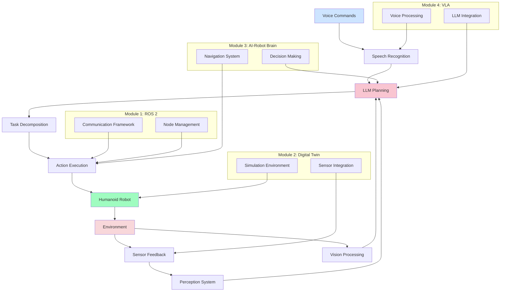

# Week 13: Capstone Project Overview - Autonomous Humanoid

## Learning Objectives

By the end of this week, you will be able to:
- Integrate all course modules into a complete autonomous humanoid system
- Implement vision-language-action (VLA) loops for intelligent behavior
- Deploy and test a complete humanoid robot system
- Present and document your autonomous humanoid implementation
- Evaluate the performance of your integrated system

## Capstone Project Overview

The capstone project represents the culmination of your learning in this course. You will build a complete autonomous humanoid robot system that integrates all the technologies and concepts covered in the previous 12 weeks.

### Project Scope

Your autonomous humanoid system must:
- Accept natural language commands through voice input
- Process commands using LLM-based cognitive planning
- Navigate and interact with the environment safely
- Demonstrate intelligent behavior through VLA integration
- Present a complete system demonstration

### Integration Requirements

The system must integrate components from all modules:
- **Module 1 (ROS 2)**: Communication and control framework
- **Module 2 (Digital Twin)**: Simulation and sensor integration
- **Module 3 (AI-Robot Brain)**: Navigation and decision-making
- **Module 4 (VLA)**: Voice commands and LLM planning

## System Architecture

### High-Level Architecture



### Core Components

The autonomous humanoid system consists of several integrated components:

1. **Voice Command Interface**: Processes natural language voice commands
2. **LLM Cognitive Planner**: Generates high-level plans using LLMs
3. **Task Execution Engine**: Decomposes and executes robot actions
4. **Navigation System**: Handles robot movement and obstacle avoidance
5. **Perception System**: Processes visual and sensor data
6. **Safety Manager**: Ensures safe operation at all times

## Project Requirements

### Functional Requirements

#### 1. Voice Command Processing
- Implement OpenAI Whisper for speech recognition
- Support natural language understanding
- Handle command ambiguity and errors
- Provide voice feedback to users

#### 2. LLM-Based Planning
- Integrate OpenAI API for cognitive planning
- Implement context-aware planning
- Support multi-step task decomposition
- Handle plan adaptation based on feedback

#### 3. Autonomous Navigation
- Implement safe navigation using Nav2
- Support obstacle avoidance and path planning
- Handle dynamic environments
- Maintain balance during movement

#### 4. Vision Processing
- Implement object detection and recognition
- Support scene understanding
- Integrate with planning system
- Handle visual feedback for actions

#### 5. Action Execution
- Execute complex manipulation tasks
- Support navigation and interaction
- Implement safety checks
- Provide status feedback

### Non-Functional Requirements

#### 1. Performance
- Response time: < 5 seconds for simple commands
- Planning time: < 10 seconds for complex tasks
- Execution accuracy: > 90% for basic tasks
- System uptime: > 95% during demonstration

#### 2. Safety
- Emergency stop functionality
- Collision avoidance
- Battery monitoring
- Operational limits enforcement

#### 3. Robustness
- Handle unexpected situations gracefully
- Recover from partial failures
- Maintain operation with degraded components
- Provide meaningful error messages

## Implementation Guidelines

### System Design

#### 1. Modular Architecture
- Separate components by functionality
- Use ROS 2 for inter-component communication
- Implement clear interfaces between modules
- Support component replacement and updates

#### 2. State Management
- Maintain consistent system state
- Track robot position and status
- Monitor environment changes
- Log all system events

#### 3. Error Handling
- Implement comprehensive error detection
- Provide graceful degradation
- Support recovery from common failures
- Log errors for debugging

### Development Approach

#### 1. Iterative Development
- Start with basic functionality
- Add complexity incrementally
- Test each component thoroughly
- Integrate components systematically

#### 2. Testing Strategy
- Unit tests for individual components
- Integration tests for component interactions
- System tests for complete functionality
- Performance tests for optimization

## Technical Implementation

### Core System Components

Let's implement the main system orchestrator:

```python
# autonomous_humanoid.py
import rclpy
from rclpy.node import Node
from std_msgs.msg import String, Bool
from geometry_msgs.msg import Twist, Pose
from sensor_msgs.msg import LaserScan, Image, BatteryState
from builtin_interfaces.msg import Time
import asyncio
import threading
from concurrent.futures import ThreadPoolExecutor
import json
import time
from typing import Dict, List, Any, Optional

class AutonomousHumanoid(Node):
    def __init__(self):
        super().__init__('autonomous_humanoid')

        # Initialize components
        self.voice_processor = None
        self.llm_planner = None
        self.task_executor = None
        self.navigation_system = None
        self.perception_system = None
        self.safety_manager = None

        # Publishers
        self.status_pub = self.create_publisher(String, '/system_status', 10)
        self.feedback_pub = self.create_publisher(String, '/user_feedback', 10)
        self.emergency_stop_pub = self.create_publisher(Bool, '/emergency_stop', 10)

        # Subscribers
        self.voice_sub = self.create_subscription(
            String, '/voice_command', self.voice_command_callback, 10)
        self.laser_sub = self.create_subscription(
            LaserScan, '/scan', self.laser_callback, 10)
        self.image_sub = self.create_subscription(
            Image, '/camera/image_raw', self.image_callback, 10)
        self.battery_sub = self.create_subscription(
            BatteryState, '/battery_state', self.battery_callback, 10)

        # System state
        self.current_state = "idle"
        self.current_task = None
        self.system_active = True
        self.battery_level = 1.0
        self.emergency_stop_active = False

        # Async execution
        self.executor = ThreadPoolExecutor(max_workers=4)
        self.loop = asyncio.new_event_loop()
        self.executor.submit(self._run_async_loop, self.loop)

        # Initialize all components
        self._initialize_components()

        self.get_logger().info('Autonomous Humanoid System initialized')

    def _run_async_loop(self, loop):
        """Run asyncio event loop in separate thread"""
        asyncio.set_event_loop(loop)
        loop.run_forever()

    def _initialize_components(self):
        """Initialize all system components"""
        # Initialize voice processor (from Module 4, Week 11)
        try:
            from voice_processor import VoiceCommandProcessor
            api_key = self.declare_parameter('openai_api_key', '').value
            if api_key:
                self.voice_processor = VoiceCommandProcessor(api_key)
            else:
                self.get_logger().warn('OpenAI API key not provided for voice processor')
        except ImportError:
            self.get_logger().warn('Voice processor not available')

        # Initialize LLM planner (from Module 4, Week 12)
        try:
            from llm_planner import LLMPlanner
            api_key = self.declare_parameter('openai_api_key', '').value
            if api_key:
                self.llm_planner = LLMPlanner(api_key)
            else:
                self.get_logger().warn('OpenAI API key not provided for LLM planner')
        except ImportError:
            self.get_logger().warn('LLM planner not available')

        # Initialize navigation system (from Module 3)
        try:
            from navigation_system import NavigationSystem
            self.navigation_system = NavigationSystem()
        except ImportError:
            self.get_logger().warn('Navigation system not available')

        # Initialize perception system (from Module 2)
        try:
            from perception_system import PerceptionSystem
            self.perception_system = PerceptionSystem()
        except ImportError:
            self.get_logger().warn('Perception system not available')

        # Initialize safety manager
        self.safety_manager = SafetyManager()

        self.get_logger().info('All components initialized')

    def voice_command_callback(self, msg):
        """Handle incoming voice commands"""
        command = msg.data
        self.get_logger().info(f'Received voice command: {command}')

        # Process command asynchronously
        asyncio.run_coroutine_threadsafe(
            self._process_voice_command_async(command), self.loop)

    async def _process_voice_command_async(self, command: str):
        """Process voice command asynchronously"""
        if self.emergency_stop_active:
            self._provide_feedback("System is in emergency stop mode")
            return

        try:
            # Update system state
            self.current_state = "processing_command"
            self._publish_status("Processing voice command")

            # Plan using LLM
            if self.llm_planner:
                self.get_logger().info('Generating plan with LLM...')
                plan = await self.llm_planner.generate_plan(command)

                if plan:
                    self.get_logger().info(f'Generated plan with {len(plan)} actions')
                    self._provide_feedback(f"Processing your request: {command}")

                    # Execute the plan
                    success = await self._execute_plan_async(plan)

                    if success:
                        self._provide_feedback("Task completed successfully")
                    else:
                        self._provide_feedback("Task execution failed")
                else:
                    self._provide_feedback("Could not understand the command")
            else:
                self._provide_feedback("Planning system not available")

        except Exception as e:
            self.get_logger().error(f'Error processing voice command: {e}')
            self._provide_feedback("Sorry, I encountered an error processing your command")

        finally:
            self.current_state = "idle"
            self._publish_status("Ready for commands")

    async def _execute_plan_async(self, plan: List[Dict[str, Any]]) -> bool:
        """Execute a plan asynchronously"""
        for i, action in enumerate(plan):
            if self.emergency_stop_active:
                self.get_logger().warn('Emergency stop during plan execution')
                return False

            self.get_logger().info(f'Executing action {i+1}/{len(plan)}: {action["description"]}')
            self._publish_status(f'Executing: {action["description"]}')

            success = await self._execute_single_action_async(action)
            if not success:
                self.get_logger().error(f'Action failed: {action["description"]}')
                return False

            self.get_logger().info(f'Action completed: {action["description"]}')

        return True

    async def _execute_single_action_async(self, action: Dict[str, Any]) -> bool:
        """Execute a single action"""
        action_type = action['action']
        parameters = action['parameters']

        # Check safety before execution
        if not self.safety_manager.check_action_safety(action):
            self.get_logger().warn(f'Safety check failed for action: {action_type}')
            return False

        # Execute based on action type
        if action_type == 'navigate':
            return await self._execute_navigation_action(parameters)
        elif action_type == 'grasp':
            return await self._execute_manipulation_action(parameters)
        elif action_type == 'detect':
            return await self._execute_perception_action(parameters)
        elif action_type == 'speak':
            return await self._execute_speech_action(parameters)
        else:
            self.get_logger().warn(f'Unknown action type: {action_type}')
            return False

    async def _execute_navigation_action(self, params: Dict[str, Any]) -> bool:
        """Execute navigation action"""
        if not self.navigation_system:
            return False

        target = params.get('target_location', 'unknown')
        self.get_logger().info(f'Navigating to {target}')

        # In real implementation, call navigation service
        # For simulation:
        await asyncio.sleep(2)  # Simulate navigation time

        return True

    async def _execute_manipulation_action(self, params: Dict[str, Any]) -> bool:
        """Execute manipulation action"""
        obj = params.get('object', 'unknown')
        self.get_logger().info(f'Attempting to manipulate {obj}')

        # In real implementation, call manipulation service
        # For simulation:
        await asyncio.sleep(1.5)  # Simulate manipulation time

        return True

    async def _execute_perception_action(self, params: Dict[str, Any]) -> bool:
        """Execute perception action"""
        obj_type = params.get('object_type', 'object')
        self.get_logger().info(f'Detecting {obj_type}')

        # In real implementation, call perception service
        # For simulation:
        await asyncio.sleep(1)  # Simulate perception time

        return True

    async def _execute_speech_action(self, params: Dict[str, Any]) -> bool:
        """Execute speech action"""
        text = params.get('text', 'Hello')
        self._provide_feedback(text)
        return True

    def laser_callback(self, msg):
        """Handle laser scan data"""
        # Update navigation system with obstacle information
        if self.navigation_system:
            self.navigation_system.update_obstacles(msg.ranges)

    def image_callback(self, msg):
        """Handle camera image data"""
        # Process with perception system
        if self.perception_system:
            self.perception_system.process_image(msg)

    def battery_callback(self, msg):
        """Handle battery state updates"""
        self.battery_level = msg.percentage
        self.get_logger().debug(f'Battery level: {self.battery_level:.1%}')

        # Check for low battery
        if self.battery_level < 0.2:
            self._provide_feedback("Battery level is low, returning to charging station")
            # In real implementation, navigate to charging station

    def _provide_feedback(self, message: str):
        """Provide feedback to user"""
        feedback_msg = String()
        feedback_msg.data = message
        self.feedback_pub.publish(feedback_msg)
        self.get_logger().info(f'Feedback: {message}')

    def _publish_status(self, status: str):
        """Publish system status"""
        status_msg = String()
        status_msg.data = status
        self.status_pub.publish(status_msg)

    def emergency_stop(self):
        """Activate emergency stop"""
        self.emergency_stop_active = True
        stop_msg = Bool()
        stop_msg.data = True
        self.emergency_stop_pub.publish(stop_msg)
        self._publish_status("EMERGENCY STOP ACTIVATED")

    def reset_emergency_stop(self):
        """Reset emergency stop"""
        self.emergency_stop_active = False
        stop_msg = Bool()
        stop_msg.data = False
        self.emergency_stop_pub.publish(stop_msg)
        self._publish_status("System reset, ready for commands")

    def destroy_node(self):
        """Clean up resources"""
        self.system_active = False
        self.executor.shutdown(wait=True)
        super().destroy_node()

class SafetyManager:
    """Manages safety checks for the autonomous system"""
    def __init__(self):
        self.safety_limits = {
            'max_speed': 0.5,  # m/s
            'min_battery': 0.1,  # 10%
            'max_current': 10.0,  # amps
        }

    def check_action_safety(self, action: Dict[str, Any]) -> bool:
        """Check if an action is safe to execute"""
        # Basic safety checks
        action_type = action.get('action', '')

        # Check battery level for navigation actions
        if action_type in ['navigate', 'move'] and self.safety_limits['min_battery'] > 0.1:
            # In real implementation, check actual battery level
            pass

        # Check for dangerous actions
        if action_type in ['unknown', 'dangerous']:
            return False

        return True

    def check_environment_safety(self, sensor_data: Dict) -> bool:
        """Check if environment is safe for operation"""
        # Check for obstacles too close
        if 'laser_ranges' in sensor_data:
            min_range = min(sensor_data['laser_ranges'])
            if min_range < 0.3:  # 30cm safety margin
                return False

        return True
```

### Voice Command Integration

```python
# voice_integration.py
import rclpy
from rclpy.node import Node
from std_msgs.msg import String
import whisper
import pyaudio
import numpy as np
import threading
import queue
import asyncio

class VoiceIntegration(Node):
    def __init__(self, api_key: str):
        super().__init__('voice_integration')

        # Publisher for recognized commands
        self.command_pub = self.create_publisher(String, '/voice_command', 10)

        # Initialize Whisper model
        self.model = whisper.load_model("base")

        # Audio parameters
        self.chunk = 1024
        self.format = pyaudio.paInt16
        self.channels = 1
        self.rate = 16000
        self.record_seconds = 3

        # Initialize PyAudio
        self.audio = pyaudio.PyAudio()

        # Queues for audio processing
        self.audio_queue = queue.Queue()
        self.result_queue = queue.Queue()

        # Start audio processing
        self.recording = True
        self.audio_thread = threading.Thread(target=self._record_audio)
        self.audio_thread.start()

        self.processing_thread = threading.Thread(target=self._process_audio)
        self.processing_thread.start()

        self.get_logger().info('Voice integration started')

    def _record_audio(self):
        """Record audio from microphone"""
        stream = self.audio.open(
            format=self.format,
            channels=self.channels,
            rate=self.rate,
            input=True,
            frames_per_buffer=self.chunk
        )

        while self.recording:
            frames = []
            for _ in range(0, int(self.rate / self.chunk * self.record_seconds)):
                data = stream.read(self.chunk, exception_on_overflow=False)
                frames.append(data)

            audio_data = b''.join(frames)
            self.audio_queue.put(audio_data)

        stream.stop_stream()
        stream.close()

    def _process_audio(self):
        """Process audio data with Whisper"""
        while self.recording:
            try:
                audio_data = self.audio_queue.get(timeout=1)
                audio_array = np.frombuffer(audio_data, dtype=np.int16)
                audio_float = audio_array.astype(np.float32) / 32768.0

                # Transcribe
                result = self.model.transcribe(audio_float)
                text = result["text"].strip()

                if text:
                    self.get_logger().info(f'Recognized: {text}')

                    # Publish recognized command
                    cmd_msg = String()
                    cmd_msg.data = text
                    self.command_pub.publish(cmd_msg)

            except queue.Empty:
                continue
            except Exception as e:
                self.get_logger().error(f'Audio processing error: {e}')

    def stop_recording(self):
        """Stop audio recording"""
        self.recording = False
        self.audio.terminate()
```

### LLM Planning Integration

```python
# llm_integration.py
import openai
import json
import asyncio
from typing import List, Dict, Any

class LLMIntegration:
    def __init__(self, api_key: str, model: str = "gpt-4-turbo"):
        openai.api_key = api_key
        self.model = model

    async def generate_plan(self, goal: str, context: Dict[str, Any] = None) -> List[Dict[str, Any]]:
        """Generate a plan for the given goal using LLM"""
        context_str = json.dumps(context) if context else "{}"

        prompt = f"""
        You are a planning system for an autonomous humanoid robot. Generate a detailed action plan to achieve this goal:

        Goal: {goal}

        Current context: {context_str}

        Robot capabilities: navigate, grasp, speak, detect_objects, place_object, open_door, close_door
        Available locations: kitchen, living_room, bedroom, entrance, office

        Return a JSON array of actions. Each action should have:
        - "action": the action type
        - "parameters": required parameters
        - "description": human-readable description
        - "estimated_duration": in seconds

        Example:
        [
          {{
            "action": "navigate",
            "parameters": {{"location": "kitchen"}},
            "description": "Move to the kitchen",
            "estimated_duration": 30
          }}
        ]
        """

        try:
            response = await openai.ChatCompletion.acreate(
                model=self.model,
                messages=[
                    {"role": "system", "content": "You are a detailed robot planning system. Respond only with valid JSON."},
                    {"role": "user", "content": prompt}
                ],
                temperature=0.3,
                max_tokens=1000,
                response_format={"type": "json_object"}
            )

            response_text = response.choices[0].message.content
            plan = json.loads(response_text)
            return plan.get("actions", [])

        except Exception as e:
            print(f"LLM planning error: {e}")
            return []
```

## Demonstration Scenarios

### Scenario 1: Simple Navigation Task
**Command**: "Please go to the kitchen and bring me a cup"
**Expected Behavior**:
1. Recognize voice command
2. Plan navigation to kitchen
3. Detect and grasp cup
4. Navigate back to user
5. Provide verbal confirmation

### Scenario 2: Complex Multi-Step Task
**Command**: "Find my keys in the living room, then go to the bedroom and wait for me there"
**Expected Behavior**:
1. Break down into subtasks
2. Navigate to living room
3. Detect keys
4. Navigate to bedroom
5. Wait in bedroom location

### Scenario 3: Context-Aware Request
**Command**: "The room is too dark, can you turn on the lights?"
**Expected Behavior**:
1. Analyze environment (detect low light)
2. Locate light switches
3. Navigate to switch location
4. Perform manipulation to turn on lights
5. Confirm completion

## Evaluation Criteria

### Technical Implementation (60%)
- **System Integration (20%)**: How well all modules work together
- **LLM Integration (15%)**: Quality of cognitive planning and task decomposition
- **Voice Processing (10%)**: Accuracy and robustness of voice command handling
- **Navigation (15%)**: Safe and efficient movement in environment

### Performance (25%)
- **Response Time**: How quickly the system responds to commands
- **Accuracy**: Success rate of task completion
- **Robustness**: Handling of unexpected situations
- **Efficiency**: Resource usage and optimization

### User Experience (15%)
- **Natural Interaction**: Quality of voice interface
- **Feedback Quality**: Clear communication with user
- **Error Handling**: Graceful degradation and recovery
- **Safety**: Proper safety measures and emergency handling

## Project Deliverables

### 1. Complete System Implementation
- All code for the integrated system
- ROS 2 package structure
- Configuration files and launch scripts

### 2. Technical Documentation
- System architecture and design decisions
- Component integration details
- API documentation
- Troubleshooting guide

### 3. Demonstration Video
- 5-10 minute video showing system capabilities
- Multiple scenarios demonstrating functionality
- Clear explanation of technical approach

### 4. Performance Analysis
- Quantitative metrics on system performance
- Comparison with baseline approaches
- Analysis of strengths and limitations

### 5. Final Presentation
- 15-20 minute presentation of the system
- Live demonstration (if possible)
- Discussion of challenges and solutions

## Best Practices for Success

### 1. Start Simple
- Begin with basic functionality
- Gradually add complexity
- Test each component thoroughly

### 2. Plan for Integration
- Design components with clear interfaces
- Consider how modules will interact
- Plan for data flow between components

### 3. Implement Safety First
- Include safety checks at every level
- Implement emergency stop functionality
- Plan for graceful degradation

### 4. Document Progress
- Keep detailed records of development
- Document design decisions and trade-offs
- Track performance metrics

### 5. Test Continuously
- Test individual components
- Test integrated functionality
- Test edge cases and error conditions

## Summary

The capstone project brings together everything you've learned in this course to create a complete autonomous humanoid robot system. This project demonstrates the integration of ROS 2, simulation, AI planning, and voice interaction to create an intelligent robotic system capable of understanding and executing natural language commands in real-world environments.

Success in this project requires careful planning, systematic integration, and thorough testing of all components working together.