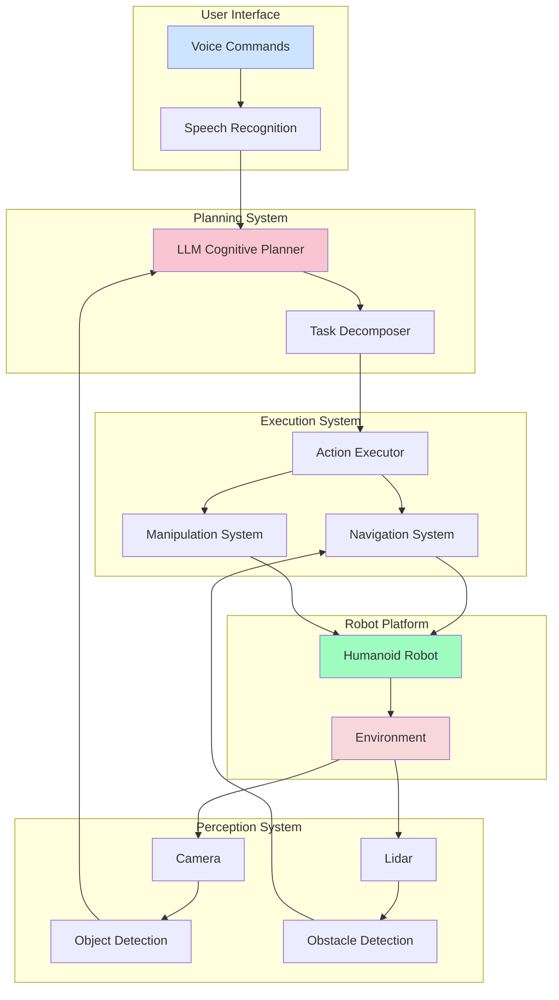

# Week 13: Final Project Presentation

## Presentation Overview

The final project presentation is your opportunity to showcase the autonomous humanoid robot system you've developed throughout the course. This presentation should demonstrate the integration of all course modules and highlight the technical achievements of your project.

## Presentation Structure

### 1. Introduction (2-3 minutes)
- **Project Title**: Clear, descriptive title
- **Team Members**: Names and roles
- **Project Overview**: Brief description of what was built
- **Objectives**: What problems the system solves

### 2. System Architecture (3-4 minutes)
- **High-Level Design**: Overall system architecture
- **Module Integration**: How course modules were integrated
- **Component Interaction**: Data flow and communication patterns
- **Technical Stack**: Technologies and frameworks used

### 3. Demonstration (5-7 minutes)
- **Live Demo**: Real-time system operation
- **Multiple Scenarios**: Different types of tasks
- **Error Handling**: How the system handles failures
- **Safety Features**: Emergency stop and safety measures

### 4. Technical Deep Dive (4-5 minutes)
- **Key Algorithms**: Planning, navigation, perception
- **Challenges Overcome**: Technical obstacles and solutions
- **Innovations**: Novel approaches or improvements
- **Performance Metrics**: Quantitative results

### 5. Lessons Learned (2-3 minutes)
- **Technical Insights**: What worked well and what didn't
- **Development Process**: Approaches that were effective
- **Future Improvements**: Potential enhancements
- **Real-World Applications**: Potential use cases

### 6. Q&A Session (3-5 minutes)
- **Technical Questions**: Deep dive into implementation
- **Design Decisions**: Rationale for architectural choices
- **Limitations**: Acknowledge system constraints
- **Next Steps**: Future development plans

## Presentation Requirements

### Content Requirements
- **Duration**: 15-20 minutes total (including Q&A)
- **Format**: Professional, technical presentation
- **Visuals**: Diagrams, screenshots, and live demonstrations
- **Technical Depth**: Appropriate for technical audience
- **Clear Communication**: Understandable to non-experts in specific areas

### Technical Demonstration
- **Working System**: Fully functional during presentation
- **Multiple Scenarios**: Show different capabilities
- **Error Handling**: Demonstrate robustness
- **Safety Features**: Show safety mechanisms in action
- **Performance**: Show real-time capabilities

### Documentation Integration
- **Architecture Diagrams**: System design and component interaction
- **Code Snippets**: Key algorithms and implementation details
- **Performance Data**: Metrics and evaluation results
- **User Interface**: Command interface and feedback mechanisms

## Evaluation Criteria

### Technical Content (40%)
- **System Complexity**: Appropriateness of technical challenges addressed
- **Integration Quality**: How well modules are integrated
- **Algorithm Quality**: Appropriateness and implementation of algorithms
- **Innovation**: Creative solutions and novel approaches

### Demonstration (30%)
- **System Functionality**: Does the system work as claimed?
- **Robustness**: How well does it handle different scenarios?
- **Real-time Performance**: Response times and execution speed
- **Safety**: Proper safety measures and error handling

### Presentation Quality (20%)
- **Clarity**: Clear communication of concepts and results
- **Organization**: Logical flow and structure
- **Visual Aids**: Effective use of diagrams and demonstrations
- **Engagement**: Ability to hold audience attention

### Q&A Response (10%)
- **Technical Understanding**: Depth of knowledge about the system
- **Problem-Solving**: Ability to address technical questions
- **Critical Thinking**: Understanding of limitations and improvements
- **Communication**: Clear, concise answers

## Preparation Guidelines

### 1. Practice Your Presentation
- **Rehearse Timing**: Ensure you stay within time limits
- **Practice Demo**: Have backup plans for technical issues
- **Anticipate Questions**: Prepare answers for likely technical questions
- **Get Feedback**: Practice with peers or mentors

### 2. Prepare Backup Plans
- **Video Demonstration**: In case live demo fails
- **Alternative Scenarios**: Have simpler demonstrations ready
- **Technical Support**: Have access to debugging tools
- **Offline Materials**: Printed materials as backup

### 3. Organize Your Materials
- **Code Samples**: Prepared snippets for technical questions
- **Architecture Diagrams**: Clear, readable system diagrams
- **Performance Data**: Charts and metrics ready to show
- **Demo Scripts**: Prepared commands for demonstration

## Technical Demonstration Ideas

### Scenario 1: Basic Navigation
- **Command**: "Go to the kitchen"
- **Demonstrate**: Path planning, obstacle avoidance, safe navigation
- **Key Points**: Navigation system, safety checks, progress feedback

### Scenario 2: Object Interaction
- **Command**: "Find the red cup and bring it to me"
- **Demonstrate**: Object detection, grasping, manipulation
- **Key Points**: Perception system, manipulation planning, execution

### Scenario 3: Complex Task
- **Command**: "Go to the bedroom, wait for me there, then follow me to the kitchen"
- **Demonstrate**: Multi-step planning, task decomposition, context awareness
- **Key Points**: LLM integration, task management, adaptive planning

### Scenario 4: Error Handling
- **Introduce Obstacle**: Show how system handles unexpected situations
- **Demonstrate**: Replanning, alternative routes, safety responses
- **Key Points**: Robustness, error recovery, safety systems

## Visual Materials

### System Architecture Diagram

### Performance Metrics Dashboard
- Response time charts
- Success rate graphs
- System uptime statistics
- Resource usage metrics

### Code Architecture
- ROS 2 node structure
- Message flow diagrams
- Key algorithm implementations
- Integration patterns

## Common Questions to Prepare For

### Technical Questions
1. **"How does your LLM planning system handle ambiguous commands?"**
   - Discuss natural language processing and disambiguation strategies

2. **"What safety measures prevent the robot from dangerous situations?"**
   - Explain safety manager, emergency stop, operational limits

3. **"How do you handle failures during plan execution?"**
   - Describe error detection, recovery mechanisms, fallback strategies

4. **"What are the limitations of your current system?"**
   - Discuss computational constraints, environmental limitations, accuracy bounds

### Design Questions
1. **"Why did you choose this particular architecture?"**
   - Explain trade-offs between different approaches

2. **"How would you scale this system for multiple robots?"**
   - Discuss distributed systems, coordination mechanisms

3. **"What improvements would you make given more time?"**
   - Identify bottlenecks, enhancement opportunities, new features

## Best Practices for Success

### 1. Tell a Story
- Present your project as a journey from problem to solution
- Explain the challenges you faced and how you overcame them
- Show the evolution of your system from basic to advanced

### 2. Show, Don't Just Tell
- Demonstrate actual system functionality
- Use live demos when possible
- Show real results, not just theoretical concepts

### 3. Acknowledge Limitations
- Be honest about what doesn't work perfectly
- Explain constraints and trade-offs you made
- Show understanding of system boundaries

### 4. Highlight Learning
- Emphasize what you learned about system integration
- Show understanding of complex robotics concepts
- Demonstrate growth in technical capabilities

### 5. Connect to Real World
- Explain practical applications of your system
- Discuss potential impact and use cases
- Show understanding of broader robotics field

## Presentation Tips

### Before the Presentation
- Test all equipment and connections
- Have backup copies of your presentation
- Prepare for technical difficulties
- Arrive early to set up

### During the Presentation
- Speak clearly and maintain eye contact
- Use the laser pointer effectively
- Pause for demonstrations
- Engage with your audience

### For the Demonstration
- Have simple commands ready for backup
- Test the system immediately before presenting
- Be prepared to explain what's happening
- Have a team member ready to assist

## Conclusion

The final presentation is your opportunity to showcase the culmination of your learning in this course. It demonstrates not only your technical skills but also your ability to communicate complex ideas and present sophisticated systems.

Your presentation should reflect the depth of knowledge you've gained about Physical AI and Humanoid Robotics, showing how individual modules can be integrated into a powerful autonomous system. Focus on the technical achievements while also communicating the broader impact and potential of your work.

Remember, this presentation represents your growth as a robotics engineer and your readiness to tackle complex, integrated systems in the future.