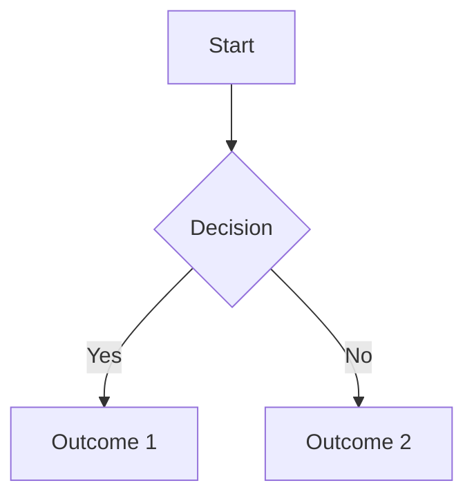

# Quickstart Guide: Physical AI & Humanoid Robotics Textbook

## Prerequisites

Before starting with the Physical AI & Humanoid Robotics textbook, ensure you have:

### System Requirements
- Node.js version 18 or higher
- npm (comes with Node.js) or yarn
- Git for version control
- A modern web browser for viewing the documentation

### Recommended Environment
- Operating System: Windows, macOS, or Linux
- Text Editor: VS Code (recommended) or any editor with Markdown support
- Terminal: Command prompt, PowerShell, or bash

## Installation

### 1. Clone the Repository
```bash
git clone https://github.com/your-organization/physical-ai-textbook.git
cd physical-ai-textbook
```

### 2. Install Dependencies
```bash
npm install
```

This will install all necessary dependencies including Docusaurus and related packages.

### 3. Start Development Server
```bash
npm start
```

This command starts the development server and opens the textbook in your default browser at `http://localhost:3000`.

## Project Structure

The textbook follows the Docusaurus standard structure:

```
physical-ai-textbook/
├── docs/
│   ├── intro.md                 # Introduction to the course
│   ├── module-1/               # Module 1: ROS 2
│   │   ├── week-1/             # Week 1 content
│   │   ├── week-2/             # Week 2 content
│   │   └── ...
│   ├── module-2/               # Module 2: Digital Twin
│   ├── module-3/               # Module 3: AI-Robot Brain
│   ├── module-4/               # Module 4: VLA
│   ├── hardware/               # Hardware requirements
│   └── assessments/            # Assessment guidelines
├── src/
│   ├── css/
│   └── pages/
├── static/
├── docusaurus.config.js        # Main configuration
├── sidebars.js                 # Navigation structure
└── package.json               # Dependencies
```

## Writing Content

### Creating New Pages
To create a new page, add a Markdown file in the appropriate directory:

```markdown
---
title: My New Page
sidebar_position: 1
---

# My New Page Title

Content goes here...
```

### Adding to Navigation
Add your new page to the `sidebars.js` file to make it appear in the navigation:

```javascript
module.exports = {
  textbookSidebar: [
    {
      type: 'category',
      label: 'Module 1: ROS 2',
      items: [
        'module-1/intro',
        'module-1/my-new-page',  // Add your page here
      ],
    },
  ],
};
```

### Using Code Blocks
Use triple backticks for code blocks with syntax highlighting:

```python
def hello_world():
    print("Hello, Physical AI!")
```

### Adding Diagrams with Mermaid
Use Mermaid syntax for diagrams:



## Building for Production

To build the static site for deployment:

```bash
npm run build
```

This creates a `build/` directory with the static site that can be deployed to any web server or GitHub Pages.

## Deployment

### GitHub Pages
The project is configured for GitHub Pages deployment. Enable GitHub Pages in your repository settings and select the `gh-pages` branch as the source.

### Continuous Deployment
The project includes a GitHub Actions workflow for automatic deployment. Push changes to the `main` branch to trigger deployment.

## Development Commands

- `npm start` - Start development server
- `npm run build` - Build static site
- `npm run serve` - Serve built site locally
- `npm run deploy` - Deploy to GitHub Pages
- `npm run clear` - Clear build cache

## Contributing

### Adding Content
1. Create a new branch for your content
2. Add your Markdown files in the appropriate module/week directory
3. Update `sidebars.js` to include your new content
4. Test locally with `npm start`
5. Submit a pull request

### Style Guidelines
- Use clear, concise titles
- Follow the existing document structure
- Include code examples where appropriate
- Add diagrams for complex concepts
- Link to related content within the textbook

## Troubleshooting

### Common Issues

**Dependency installation fails**
- Ensure you're using Node.js 18 or higher
- Try clearing npm cache: `npm cache clean --force`
- Delete `node_modules` and `package-lock.json`, then run `npm install` again

**Development server won't start**
- Check for syntax errors in your Markdown files
- Verify that all paths in `sidebars.js` are correct
- Look for broken links or invalid content

**Build fails**
- Check for broken links in your content
- Ensure all referenced images/files exist
- Verify that Mermaid diagrams are properly formatted

## Getting Help

- Check the existing documentation in the textbook
- Review the Docusaurus documentation at https://docusaurus.io
- Open an issue in the repository for technical problems
- Contact the course maintainers for content-related questions

## Next Steps

1. Start with the introduction (`docs/intro.md`) to understand the course structure
2. Proceed through the modules in order (Module 1 → Module 4)
3. Complete the exercises for each week
4. Refer to the hardware and assessment sections as needed